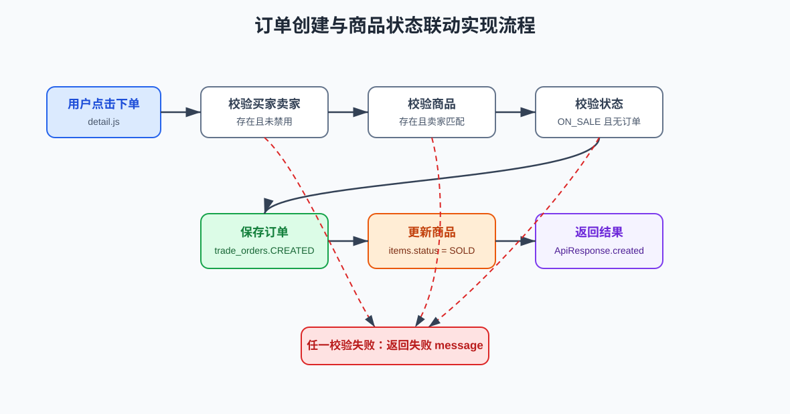

# 校园二手交易平台软件实现说明书

## 1 前后端技术选型

### 1.1 前后端技术选型介绍

校园二手交易平台采用静态前端、Spring Boot 后端和 MySQL 数据库。前端使用 HTML、CSS、JavaScript 实现页面和交互；后端使用 Java 24、Spring Boot 3.5.14、Spring Web、Spring Data JPA 实现 REST API；数据库使用 MySQL 8.x 保存业务数据；测试使用 JUnit 5、MockMvc 和 H2。

### 1.2 前端技术选型理由

- 原生 HTML、CSS、JavaScript 无需构建工具，便于课程项目部署和演示。
- 页面文件与功能对应清晰，便于维护。
- 静态页面可直接打开，也可以通过简单静态服务器访问。
- 公共 API 地址集中在 `frontend/assets/js/api.js`，便于切换后端地址。

### 1.3 后端技术选型理由

#### 1.3.1 Spring Boot

Spring Boot 提供快速启动、自动配置和成熟的 Web 开发能力，适合实现课程项目中的 REST API。

#### 1.3.2 Spring Data JPA

Spring Data JPA 简化实体持久化、条件查询和 Repository 编写。当前项目规模较小，JPA 能减少重复数据访问代码。

#### 1.3.3 Maven

Maven 用于依赖管理、项目构建、测试执行和 Spring Boot 启动。

#### 1.3.4 MySQL

MySQL 适合保存结构化业务数据，并通过外键和索引维护用户、商品、留言和订单之间的关系。

#### 1.3.5 BCrypt 与邮箱验证码

BCrypt 用于保存密码散列，避免明文密码落库。邮箱验证码用于注册、修改邮箱和忘记密码流程，增强账号操作校验。

## 2 软件实现基本思路

### 2.1 调研与需求确定

系统围绕校园二手物品交易流程设计，核心目标是完成从账号注册、商品发布、浏览沟通到订单创建的闭环。

#### 2.1.1 系统实现的功能

- 用户注册、登录、邮箱验证码、忘记密码、资料维护。
- 商品列表、搜索、分类筛选、详情查看、商品发布。
- 商品留言、修改自己的留言、删除自己的留言。
- 创建订单、查询订单、更新订单状态。
- 管理员用户管理、留言管理和商品管理。

#### 2.1.2 性能需求

系统面向课程项目和小规模校园演示，预期支持 10 到 20 人同时访问。商品列表和订单、留言查询通过必要索引提升查询效率。

### 2.2 确定系统运行环境

#### 2.2.1 硬件接口

系统无专用硬件接口，普通个人电脑即可完成开发和本地部署。

#### 2.2.2 软件接口

前端通过 HTTP JSON 调用后端接口，后端通过 JDBC 和 JPA 访问 MySQL。

#### 2.2.3 通讯接口

开发环境前端默认调用 `http://localhost:8080/api`。后端开启跨域配置，允许静态前端页面访问接口。

#### 2.2.4 编程语言

前端使用 HTML、CSS、JavaScript。后端使用 Java 24。数据库脚本使用 SQL。

### 2.3 划分系统模块

| 模块 | 实现位置 | 实现内容 |
|---|---|---|
| 用户模块 | `backend/.../user`、`profile.js`、`register.js` | 注册、登录、验证码、重置密码、资料修改。 |
| 商品模块 | `backend/.../item`、`main.js`、`publish.js`、`detail.js` | 商品发布、列表、搜索、详情。 |
| 留言模块 | `backend/.../message`、`detail.js` | 商品留言查询、发送、修改、删除。 |
| 订单模块 | `backend/.../order`、`orders.js`、`detail.js` | 订单创建、查询、状态更新。 |
| 管理员模块 | `backend/.../admin`、`admin.js` | 用户、留言、商品管理。 |
| 公共模块 | `backend/.../common`、`api.js` | 统一响应、跨域、邮件、异常处理、API 地址。 |

### 2.4 用户界面实现

前端页面采用统一导航和卡片式内容展示。首页显示商品卡片；详情页集中展示商品、留言和下单操作；个人中心集成登录、忘记密码和资料维护；管理中心按用户、留言、商品三个管理区组织。

### 2.5 功能实现与集成测试

后端自动化测试集中在 `SecondhandApplicationTests.java`，使用 MockMvc 调用接口，使用 H2 内存数据库执行测试。测试覆盖注册登录、账号锁定、密码重置、商品、留言、订单和管理员功能。

### 2.6 目录实现说明

```text
backend/
  src/main/java/com/campus/secondhand/
    admin/      管理员接口
    common/     公共响应、跨域、邮件、异常处理
    item/       商品实体、仓库、接口
    message/    留言实体、仓库、接口
    order/      订单实体、仓库、接口
    user/       用户、验证码、注册登录接口
frontend/
  assets/js/    各页面脚本和 API 地址配置
  assets/css/   页面样式
database/
  schema.sql    建库建表
  seed.sql      演示数据
doc/
  *.md          项目文档
```

### 2.7 实现顺序

| 顺序 | 内容 | 说明 |
|---|---|---|
| 1 | 数据库表结构 | 先确定用户、商品、留言、订单和验证码表。 |
| 2 | 后端实体和 Repository | 建立实体与表字段映射。 |
| 3 | 后端 Controller | 实现注册登录、商品、留言、订单和管理接口。 |
| 4 | 前端页面和脚本 | 对接接口并完成页面交互。 |
| 5 | 自动化测试 | 使用 MockMvc 验证核心业务规则。 |
| 6 | 文档归档 | 根据当前代码补齐课程文档。 |

## 3 映射方法介绍

### 3.1 前端映射方法介绍

前端根据页面职责调用后端接口：

| 页面脚本 | 调用接口 | 说明 |
|---|---|---|
| `main.js` | `GET /api/items` | 加载商品列表、执行搜索和分类筛选。 |
| `register.js` | `/api/users/send-verification`、`/api/users/register` | 注册账号。 |
| `profile.js` | `/api/users/login`、`/api/users/{id}`、忘记密码接口 | 登录、资料维护、密码重置。 |
| `publish.js` | `POST /api/items` | 发布商品。 |
| `detail.js` | `/api/items/{id}`、`/api/messages/**`、`POST /api/orders` | 商品详情、留言、下单。 |
| `orders.js` | `/api/orders`、`/api/orders/{id}/status` | 查询和更新订单。 |
| `admin.js` | `/api/admin/**` | 管理用户、留言和商品。 |

前端登录态保存在 `localStorage`，用于判断是否登录和向接口传递当前用户 ID。

### 3.2 后端映射方法介绍

后端使用 Controller 方法映射 HTTP 接口：

| Controller | 映射前缀 | 说明 |
|---|---|---|
| `UserController` | `/users` | 用户注册、登录、验证码、资料修改。 |
| `ItemController` | `/items` | 商品列表、详情、发布。 |
| `MessageController` | `/messages` | 留言查询、发送、修改、删除。 |
| `TradeOrderController` | `/orders` | 订单创建、查询、状态更新。 |
| `AdminController` | `/admin` | 管理员功能。 |

实体类通过 JPA 注解映射到数据库表。Repository 负责基础查询，Controller 负责组织业务校验和响应。

### 3.3 数据库映射方法介绍

| 实体类 | 数据表 | 说明 |
|---|---|---|
| `User` | `users` | 用户账号、角色、状态、登录失败次数。 |
| `Item` | `items` | 商品标题、分类、价格、卖家和状态。 |
| `Message` | `messages` | 商品留言、发送者、接收者和内容。 |
| `TradeOrder` | `trade_orders` | 订单商品、买家、卖家和状态。 |
| `EmailVerification` | `email_verification` | 邮箱验证码和过期控制。 |

### 3.4 请求响应映射

所有 Controller 返回 `ApiResponse`。前端判断 `success` 字段，成功时使用 `data` 渲染页面，失败时展示 `message`。

```json
{
  "success": false,
  "message": "物品已被下单或售出",
  "data": null
}
```

## 4 重点实现

### 4.1 密码保护与登录锁定

用户密码使用 BCrypt 散列保存。登录失败时累计 `loginFailedCount`，连续失败 3 次后写入 `lockedUntil`，锁定 10 分钟。登录成功后清空失败次数和锁定时间。

### 4.2 邮箱验证码

验证码保存到 `email_verification` 表，包含邮箱、验证码、创建时间、过期时间、尝试次数和是否使用。注册、修改邮箱、忘记密码均复用验证码校验逻辑。

### 4.3 商品状态联动

商品状态包括 `ON_SALE`、`SOLD`、`REMOVED`。创建订单时校验商品仍在售且不存在非取消订单，订单保存后将商品状态更新为 `SOLD`，避免重复下单。

### 4.4 管理员权限校验

管理员接口统一调用 `requireAdmin(adminId)`，校验用户存在、角色为 `ADMIN` 且状态未禁用。普通用户不能执行管理操作。

### 4.5 统一响应与异常处理

所有接口使用 `ApiResponse` 返回成功标志、提示信息和数据。全局异常处理器负责处理参数校验等异常，使前端可以统一展示错误提示。

### 4.6 商品搜索实现

商品列表接口根据参数选择不同查询路径：

1. `keyword` 不为空时，调用按标题模糊匹配和状态查询的方法。
2. `keyword` 为空且 `category` 不为空时，调用按分类和状态查询的方法。
3. 两者都为空时，查询全部 `ON_SALE` 商品。

该实现保证首页只展示在售商品，已售出或下架商品不会出现在普通列表中。

### 4.7 留言权限实现

留言修改和删除接口都要求传入 `senderId`。后端查询留言后比较留言记录中的 `senderId` 与请求中的 `senderId`，不一致时拒绝操作。管理员删除留言不复用普通删除接口，而是走 `/admin/messages/{id}`，并先校验管理员身份。

### 4.8 订单创建实现

订单创建接口按顺序校验买家、卖家、账号状态、商品、商品卖家、买卖双方关系、商品状态和重复订单。全部通过后保存订单，并同步将商品状态修改为 `SOLD`。



图 1 给出了订单创建过程中从前端点击下单，到后端校验、保存订单、更新商品状态并返回结果的实现流程。

### 4.9 管理功能实现

管理接口集中在 `AdminController`，通过 `requireAdmin(adminId)` 统一检查管理员身份。管理功能不直接删除用户和商品，而是通过状态字段控制用户可用性和商品展示状态。

## 5 集成与验证

### 5.1 自动化测试实现

自动化测试使用 H2 内存数据库，每个用例执行前清空数据，确保测试互不影响。测试覆盖：

- Spring Boot 上下文加载。
- 注册、用户名登录、邮箱登录和错误密码。
- 连续错误密码后的账号锁定。
- 忘记密码验证码重置。
- 商品发布和搜索。
- 留言发送、查询、修改和删除权限。
- 管理员禁用用户、删除留言、下架商品。
- 创建订单、重复下单拦截和订单状态校验。

### 5.2 部署验证实现

部署验证依赖三类检查：

| 检查 | 方法 |
|---|---|
| 数据库 | 执行 `schema.sql` 和 `seed.sql`，检查 5 张表和演示数据。 |
| 后端 | 执行 `mvn spring-boot:run`，访问 `/api/actuator/health`。 |
| 前端 | 打开首页，确认商品列表、搜索、登录和主要页面跳转正常。 |

## 6 实现边界

- 不实现本地图片上传，商品图片使用地址。
- 不实现正式 Token 或 Session 鉴权。
- 不实现支付、物流、评价、实时聊天。
- 管理员权限和前端登录态为课程项目级简化实现。

## 7 后面可以扩展方向

| 方向 | 实现思路 |
|---|---|
| Token 鉴权 | 后端登录成功后签发 Token，前端请求携带 Authorization 头。 |
| 图片上传 | 后端提供上传接口，保存文件路径或对象存储地址。 |
| 订单权限细分 | 根据买家和卖家角色限制可执行的订单状态变更。 |
| 私信会话 | 增加会话表和消息表，支持按用户维度沟通。 |
| 商品评价 | 订单完成后增加评价表和评分展示。 |
