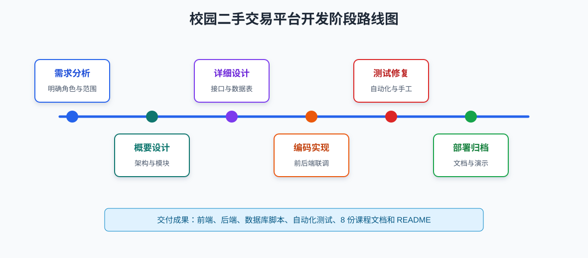

# 校园二手交易平台软件开发计划书

## 1. 引言

### 1.1 项目标识

- 项目名称：校园二手交易平台
- 项目类型：课程设计软件项目
- 本项目目前：V1.0
- 开发模式：小组协作，简化敏捷迭代
- 主要技术：HTML、CSS、JavaScript、Spring Boot、Spring Data JPA、MySQL、Maven

### 1.2 系统概述

校园二手交易平台面向在校学生，解决教材、生活用品、电子产品等闲置物品的校内流转问题。系统提供用户注册登录、邮箱验证码、商品浏览搜索、商品发布、留言沟通、订单管理、个人资料维护和管理员管理等功能。

项目采用简易前后端分离架构。前端位于 `frontend/`，由静态 HTML/CSS/JavaScript 页面组成；后端位于 `backend/`，提供 Spring Boot REST API；数据库使用 MySQL，建表和演示数据脚本位于 `database/`。

### 1.3 文档目的

本计划书主要安排校园二手交易平台的开发活动，明确交付内容、阶段安排、资源分工、质量保证、测试安排和风险控制，为课程项目实施和验收提供依据。

### 1.4 项目目标

| 目标 | 说明 |
|---|---|
| 完成功能闭环 | 覆盖注册登录、商品发布、浏览搜索、留言、下单、订单管理和管理员管理。 |
| 保持部署简单 | 前端无需构建，后端使用 Maven 启动，数据库通过 SQL 脚本初始化。 |
| 文档与代码一致 | 所有课程文档均基于当前实现，不作为未实现功能。 |
| 满足课程验收 | 提供可运行程序、数据库脚本、自动化测试和完整说明文档。 |

图 1 给出了项目从需求分析到部署归档的主要阶段，以及每个阶段对应的核心产出。

## 2. 交付产品

### 2.1 程序交付

| 交付项 | 位置 | 说明 |
|---|---|---|
| 前端页面 | `frontend/` | 首页、注册页、详情页、发布页、订单页、个人中心、管理中心。 |
| 后端服务 | `backend/` | Spring Boot REST API，默认端口 `8080`，接口前缀 `/api`。 |
| 数据库脚本 | `database/schema.sql`、`database/seed.sql` | 创建 MySQL 数据库、表结构和演示数据。 |
| 自动化测试 | `backend/src/test/` | 基于 JUnit 5、MockMvc、H2 的后端测试。 |

### 2.2 文档交付

| 文档 | 说明 |
|---|---|
| 软件开发计划书 | 项目计划、进度、资源、风险和质量保证。 |
| 软件需求规格说明书 | 功能需求、非功能需求、数据需求和实现边界。 |
| 软件概要设计说明书 | 总体架构、模块划分、接口概览和数据设计。 |
| 软件详细设计说明书 | 关键类、接口、流程和约束的详细设计。 |
| 软件实现说明书 | 技术选型、实现思路、映射方法和重点实现。 |
| 软件部署文档 | 环境准备、数据库初始化、前后端启动和常见问题。 |
| 软件用户手册 | 普通用户和管理员的页面操作说明。 |
| 软件测试文档 | 测试环境、测试范围、用例和结果。 |

## 3. 项目范围

### 3.1 范围内功能

- 用户注册，注册时通过邮箱验证码校验。
- 用户名登录和邮箱登录。
- 连续 3 次登录失败后锁定账号 10 分钟。
- 忘记密码，通过已注册邮箱验证码重置密码。
- 个人资料查看与修改，修改邮箱时校验验证码。
- 商品列表、关键词搜索、分类筛选、详情查看。
- 登录用户发布商品，商品图片使用图片地址。
- 商品详情页留言、修改自己的留言、删除自己的留言。
- 创建订单，订单创建后商品状态更新为 `SOLD`。
- 查看与当前用户相关的订单，并更新订单状态。
- 管理员禁用/恢复普通用户、删除留言、下架/恢复商品。

### 3.2 范围外说明

- 不实现本地图片文件上传，本项目目前使用 `imageUrl` 保存图片地址。
- 不实现正式 Token、Session 或 OAuth 鉴权，前端使用 `localStorage` 保存当前用户基本信息。
- 不实现在线支付、物流配送、评价体系和实时聊天。
- 管理员权限采用课程项目级简化校验，由请求中的 `adminId` 在后端校验角色。

## 4. 开发过程与阶段安排

项目采用简化敏捷过程，按“需求分析、概要设计、详细设计、编码实现、测试修复、文档归档”推进。

| 阶段 | 时间安排 | 主要任务 | 输出 |
|---|---|---|---|
| 需求分析 | 第 1 周 | 明确用户角色、业务流程、功能边界和非功能要求。 | 软件需求规格说明书。 |
| 概要设计 | 第 2 周前半 | 确定前后端分离架构、模块划分、数据库总体结构。 | 软件概要设计说明书。 |
| 详细设计 | 第 2 周后半 | 设计接口、实体、Controller、Repository、页面脚本流程。 | 软件详细设计说明书。 |
| 编码实现 | 第 3-4 周 | 完成前端页面、后端接口、数据库脚本和联调。 | 可运行程序。 |
| 测试修复 | 第 5 周前半 | 执行自动化测试和手工流程测试，修复缺陷。 | 软件测试文档。 |
| 部署归档 | 第 5 周后半 | 整理部署步骤、用户操作说明、实现说明和项目文档。 | 实现说明书、部署文档、用户手册、最终归档包。 |

### 4.1 里程碑计划

| 里程碑 | 完成标志 | 验证方式 |
|---|---|---|
| M1 需求冻结 | 需求规格说明书完成，范围内外功能明确。 | 检查需求文档和用例表。 |
| M2 架构确定 | 概要设计和数据库初稿完成。 | 检查架构图、模块表、表结构。 |
| M3 核心编码完成 | 用户、商品、留言、订单接口与页面完成。 | 本地联调主流程。 |
| M4 管理功能完成 | 管理员用户、留言、商品管理完成。 | 管理员账号演示。 |
| M5 测试通过 | 自动化测试和主要手工流程通过。 | 执行 `mvn test` 和测试文档用例。 |
| M6 文档归档 | 8 份课程文档与 README 索引完成。 | 检查 `doc/` 目录和 README。 |

### 4.2 工作分解结构

| 编号 | 工作项 | 主要输出 |
|---|---|---|
| WBS-01 | 需求分析 | 角色、用例、功能需求、非功能需求。 |
| WBS-02 | 数据库设计 | `users`、`items`、`messages`、`trade_orders`、`email_verification`。 |
| WBS-03 | 后端开发 | Controller、Repository、Entity、统一响应、邮件服务。 |
| WBS-04 | 前端开发 | 首页、注册页、详情页、发布页、订单页、个人中心、管理中心。 |
| WBS-05 | 集成联调 | 前后端接口联调、演示数据验证。 |
| WBS-06 | 测试验证 | 自动化测试、手工测试、数据库测试。 |
| WBS-07 | 文档整理 | 计划、需求、设计、实现、部署、用户、测试文档。 |

## 5. 资源与职责

| 角色 | 职责 |
|---|---|
| 项目负责人 | 制定计划、跟踪进度、协调任务、组织验收材料。 |
| 需求分析人员 | 梳理用户需求、业务流程和验收标准。 |
| 后端开发人员 | 实现用户、商品、留言、订单和管理员接口。 |
| 前端开发人员 | 实现静态页面、接口调用、页面交互和本地登录态。 |
| 数据库设计人员 | 设计 MySQL 表结构、索引、外键和演示数据。 |
| 测试人员 | 编写并执行自动化测试、手工测试、缺陷复测。 |
| 文档人员 | 编写和维护项目计划、需求、设计、部署、用户、测试文档。 |

### 5.1 人员协作方式

- 需求变更先记录影响范围，再同步修改需求、设计和测试用例。
- 后端接口变更需通知前端同步修改调用参数和页面提示。
- 数据库字段变更需同步修改实体类、`schema.sql`、设计文档和测试数据。
- 文档人员在每个阶段收集代码、脚本和测试结果，避免文档与实现脱节。

### 5.2 沟通机制

| 沟通事项 | 频率 | 内容 |
|---|---|---|
| 进度同步 | 每阶段至少一次 | 当前完成情况、阻塞问题、下一步安排。 |
| 接口确认 | 接口调整时 | URL、方法、参数、返回结构、错误提示。 |
| 缺陷复盘 | 测试修复后 | 缺陷原因、修复方式、回归结果。 |
| 验收准备 | 归档前 | 演示账号、部署步骤、文档完整性。 |

## 6. 技术路线

- 前端：静态 HTML/CSS/JavaScript，公共接口封装在 `frontend/assets/js/api.js`。
- 后端：Spring Boot 3.5.14，按 `user`、`item`、`message`、`order`、`admin`、`common` 包组织。
- 数据访问：Spring Data JPA Repository。
- 数据库：MySQL 8.x，生产运行使用 `campus_secondhand` 数据库。
- 测试：JUnit 5、MockMvc、H2 内存数据库。
- 密码保护：Spring Security Crypto BCrypt。
- 邮件：Spring Boot Mail，SMTP 参数通过 `application.yml` 配置。

## 7. 配置管理

项目配置项包括：

- 源代码：`backend/`、`frontend/`。
- 数据库脚本：`database/schema.sql`、`database/seed.sql`。
- 配置文件：`backend/src/main/resources/application.yml`、`backend/src/test/resources/application-test.yml`。
- 文档：`doc/` 下各类说明书和手册。
- 测试报告：Maven Surefire 输出和软件测试文档。

配置管理要求：

- 使用 Git 跟踪源代码和文档变更。
- 修改数据库结构时同步更新 `schema.sql` 和设计文档。
- 修改接口时同步更新需求、概要设计、详细设计和测试文档。
- 不在文档中承诺当前代码未实现的功能。

### 7.1 版本命名

| 版本 | 含义 |
|---|---|
| V0.1 | 需求和数据库设计初稿。 |
| V0.5 | 核心后端接口和前端页面完成。 |
| V0.8 | 管理功能和测试用例完成。 |
| V1.0 | 课程验收版本，功能、测试、文档齐全。 |

### 7.2 变更控制

| 变更类型 | 处理方式 |
|---|---|
| 功能新增 | 先判断是否属于课程范围，确认后更新需求和计划。 |
| 接口变更 | 同步修改前端调用、详细设计和测试用例。 |
| 数据库变更 | 修改 `schema.sql`，旧库需备份后迁移或重建。 |
| 文档修订 | 以当前代码为准，保持文件名和 README 索引一致。 |

## 8. 质量保证计划

### 8.1 编码质量

- 后端按模块分包，Controller 只处理请求校验和业务流程，Repository 负责数据访问。
- 前端按页面拆分 JS 文件，公共请求逻辑放在 `api.js`。
- 密码不明文存储，统一使用 BCrypt 散列。
- 接口统一返回 `ApiResponse`，便于前端处理成功和失败结果。

### 8.2 测试质量

- 后端自动化测试覆盖注册登录、锁定、重置密码、商品、留言、订单和管理员功能。
- 手工测试覆盖前端主要页面流程。
- 数据库测试覆盖建表脚本、演示数据和关键字段。
- 缺陷修复后执行回归测试。

### 8.3 文档质量

- 文档与代码实现保持一致。
- 重要约束和简化点明确写出。
- 接口、数据库字段、状态值和启动方式与项目文件保持一致。
- 文档结构参考课程示例，需求、设计、实现、部署、用户、测试文档各自职责清晰。

### 8.4 评审检查项

| 检查项 | 要求 |
|---|---|
| 功能一致性 | 文档描述必须能在系统中找到对应功能或明确为实现边界。 |
| 接口一致性 | URL、请求方法、主要参数和返回结构与 Controller 一致。 |
| 数据一致性 | 表名、字段名、状态值与 `schema.sql` 和实体类一致。 |
| 测试一致性 | 测试文档中的自动化用例与测试类名称一致。 |
| 部署可执行 | 部署文档中的命令可按顺序执行。 |

## 9. 风险管理

| 风险 | 影响 | 应对措施 |
|---|---|---|
| SMTP 配置不可用 | 注册、修改邮箱、忘记密码验证码发送失败。 | 部署文档明确配置方式，测试环境可使用已写入数据库的验证码或可用 SMTP。 |
| 数据库表结构不一致 | 后端启动时 JPA validate 失败。 | 部署前执行 `schema.sql`，旧库先备份再重建。 |
| 前端登录态较简单 | 无法达到生产级认证安全。 | 在文档中说明实现边界，课程项目演示使用，后面可以再改成 Token 鉴权。 |
| 时间不足 | 功能或文档无法按期完成。 | 优先完成核心交易闭环，非核心功能保持简化。 |
| 需求变更 | 返工增加。 | 控制范围，变更后同步更新文档和测试用例。 |

## 10. 验收标准

- 可按部署文档完成数据库初始化、后端启动和前端访问。
- 首页能展示可售商品，支持搜索和分类筛选。
- 注册、登录、忘记密码、账号锁定流程可用。
- 登录用户可发布商品、留言、创建订单和查看订单。
- 管理员可管理普通用户、留言和商品。
- 自动化测试执行 `mvn test` 通过。
- 课程文档齐全，内容与当前项目一致，且章节结构便于按示例检查。

## 11. 项目交付清单

| 类型 | 内容 | 路径 |
|---|---|---|
| 前端代码 | 静态页面、样式、脚本和图片资源 | `frontend/` |
| 后端代码 | Spring Boot 源码和 Maven 配置 | `backend/` |
| 数据库脚本 | 建表脚本和演示数据 | `database/` |
| 项目文档 | 计划、需求、设计、实现、部署、用户、测试文档 | `doc/` |
| 项目说明 | 快速启动、目录结构、功能概览 | `README.md` |

## 12. 后续改进计划

| 改进项 | 说明 |
|---|---|
| Token 鉴权 | 将当前 `localStorage` 简化登录态升级为后端签发 Token。 |
| 图片上传 | 支持本地图片上传和服务器端文件存储。 |
| 订单权限 | 按买家和卖家角色细分订单状态操作权限。 |
| 私信聊天 | 在留言基础上扩展独立会话功能。 |
| 评价体系 | 订单完成后允许双方评价。 |
