# 校园二手交易平台软件概要设计说明书

## 总体架构

```markdown
Browser -> Nginx/static frontend -> Spring Boot /api -> MySQL 8.4
                                      |                    |
                                      +-- Spring Session ---+
                                      +-- Flyway migrations

```

前端通过同源 `/api` 调用后端。Web 登录使用 HttpOnly Cookie 和 Spring Session JDBC；所有写请求携带 CSRF。后端以 `CurrentActorService` 读取当前会话身份，客户端提交的 `userId`、`buyerId`、`sellerId` 或 `adminId` 不作为身份来源。

## 技术选型

| 层次   | 技术                                                       |
| ------ | ---------------------------------------------------------- |
| 前端   | HTML、CSS、JavaScript、Nginx                               |
| 后端   | Java 25、Spring Boot 3.5、Spring Security、Spring Data JPA |
| 数据库 | MySQL 8.4、Flyway、Spring Session JDBC                     |
| 测试   | JUnit 5、MockMvc、H2、Testcontainers MySQL 8.4             |
| 邮件   | Spring Mail；开发环境可使用 Mailpit                        |


## 组件图

整体系统划分为以下组件，服务间通过 RESTful API 通信：

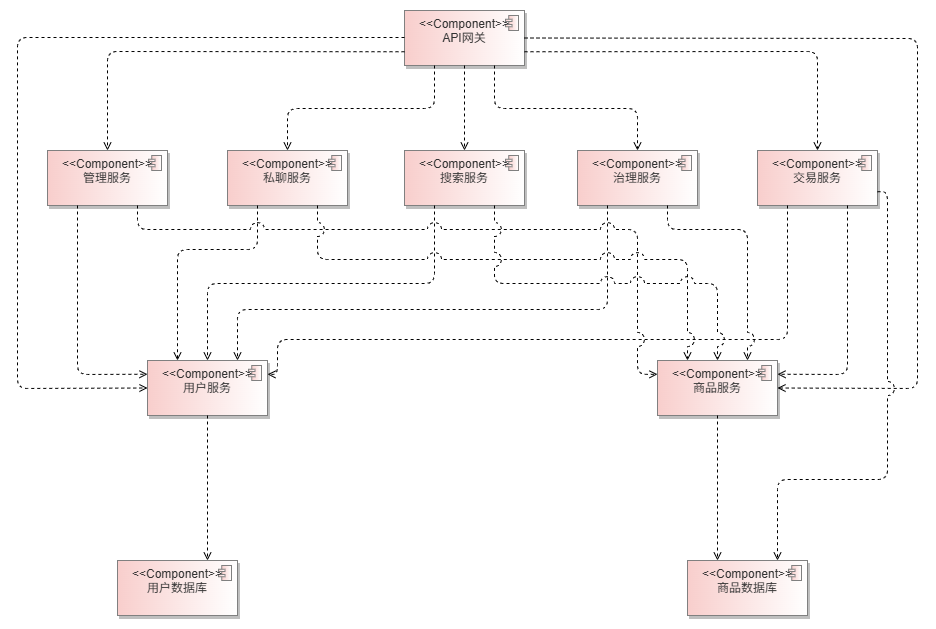


## 模块设计

| 模块       | 服务边界                                                     |
| ---------- | ------------------------------------------------------------ |
| 用户与安全 | `AuthController`、`UserController`、`CurrentActorService`；负责会话、验证码、资料和账号状态。 |
| 商品与媒体 | `SellerInventory`、`ProductDetailService`、`ProductImages`；负责商品归属、展示和受控图片。 |
| 搜索       | `CampusSearch`；负责商品/用户的安全公开投影和筛选排序。      |
| 私聊与留言 | `DirectChat`、`MessageController`；公开问答与仅参与者可见私聊隔离。 |
| 交易       | `TradingService`、`TradeDesk`；负责购买意向、预留、状态机与订单工作台。 |
| 内容治理   | `ContentGovernance`；负责举报、管理员决定和审计。            |


## 核心业务规则

- 商品发布、编辑和卖家动作只能由商品所有者执行。
- 买家提交购买意向后商品继续在售；卖家接受后才预留，买家完成确认后才售出。
- 商品、订单、私聊和举报的读取与写入均按当前会话身份和资源关系授权。
- 管理员入口默认隐藏，仅 ADMIN Session 可显示；后端每次管理操作重新核验账号角色和状态。
- 商品图片由服务端验证、标准化和存储，不接受外部图片 URL 作为业务图片来源。


## 数据、页面与边界

核心数据包括 `users`、`items`、`messages`、`trade_orders`、`email_verification`、`content_reports`、`report_actions`、`chat_conversations`、`chat_messages` 和 Spring Session 表。Flyway V1-V5 从空库建立这些结构，订单保存商品和双方资料快照以避免后续资料变更影响历史记录。

页面覆盖搜索首页、商品详情、发布、我的发布、订单工作台、消息、个人中心、举报记录和管理中心。主要接口以 `/api` 为前缀，包含 `/auth`、`/users`、`/items`、`/search`、`/messages`、`/chat`、`/orders`、`/reports` 与 `/admin`。

Web 已实现 Session、受控单图、文本私聊和短轮询。在线支付、物流、评价、多图、图片消息、WebSocket/SSE，以及 Windows/移动原生端令牌适配尚未实现。


## 组件级顺序图

以下为各业务场景的组件级顺序图，展示服务间的交互流程。

### UC01 学生注册并完成邮箱验证

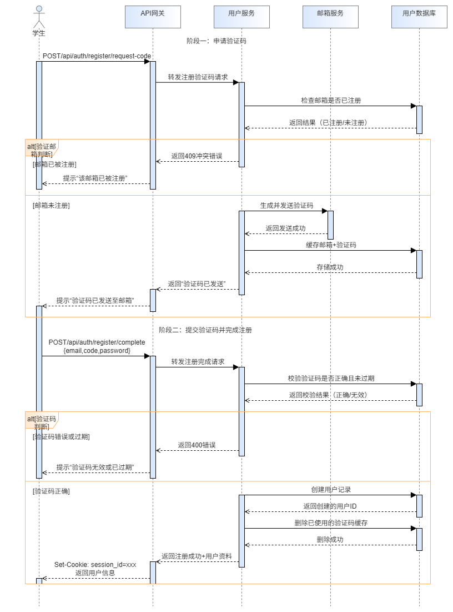

### UC02 学生登录、退出与会话恢复

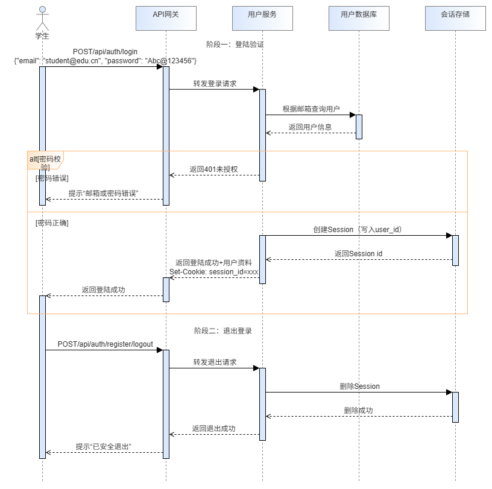

### UC03 学生找回并重置密码

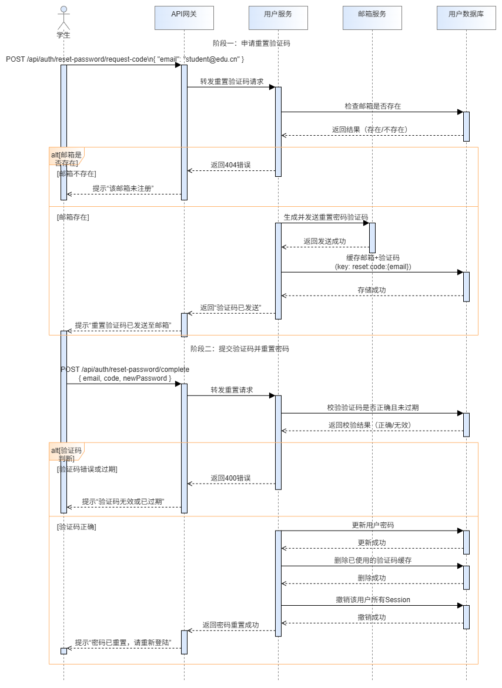

### UC04 学生维护个人资料和校园区域

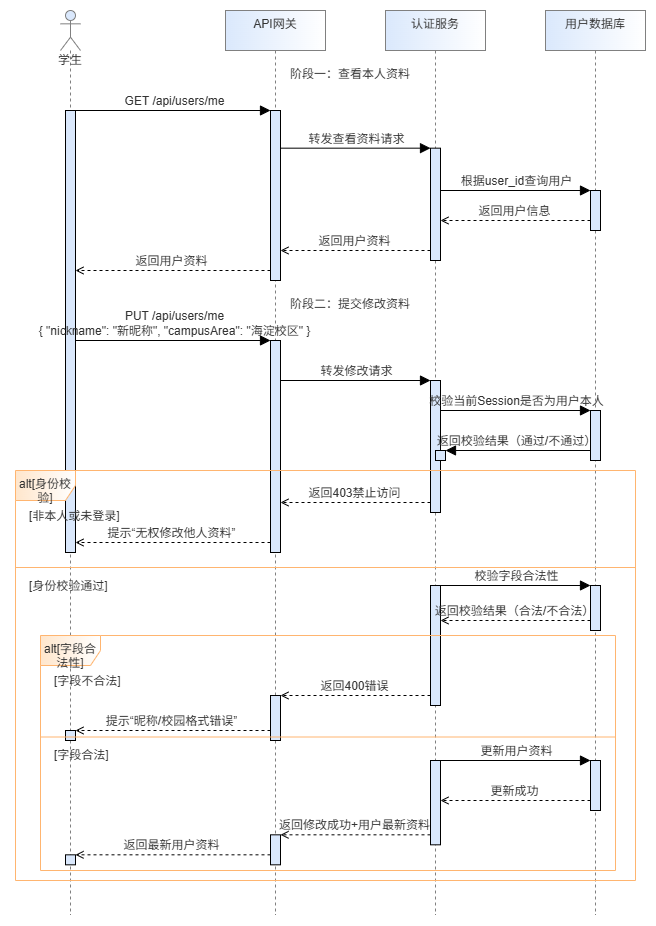

### UC05 搜索并筛选校园商品/用户

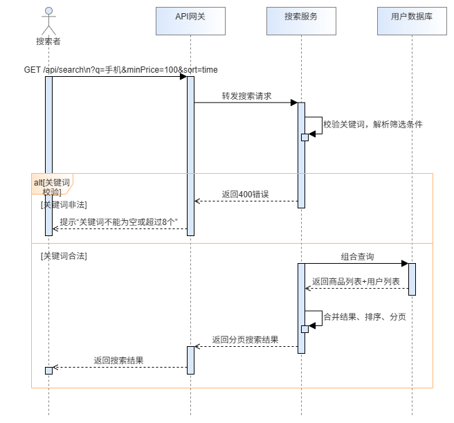

### UC06 学生发布带图片的二手商品

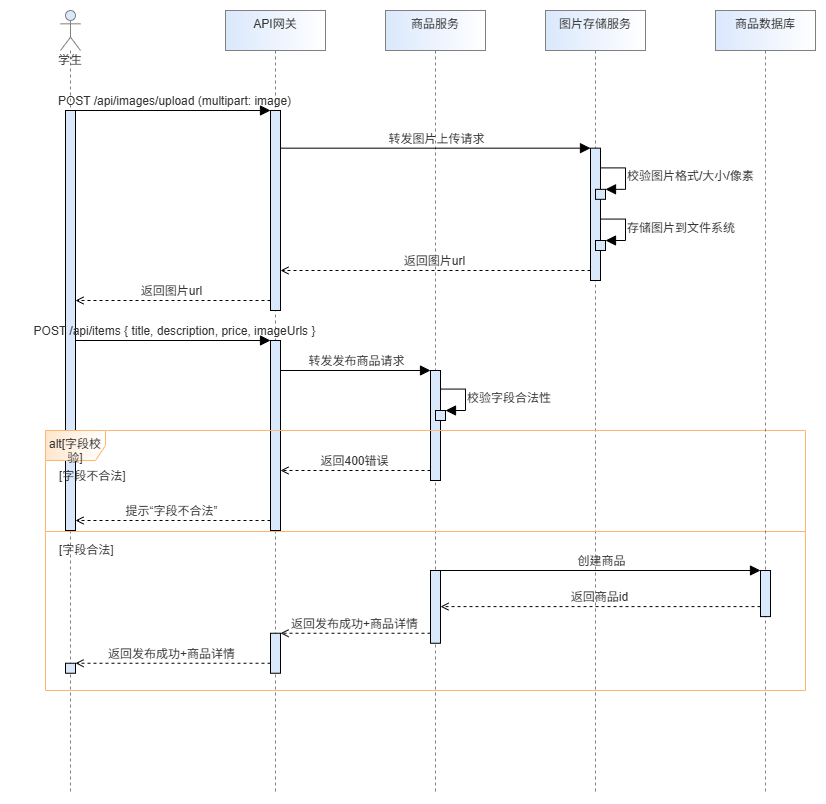

### UC07 学生维护自己的商品并下架/重新上架

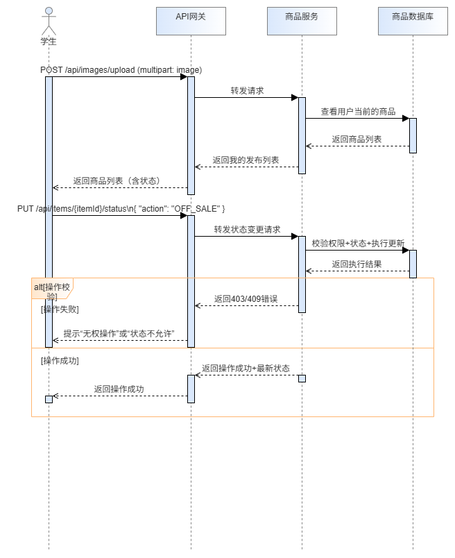

### UC08 查看商品详情并获取交易动作

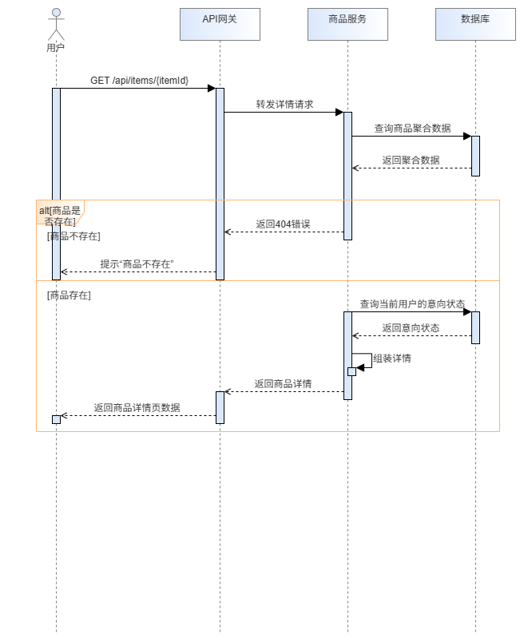

### UC09 用户参与商品公开问答

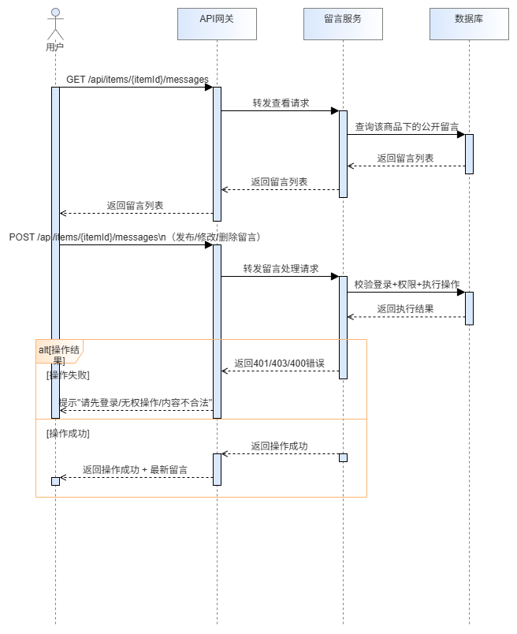

### UC10 买卖双方建立私聊并完成消息沟通

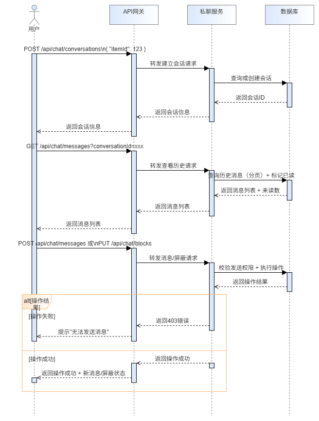

### UC11 买家提交购买意向

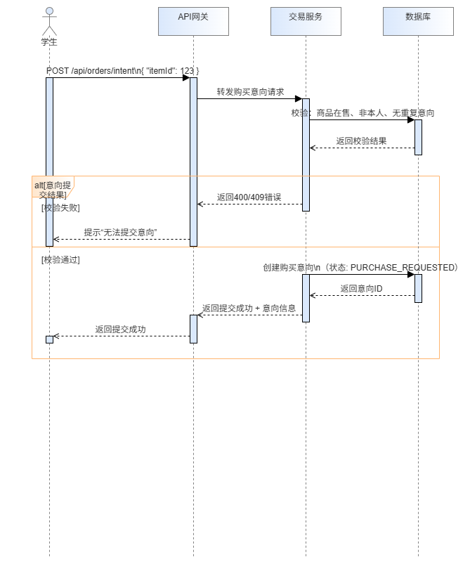

### UC12 卖家处理购买意向并形成预留订单

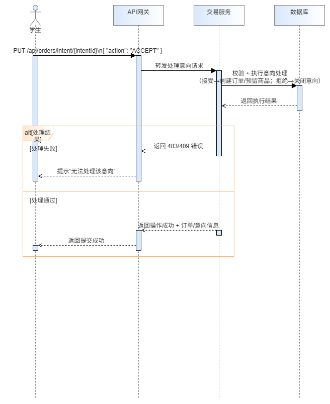

### UC13 买卖双方完成当面交接交易

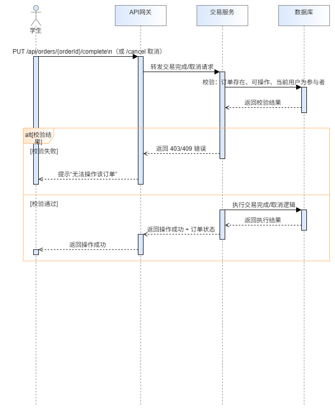

### UC14 学生查看和处理自己的交易工作台

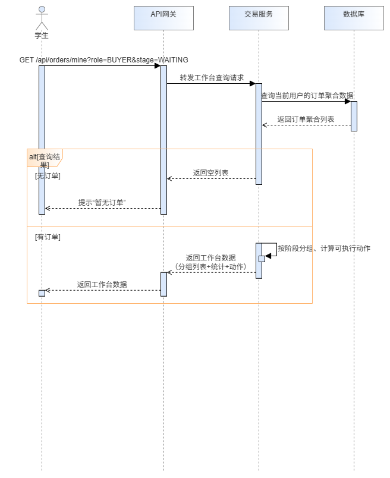

### UC15 学生提交举报并查看处理结果

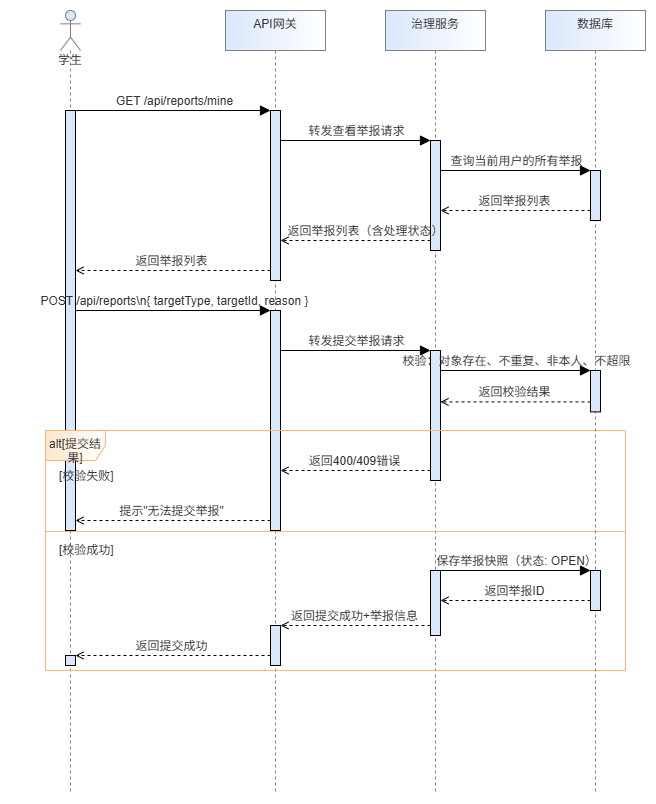

### UC16 管理员治理举报对象

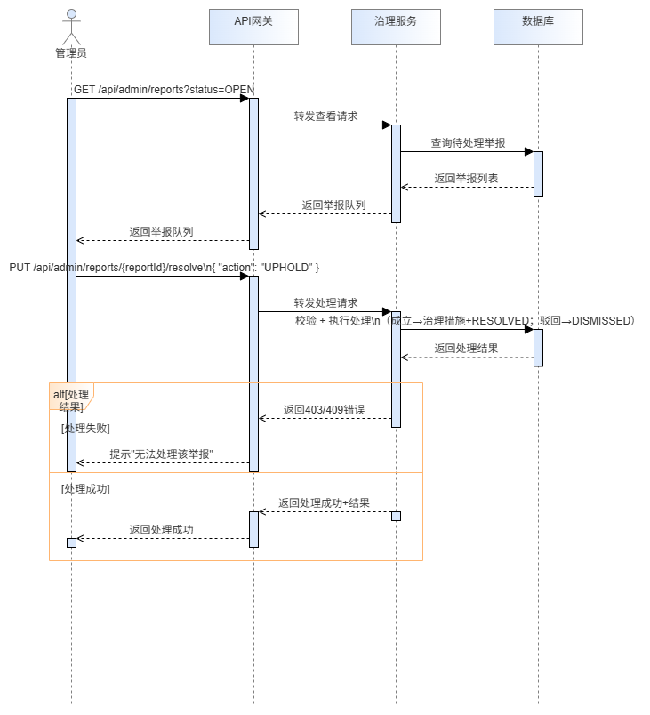

### UC17 管理员管理用户、商品和公开留言

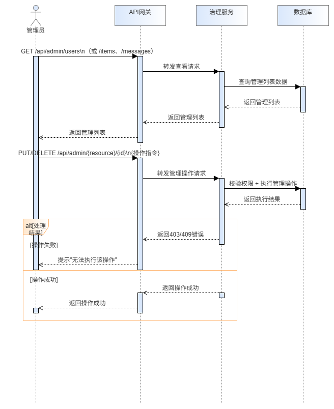

### UC18 平台安全控制一次受保护业务操作


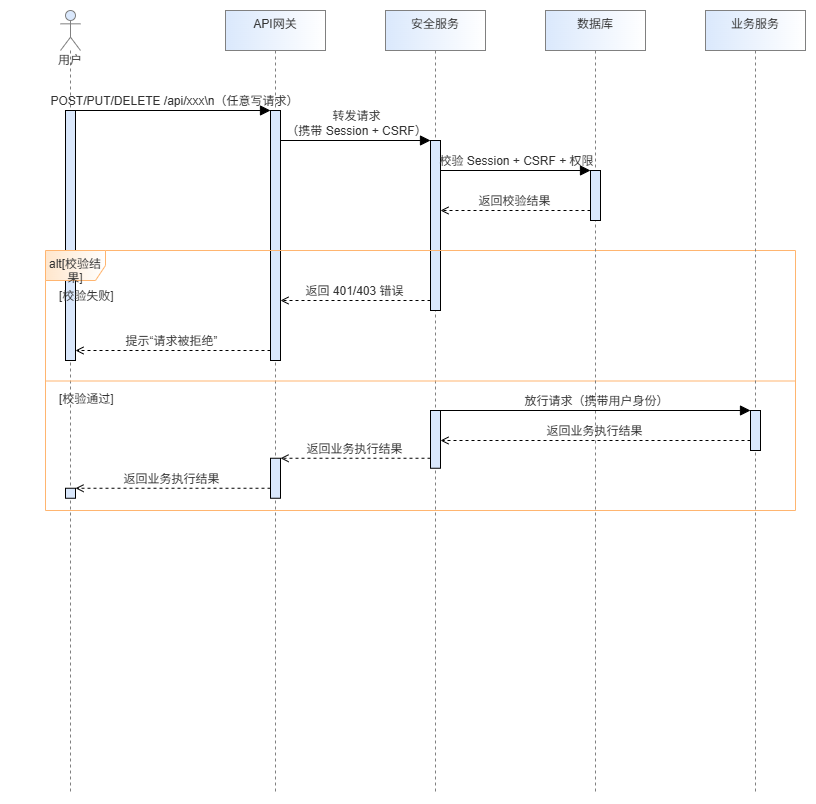
