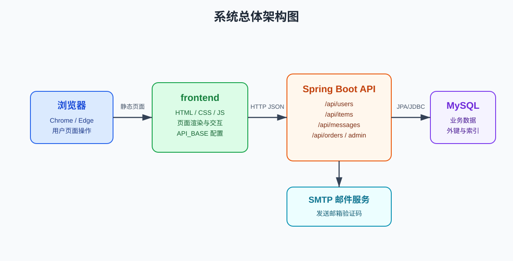
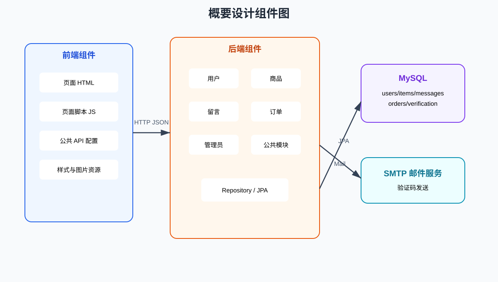
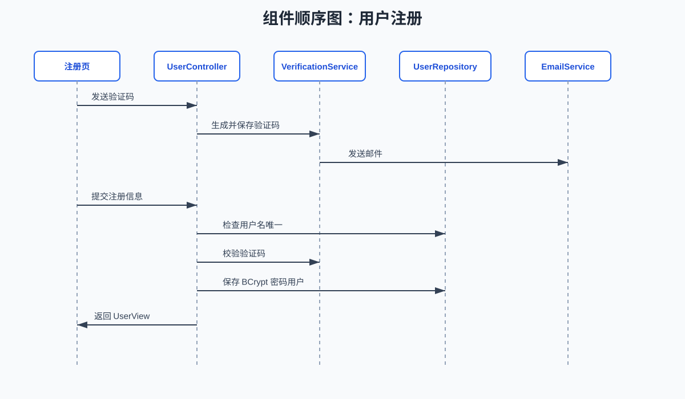

# 校园二手交易平台软件概要设计说明书

## 1 引言

### 1.1 编写目的

本说明书记录校园二手交易平台的总体设计方案，包括设计目标、设计约束、体系结构、子系统划分、用户界面、接口、数据和部署概要，为详细设计和编码实现提供依据。

### 1.2 读者对象

这份说明主要给开发、测试、文档整理和课程验收时查阅。

### 1.3 软件项目概述

校园二手交易平台用于支持校园内二手物品发布、浏览搜索、留言沟通和订单管理。项目采用静态前端、Spring Boot 后端和 MySQL 数据库构成的前后端分离架构。

### 1.4 文档概述

章节安排上，先交代设计约束，再写体系结构、子系统、界面、接口、数据和部署设计。

### 1.5 定义

| 名称 | 定义 |
|---|---|
| 前端 | `frontend/` 下的 HTML、CSS、JavaScript 静态页面。 |
| 后端 | `backend/` 下的 Spring Boot REST API 服务。 |
| 数据库 | MySQL 数据库 `campus_secondhand`。 |
| 统一响应 | 后端接口返回的 `success`、`message`、`data` 结构。 |

### 1.6 参考资料

- 《校园二手交易平台需求规格说明书》
- 项目源码 `backend/`、`frontend/`、`database/`
- Spring Boot、Spring Data JPA、MySQL 官方文档

## 2 软件设计约束

### 2.1 软件设计目标和原则

- 功能上覆盖注册登录、商品、留言、订单、个人资料和管理员管理闭环。
- 架构上保持前后端职责清晰，接口统一使用 HTTP JSON。
- 数据层通过 MySQL 表结构和外键约束维护主要关联关系。
- 安全上不保存明文密码，禁用用户和管理员权限由后端校验。
- 文档内容以当前代码为准，不把没有实现的功能写成已完成。

### 2.2 软件设计的约束和限制

- 前端无工程化构建流程，使用原生 JavaScript。
- 后端采用 Spring Boot 3.5.14 和 Java 24。
- 数据库表结构由 `schema.sql` 管理，JPA 仅校验不自动建表。
- 图片功能为地址保存和展示，不包含本地上传。
- 登录态和管理员权限为课程项目简化方案，不作为生产级安全设计。

### 2.3 设计权衡

| 设计点 | 选择 | 原因 |
|---|---|---|
| 前端形态 | 静态 HTML/CSS/JavaScript | 降低部署复杂度，适合课程演示。 |
| 后端框架 | Spring Boot REST API | 开发效率高，便于组织接口和测试。 |
| 数据访问 | Spring Data JPA | 减少重复 SQL 编写，实体与表结构关系清晰。 |
| 权限模型 | 请求中传递用户 ID 或管理员 ID | 实现简单，能满足课堂演示；如果上线使用，需要再做正式鉴权。 |
| 图片处理 | 保存图片地址 | 避免引入文件存储服务，保持系统范围可控。 |

## 3 软件设计

### 3.1 软件体系结构设计

#### 3.1.1 总体设计

```text
浏览器
  |
  | HTML/CSS/JavaScript
  v
frontend 静态页面
  |
  | HTTP JSON
  v
Spring Boot REST API /api
  |
  | Spring Data JPA
  v
MySQL campus_secondhand
```

前端负责渲染页面、收集输入、显示提示和调用接口。后端负责业务规则、参数校验、权限校验、邮箱验证码、密码散列和数据持久化。数据库负责保存用户、商品、留言、订单和验证码。



图 1 给出了浏览器、前端静态页面、Spring Boot API、MySQL 数据库和 SMTP 邮件服务之间的调用关系。



图 2 给出了前端组件、后端业务组件、数据库组件和邮件服务组件之间的依赖关系。

#### 3.1.2 技术结构

| 层次 | 技术 | 设计说明 |
|---|---|---|
| 表现层 | HTML、CSS、JavaScript | 无构建步骤，页面与脚本按功能拆分。 |
| 接口层 | Spring Web | 提供 `/api` 下 REST 接口。 |
| 业务层 | Controller 内部流程 | 课程项目规模较小，业务校验集中在各模块 Controller。 |
| 数据访问层 | Spring Data JPA | Repository 提供实体查询和保存。 |
| 数据层 | MySQL 8.x | 保存业务数据，使用外键和索引。 |
| 安全相关 | BCrypt、邮箱验证码 | 密码散列、验证码校验、登录失败锁定。 |

#### 3.1.3 子系统设计

| 子系统 | 主要职责 |
|---|---|
| 用户子系统 | 注册、登录、邮箱验证码、忘记密码、资料查询和资料修改。 |
| 商品子系统 | 商品发布、商品列表、关键词搜索、分类筛选和商品详情。 |
| 留言子系统 | 查询商品留言、发送留言、修改自己的留言、删除自己的留言。 |
| 订单子系统 | 创建订单、查询用户相关订单、更新订单状态。 |
| 管理员子系统 | 普通用户状态管理、留言管理、商品上下架管理。 |
| 公共子系统 | 统一响应、跨域配置、邮件发送、全局异常处理。 |

#### 3.1.4 数据流设计

注册数据流：

```text
注册页 -> 发送验证码接口 -> 邮件服务 -> email_verification
注册页 -> 注册接口 -> 验证码校验 -> BCrypt 加密 -> users
```

交易数据流：

```text
首页 -> 商品列表接口 -> items
详情页 -> 留言接口 -> messages
详情页 -> 创建订单接口 -> trade_orders
创建订单接口 -> 更新商品状态 -> items.status = SOLD
```

管理数据流：

```text
管理中心 -> 管理接口 -> requireAdmin(adminId)
管理接口 -> users/messages/items -> 返回管理结果
```

#### 3.1.5 控制流设计

| 场景 | 控制规则 |
|---|---|
| 普通接口调用 | 前端调用 `/api` 接口，后端返回 `ApiResponse`，前端展示结果。 |
| 需要登录的前端操作 | 前端检查 `localStorage` 中的当前用户，不存在则提示先登录。 |
| 后端业务校验 | 后端按用户状态、商品状态、订单状态执行二次校验。 |
| 管理员操作 | 后端必须先执行 `requireAdmin(adminId)`，通过后再修改数据。 |



图 3 给出了用户注册时前端页面、用户控制器、验证码服务、用户仓库和邮件服务之间的组件级调用顺序。

### 3.2 用户界面设计

| 页面 | 文件 | 设计内容 |
|---|---|---|
| 首页 | `index.html`、`main.js` | 商品卡片列表、关键词输入、分类筛选、详情跳转。 |
| 注册页 | `register.html`、`register.js` | 用户名、密码、昵称、邮箱、验证码输入和注册提交。 |
| 个人中心 | `profile.html`、`profile.js` | 登录、忘记密码、资料展示、资料修改、退出登录。 |
| 发布页 | `publish.html`、`publish.js` | 商品标题、分类、价格、图片地址、描述提交。 |
| 详情页 | `detail.html`、`detail.js` | 商品详情、留言列表、留言编辑删除、创建订单。 |
| 订单页 | `orders.html`、`orders.js` | 买家和卖家相关订单列表、状态更新。 |
| 管理中心 | `admin.html`、`admin.js` | 普通用户管理、留言管理、商品管理。 |

页面间通过普通链接和 URL 查询参数跳转。商品详情页使用 `detail.html?id={itemId}` 读取商品 ID。

### 3.3 用例设计

| 用例 | 参与者 | 设计要点 |
|---|---|---|
| 浏览商品 | 游客、注册用户 | 前端调用 `GET /api/items`，后端只返回 `ON_SALE` 商品。 |
| 注册账号 | 游客 | 先发送邮箱验证码，再提交注册信息，后端保存 BCrypt 密码散列。 |
| 登录账号 | 注册用户、管理员 | 支持用户名或邮箱登录，失败 3 次锁定 10 分钟。 |
| 发布商品 | 注册用户 | 前端读取当前用户 ID，后端校验卖家存在且未禁用。 |
| 留言沟通 | 注册用户 | 后端校验发送者存在且未禁用，留言按商品查询。 |
| 创建订单 | 注册用户 | 后端校验商品状态、买卖双方、重复订单并联动商品售出。 |
| 管理内容 | 管理员 | 每个管理接口校验 `adminId` 对应用户角色。 |

### 3.4 接口概要设计

接口统一返回：

```json
{
  "success": true,
  "message": "success",
  "data": {}
}
```

| 模块 | 接口类型 | 说明 |
|---|---|---|
| 用户 | `/users/**` | 注册、登录、验证码、忘记密码、资料管理。 |
| 商品 | `/items/**` | 商品列表、详情、发布。 |
| 留言 | `/messages/**` | 商品留言查询、发送、修改、删除。 |
| 订单 | `/orders/**` | 订单创建、查询、状态更新。 |
| 管理员 | `/admin/**` | 用户、留言、商品管理。 |

#### 3.4.1 主要接口清单

| 方法 | 路径 | 说明 |
|---|---|---|
| `POST` | `/api/users/send-verification` | 发送注册或邮箱修改验证码。 |
| `POST` | `/api/users/register` | 注册普通用户。 |
| `POST` | `/api/users/login` | 用户名或邮箱登录。 |
| `POST` | `/api/users/forgot-password/send-code` | 忘记密码发送验证码。 |
| `POST` | `/api/users/forgot-password/reset` | 重置密码。 |
| `GET` | `/api/users/{id}` | 查询用户资料。 |
| `PUT` | `/api/users/{id}` | 修改用户资料。 |
| `GET` | `/api/items` | 查询商品列表。 |
| `GET` | `/api/items/{id}` | 查询商品详情。 |
| `POST` | `/api/items` | 发布商品。 |
| `GET` | `/api/messages/item/{itemId}` | 查询商品留言。 |
| `POST` | `/api/messages` | 发送留言。 |
| `PUT` | `/api/messages/{id}` | 修改自己的留言。 |
| `DELETE` | `/api/messages/{id}` | 删除自己的留言。 |
| `GET` | `/api/orders` | 查询当前用户相关订单。 |
| `POST` | `/api/orders` | 创建订单。 |
| `PUT` | `/api/orders/{id}/status` | 更新订单状态。 |
| `GET` | `/api/admin/users` | 管理员查询普通用户。 |
| `PUT` | `/api/admin/users/{id}/status` | 管理员修改用户状态。 |
| `GET` | `/api/admin/messages` | 管理员查询全部留言。 |
| `DELETE` | `/api/admin/messages/{id}` | 管理员删除留言。 |
| `GET` | `/api/admin/items` | 管理员查询全部商品。 |
| `PUT` | `/api/admin/items/{id}/status` | 管理员修改商品状态。 |

### 3.5 类与包概要设计

```text
com.campus.secondhand
├── admin
├── common
├── item
├── message
├── order
└── user
```

| 包 | 代表类 | 说明 |
|---|---|---|
| `admin` | `AdminController` | 管理员操作入口。 |
| `common` | `ApiResponse`、`CorsConfig`、`EmailService`、`GlobalExceptionHandler` | 公共基础能力。 |
| `item` | `Item`、`ItemRepository`、`ItemController` | 商品实体、查询和接口。 |
| `message` | `Message`、`MessageRepository`、`MessageController` | 留言实体、查询和接口。 |
| `order` | `TradeOrder`、`TradeOrderRepository`、`TradeOrderController` | 订单实体、查询和接口。 |
| `user` | `User`、`UserController`、`VerificationService` | 用户、验证码和账号流程。 |

### 3.6 数据设计

| 表名 | 主要字段 | 说明 |
|---|---|---|
| `users` | `username`、`password_hash`、`email`、`role`、`status`、`locked_until` | 用户账号和状态。 |
| `items` | `title`、`category`、`price`、`image_url`、`seller_id`、`status` | 商品信息。 |
| `messages` | `item_id`、`sender_id`、`receiver_id`、`content` | 商品留言。 |
| `trade_orders` | `item_id`、`buyer_id`、`seller_id`、`status` | 交易订单。 |
| `email_verification` | `email`、`code`、`expires_at`、`attempts`、`used` | 邮箱验证码。 |

主要关系：

- 一个用户可发布多个商品。
- 一个商品可拥有多条留言。
- 一个订单关联一个商品、一个买家和一个卖家。
- 验证码按邮箱保存，用于注册、修改邮箱和重置密码。

#### 3.6.1 状态设计

| 对象 | 状态 | 含义 |
|---|---|---|
| 用户 | `ACTIVE` | 正常可登录和操作。 |
| 用户 | `DISABLED` | 被管理员禁用，不可登录、发布、留言或下单。 |
| 商品 | `ON_SALE` | 在售，可展示，可下单。 |
| 商品 | `SOLD` | 已售出，首页不展示。 |
| 商品 | `REMOVED` | 被管理员下架，首页不展示。 |
| 订单 | `CREATED` | 订单已创建。 |
| 订单 | `CONFIRMED` | 订单已确认。 |
| 订单 | `COMPLETED` | 订单已完成。 |
| 订单 | `CANCELLED` | 订单已取消。 |

#### 3.6.2 数据一致性策略

- 商品、留言和订单通过外键关联用户与商品。
- 创建订单前检查商品状态和重复订单，创建后立即将商品状态改为 `SOLD`。
- 管理员下架商品只影响商品展示，不删除商品记录。
- 管理员删除留言为物理删除，删除后详情页和管理列表均不再展示。
- 验证码按邮箱查询，校验通过后标记为已使用，避免重复使用。

### 3.7 部署设计

部署时先准备 MySQL 并执行 `database/schema.sql` 和 `database/seed.sql`。后端在 `backend/` 下通过 `mvn spring-boot:run` 启动，默认端口为 `8080`，接口上下文为 `/api`。前端可直接打开 HTML，也可以通过 `python -m http.server 5500` 提供静态访问。

部署结构：

```text
浏览器: http://localhost:5500/index.html
  -> 前端静态资源 frontend/
  -> 后端接口 http://localhost:8080/api
  -> MySQL campus_secondhand
```

### 3.8 设计限制

- 不支持本地图片上传。
- 不支持正式 Token 鉴权。
- 不支持支付、物流、评价和实时聊天。
- 订单状态更新未按买家和卖家细分权限。

## 4 安全设计

### 4.1 密码安全

用户密码不以明文形式保存。注册、重置密码时使用 BCrypt 生成密码散列，登录时使用 BCrypt 校验。

### 4.2 账号保护

连续 3 次登录失败后临时锁定 10 分钟。管理员可禁用普通用户，被禁用用户不能登录、发布商品、发送留言或创建订单。

### 4.3 管理权限

管理员接口要求传入 `adminId`。后端根据 `adminId` 查询用户并校验角色为 `ADMIN`，同时检查管理员账号未被禁用。

### 4.4 安全边界

本项目目前未实现 Token、Session 或 OAuth 鉴权，前端登录态保存在浏览器 `localStorage` 中，适合本次课程验收和本地演示，不适合作为生产系统安全方案。

## 5 可维护性设计

| 设计点 | 说明 |
|---|---|
| 模块分包 | 后端按 `user`、`item`、`message`、`order`、`admin`、`common` 分包。 |
| 页面拆分 | 前端每个页面对应独立 JS 文件。 |
| 配置集中 | 后端数据库、邮件、端口配置集中在 `application.yml`。 |
| 脚本集中 | 数据库建表和演示数据集中在 `database/`。 |
| 文档集中 | 课程文档集中在 `doc/`。 |
