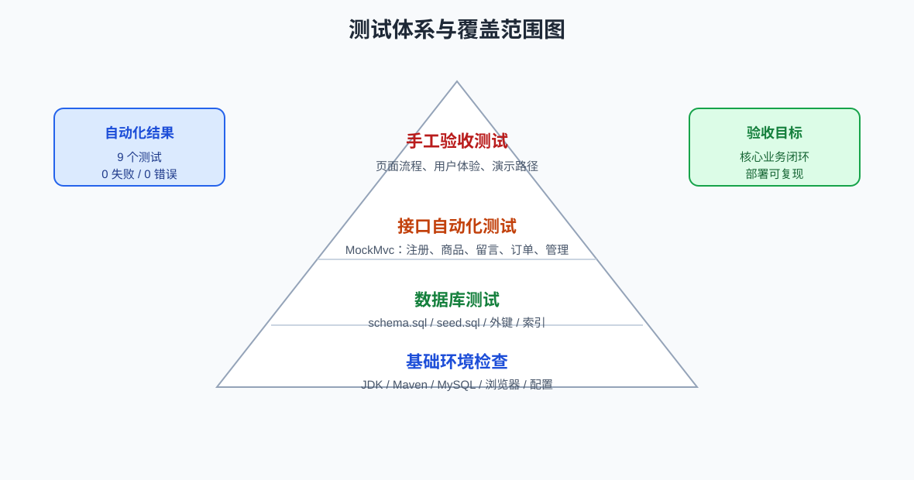

# 校园二手交易平台测试文档（测试报告）

## 1 测试概述

### 1.1 测试目的

本报告汇总校园二手交易平台的测试目标、环境、范围、数据、自动化测试、手工测试、数据库测试、缺陷处理和结论，用来检查系统是否达到《软件需求规格说明书》和课程验收要求。

测试重点包括：

- 用户注册、登录、邮箱验证码、忘记密码和账号锁定流程是否正确。
- 商品发布、浏览、搜索、详情查看是否正确。
- 留言发送、查询、修改、删除权限是否正确。
- 订单创建、重复下单拦截、订单状态更新和商品售出联动是否正确。
- 管理员用户管理、留言管理、商品管理是否正确。
- 数据库脚本、外键、索引、演示数据是否可用于部署和演示。

### 1.2 测试对象

| 测试对象 | 位置 | 说明 |
|---|---|---|
| 后端接口 | `backend/src/main/java/com/campus/secondhand/` | Spring Boot REST API。 |
| 前端页面 | `frontend/` | 静态 HTML、CSS、JavaScript 页面。 |
| 数据库脚本 | `database/schema.sql`、`database/seed.sql` | 建库建表和演示数据。 |
| 自动化测试 | `backend/src/test/java/com/campus/secondhand/SecondhandApplicationTests.java` | MockMvc 后端接口测试。 |

### 1.3 测试策略

测试时没有只依赖一种方式，而是把自动化测试、手工测试和数据库脚本验证放在一起做。

自动化测试主要检查后端业务规则，使用 JUnit 5、Spring Boot Test、MockMvc 和 H2 内存数据库，不依赖本地 MySQL。每个测试方法执行前都会清空用户、商品、留言、订单和验证码数据，避免上一个用例影响下一个用例。

手工测试主要看前端页面、浏览器交互、页面跳转、提示信息和完整业务流程。测试时先启动 MySQL 和后端，再用浏览器打开前端页面。

数据库测试重点检查 `schema.sql` 能否建表、`seed.sql` 能否写入演示账号和商品，同时核对字段、状态值、索引和外键是否与代码一致。



图 1 给出了本项目测试体系由环境检查、数据库测试、接口自动化测试和手工验收测试组成。

### 1.4 测试通过准则

- 后端自动化测试执行 `mvn test` 全部通过。
- 手工测试主要流程均可按预期完成。
- 数据库脚本可在空库环境下成功执行。
- 系统关键错误提示清晰，异常输入不会导致程序崩溃。
- 文档中记录的实现边界与测试结果一致。

### 1.5 测试暂停与恢复准则

出现以下情况时暂停对应测试：

- 后端无法启动，且健康检查接口不可访问。
- 数据库连接失败或表结构校验失败。
- 前端无法访问后端接口。
- SMTP 未配置导致真实邮件验证码无法发送。

处理方式：

- 后端启动失败时先检查 JDK、Maven 和 `application.yml`。
- 数据库失败时重新执行 `schema.sql` 和 `seed.sql`。
- 前端请求失败时检查 `frontend/assets/js/api.js` 中的 `API_BASE`。
- 邮件不可用时记录为环境配置问题，自动化测试可使用直接写入验证码数据的方式覆盖验证码校验逻辑。

## 2 测试环境

### 2.1 软件环境

| 项目 | 内容 |
|---|---|
| 操作系统 | Windows |
| 后端 | Java 24、Spring Boot 3.5.14、Maven |
| 数据库 | MySQL 8.x；自动化测试使用 H2 |
| 前端 | HTML、CSS、JavaScript |
| 浏览器 | Chrome 或 Edge |
| 测试框架 | JUnit 5、Spring Boot Test、MockMvc |
| 测试配置 | `backend/src/test/resources/application-test.yml` |

### 2.2 测试启动顺序

1. 执行 `database/schema.sql` 创建数据库和表。
2. 执行 `database/seed.sql` 导入演示用户和商品。
3. 检查 `backend/src/main/resources/application.yml` 中数据库账号和密码。
4. 在 `backend/` 下执行 `mvn spring-boot:run` 启动后端。
5. 打开 `frontend/index.html`，或在 `frontend/` 下执行 `python -m http.server 5500` 后访问 `http://localhost:5500/index.html`。
6. 按测试用例执行前端手工测试。

### 2.3 后端自动化测试环境

自动化测试使用 `test` profile 和 H2 内存数据库。测试类使用 `@SpringBootTest` 加载完整 Spring 上下文，使用 `@AutoConfigureMockMvc` 注入 MockMvc 直接调用接口。

每个测试执行前调用 Repository 清理数据：

- `TradeOrderRepository.deleteAll()`
- `MessageRepository.deleteAll()`
- `ItemRepository.deleteAll()`
- `UserRepository.deleteAll()`
- `EmailVerificationRepository.deleteAll()`

## 3 测试数据

### 3.1 演示账号

| 用户名 | 密码 | 角色 | 状态 | 用途 |
|---|---|---|---|---|
| `admin` | `abc123` | `ADMIN` | `ACTIVE` | 管理员登录、用户管理、留言管理、商品管理。 |
| `alice` | `abc123` | `USER` | `ACTIVE` | 普通用户演示，发布商品或作为卖家。 |
| `bob` | `abc123` | `USER` | `ACTIVE` | 普通用户演示，浏览、留言、下单。 |

### 3.2 演示商品

| 商品 | 分类 | 价格 | 卖家 | 图片 |
|---|---|---:|---|---|
| 高等数学教材 | 书籍 | 18.00 | `alice` | `assets/images/book.svg` |
| 宿舍小台灯 | 生活用品 | 25.00 | `bob` | `assets/images/lamp.svg` |
| 二手蓝牙耳机 | 电子产品 | 68.00 | `alice` | `assets/images/earphone.svg` |

### 3.3 自动化测试数据

自动化测试在 H2 中动态创建用户、验证码、商品、留言和订单。常用测试数据如下：

| 数据 | 值 |
|---|---|
| 默认密码 | `abc123` |
| 注册验证码 | `123456` |
| 重置密码验证码 | `654321` |
| 测试商品 | `二手教材`、分类 `书籍`、价格 `20` |
| 测试留言 | `这个还能便宜吗？` |
| 修改后留言 | `明天可以当面交易吗？` |

## 4 测试范围

### 4.1 范围内测试

| 模块 | 测试内容 |
|---|---|
| 用户模块 | 注册、用户名登录、邮箱登录、错误密码、账号锁定、忘记密码、资料修改。 |
| 商品模块 | 发布商品、列表展示、关键词搜索、分类筛选、详情查看。 |
| 留言模块 | 发送留言、查询留言、修改自己的留言、删除自己的留言。 |
| 订单模块 | 创建订单、重复下单拦截、订单状态更新、商品售出联动。 |
| 管理员模块 | 禁用或恢复用户、删除留言、下架或恢复商品。 |
| 数据库 | 建表脚本、演示数据、字段、索引和外键。 |
| 前端页面 | 首页、注册页、个人中心、发布页、详情页、订单页、管理中心。 |

### 4.2 范围外测试

以下功能当前项目未实现，不作为本轮测试范围：

- 在线支付。
- 物流配送。
- 商品评价。
- 实时聊天。
- 本地图片文件上传。
- Token、Session 或 OAuth 生产级认证。
- 高并发压力测试。

## 5 自动化测试

### 5.1 执行方式

执行命令：

```bash
cd backend
mvn test
```

测试类：

```text
backend/src/test/java/com/campus/secondhand/SecondhandApplicationTests.java
```

最近一次执行记录：

| 执行日期 | 执行命令 | 测试数量 | 失败 | 错误 | 跳过 | 结果 |
|---|---|---:|---:|---:|---:|---|
| 2026-06-24 | `mvn test` | 9 | 0 | 0 | 0 | BUILD SUCCESS |

### 5.2 自动化测试用例汇总

| 编号 | 用例名称 | 测试内容 | 结果 |
|---|---|---|---|
| T-BE-001 | `contextLoads` | Spring Boot 上下文加载。 | 通过 |
| T-BE-002 | `registerLoginAndRejectWrongPassword` | 注册、用户名登录、邮箱登录、错误密码提示。 | 通过 |
| T-BE-003 | `lockUserAfterThreeFailedLogins` | 连续 3 次登录失败后账号锁定。 | 通过 |
| T-BE-004 | `resetPasswordWithVerificationCodeAndLoginWithNewPassword` | 验证码重置密码，旧密码失效，新密码可登录。 | 通过 |
| T-BE-005 | `publishAndSearchItems` | 发布商品并按关键词搜索。 | 通过 |
| T-BE-006 | `sendAndListMessages` | 发送留言并查询商品留言。 | 通过 |
| T-BE-007 | `updateAndDeleteOwnMessageOnly` | 只能修改和删除自己的留言。 | 通过 |
| T-BE-008 | `adminCanManageUsersMessagesAndItems` | 管理员禁用用户、删除留言、下架商品。 | 通过 |
| T-BE-009 | `createOrderMarksItemSoldAndValidatesStatus` | 创建订单、商品售出、重复下单拦截、状态校验。 | 通过 |

### 5.2.1 测试用例规格表

| 测试用例编号 | 对应需求/用例 | 测试目标 | 前置条件 | 输入数据 | 执行步骤 | 预期结果 | 实际结果 |
|---|---|---|---|---|---|---|---|
| TC-001 | UC-01、UC-02 | 验证注册和登录流程 | 验证码存在 | `testuser`、`abc123`、`test@example.com`、`123456` | 注册账号；用户名登录；邮箱登录；错误密码登录 | 注册成功；两种登录成功；错误密码失败 | 通过 |
| TC-002 | UC-02 | 验证登录失败锁定 | 用户 `lockuser` 存在 | 错误密码 `wrong123` | 连续 3 次错误登录；锁定后使用正确密码登录 | 第 3 次后锁定 10 分钟；锁定期正确密码也失败 | 通过 |
| TC-003 | UC-03 | 验证忘记密码 | 用户邮箱和验证码存在 | `reset@example.com`、`654321`、`new123` | 重置密码；旧密码登录；新密码登录 | 重置成功；旧密码失败；新密码成功 | 通过 |
| TC-004 | UC-04、UC-05 | 验证商品发布和搜索 | 卖家用户存在 | 高等数学教材、书籍、18 | 发布商品；按“数学”搜索 | 发布成功；搜索结果包含商品 | 通过 |
| TC-005 | UC-06 | 验证留言发送和查询 | 买家、卖家、商品存在 | `这个还能便宜吗？` | 发送留言；查询商品留言 | 留言保存；列表显示发送者昵称和内容 | 通过 |
| TC-006 | UC-06 | 验证留言修改删除权限 | 买家、其他用户、留言存在 | 修改后的留言内容 | 买家修改；其他用户删除；买家删除 | 修改成功；非本人删除失败；本人删除成功 | 通过 |
| TC-007 | UC-08 | 验证管理员管理 | 管理员、用户、留言、商品存在 | `DISABLED`、`REMOVED` | 禁用用户；删除留言；下架商品；查询首页 | 用户禁用；留言删除；下架商品不展示 | 通过 |
| TC-008 | UC-07 | 验证创建订单 | 买家、卖家、在售商品存在 | 商品 ID、买家 ID、卖家 ID | 创建订单；重复下单；更新状态；查询商品 | 首次成功；重复失败；状态更新成功；商品为 `SOLD` | 通过 |
| TC-009 | UC-07 | 验证订单非法状态 | 订单存在 | `WRONG` | 调用订单状态更新接口 | 返回“订单状态不合法” | 通过 |

### 5.3 自动化测试用例明细

#### 5.3.1 T-BE-001 Spring Boot 上下文加载

| 项目 | 内容 |
|---|---|
| 前置条件 | 测试依赖可加载，`application-test.yml` 配置正确。 |
| 输入 | 无。 |
| 操作 | 执行 `contextLoads()`。 |
| 预期结果 | Spring 容器启动成功，测试方法无异常。 |
| 检查点 | Controller、Repository、配置类可以被 Spring 管理。 |

#### 5.3.2 T-BE-002 注册、登录和错误密码

| 项目 | 内容 |
|---|---|
| 前置条件 | H2 数据库为空，写入邮箱 `test@example.com` 的验证码 `123456`。 |
| 输入 | 用户名 `testuser`、密码 `abc123`、邮箱 `test@example.com`。 |
| 操作 | 调用 `/users/register` 注册；调用 `/users/login` 使用用户名登录；调用 `/users/login` 使用邮箱登录；使用错误密码登录。 |
| 预期结果 | 注册成功；用户名登录成功；邮箱登录成功；错误密码返回失败。 |
| 检查点 | `$.success=true`，返回用户名为 `testuser`；错误密码提示剩余尝试次数。 |

#### 5.3.3 T-BE-003 登录失败锁定

| 项目 | 内容 |
|---|---|
| 前置条件 | 写入用户 `lockuser`，密码为 `abc123`。 |
| 输入 | 连续提交错误密码 `wrong123`。 |
| 操作 | 连续 3 次调用 `/users/login`；锁定后再使用正确密码登录。 |
| 预期结果 | 第 3 次错误后提示账号锁定 10 分钟；锁定期间正确密码也不能登录。 |
| 检查点 | 返回消息为“密码错误次数过多，账号已锁定10分钟”和“账号已被临时锁定，请10分钟后再试”。 |

#### 5.3.4 T-BE-004 忘记密码重置

| 项目 | 内容 |
|---|---|
| 前置条件 | 写入用户 `resetuser`，邮箱 `reset@example.com`，验证码 `654321`。 |
| 输入 | 新密码 `new123`。 |
| 操作 | 调用 `/users/forgot-password/reset`；使用旧密码登录；使用新密码登录。 |
| 预期结果 | 重置成功；旧密码失效；新密码可登录。 |
| 检查点 | 返回“密码重置成功”；新密码登录后返回用户名 `resetuser`。 |

#### 5.3.5 T-BE-005 商品发布和搜索

| 项目 | 内容 |
|---|---|
| 前置条件 | 写入卖家用户 `seller`。 |
| 输入 | 商品标题 `高等数学教材`、分类 `书籍`、价格 `18`。 |
| 操作 | 调用 `POST /items` 发布商品；调用 `GET /items?keyword=数学` 搜索。 |
| 预期结果 | 商品发布成功；搜索结果包含该商品。 |
| 检查点 | 返回商品标题正确；搜索结果数量为 1，分类为 `书籍`。 |

#### 5.3.6 T-BE-006 留言发送和查询

| 项目 | 内容 |
|---|---|
| 前置条件 | 写入卖家 `seller`、买家 `buyer` 和测试商品。 |
| 输入 | 留言内容 `这个还能便宜吗？`。 |
| 操作 | 调用 `POST /messages` 发送留言；调用 `GET /messages/item/{itemId}` 查询留言。 |
| 预期结果 | 留言保存成功；商品留言列表包含该留言。 |
| 检查点 | 返回留言内容正确；返回 `senderNickname=buyer`。 |

#### 5.3.7 T-BE-007 修改和删除自己的留言

| 项目 | 内容 |
|---|---|
| 前置条件 | 写入卖家、买家、其他用户和测试商品，买家先发送一条留言。 |
| 输入 | 修改内容 `明天可以当面交易吗？`。 |
| 操作 | 买家修改留言；其他用户尝试删除留言；买家删除留言；再次查询留言列表。 |
| 预期结果 | 买家可修改自己的留言；其他用户删除失败；买家删除成功；列表为空。 |
| 检查点 | 非本人删除返回“只能删除自己的留言”；删除后列表数量为 0。 |

#### 5.3.8 T-BE-008 管理员管理用户、留言和商品

| 项目 | 内容 |
|---|---|
| 前置条件 | 写入管理员 `admin`、卖家 `seller`、买家 `buyer`、商品和留言。 |
| 输入 | 用户状态 `DISABLED`、商品状态 `REMOVED`。 |
| 操作 | 管理员禁用买家；买家尝试登录；管理员删除留言；管理员下架商品；查询首页商品列表。 |
| 预期结果 | 买家状态变为禁用；被禁用用户不能登录；留言删除成功；商品下架后首页不展示。 |
| 检查点 | 用户状态为 `DISABLED`；登录提示“账号已被管理员禁用”；首页商品列表数量为 0。 |

#### 5.3.9 T-BE-009 创建订单和状态校验

| 项目 | 内容 |
|---|---|
| 前置条件 | 写入卖家、买家和在售商品。 |
| 输入 | 商品 ID、买家 ID、卖家 ID。 |
| 操作 | 创建订单；再次对同一商品创建订单；更新订单状态为 `CONFIRMED`；更新非法状态 `WRONG`；查询商品详情。 |
| 预期结果 | 首次创建成功；重复下单失败；合法状态更新成功；非法状态被拒绝；商品状态变为 `SOLD`。 |
| 检查点 | 订单状态为 `CREATED` 和 `CONFIRMED`；重复下单提示“物品已被下单或售出”；非法状态提示“订单状态不合法”；商品状态为 `SOLD`。 |

## 6 手工测试

### 6.1 手工测试准备

| 项目 | 内容 |
|---|---|
| 后端地址 | `http://localhost:8080/api` |
| 前端入口 | `frontend/index.html` 或 `http://localhost:5500/index.html` |
| 管理员账号 | `admin / abc123` |
| 普通用户账号 | `alice / abc123`、`bob / abc123` |
| 浏览器 | Chrome 或 Edge |

### 6.2 首页浏览和搜索

| 编号 | 操作步骤 | 测试数据 | 预期结果 | 结果 |
|---|---|---|---|---|
| T-FE-001 | 打开首页 | 无 | 展示可售商品列表。 | 通过 |
| T-FE-002 | 输入关键词并搜索 | `数学` | 显示标题包含“数学”的商品。 | 通过 |
| T-FE-003 | 选择分类筛选 | `书籍` | 显示书籍分类商品。 | 通过 |
| T-FE-004 | 点击商品卡片 | 高等数学教材 | 跳转到 `detail.html?id={itemId}`。 | 通过 |
| T-FE-005 | 搜索不存在的关键词 | `不存在商品` | 页面显示空列表或无匹配商品提示。 | 通过 |

### 6.3 注册、登录和密码重置

| 编号 | 操作步骤 | 测试数据 | 预期结果 | 结果 |
|---|---|---|---|---|
| T-FE-006 | 注册页填写合法信息并发送验证码 | 新用户名、新邮箱 | 验证码发送请求成功。 | 通过 |
| T-FE-007 | 输入正确验证码并注册 | 邮箱收到的验证码 | 注册成功，返回登录或提示成功。 | 通过 |
| T-FE-008 | 使用用户名和密码登录 | `alice / abc123` | 登录成功，个人资料显示。 | 通过 |
| T-FE-009 | 使用邮箱和密码登录 | `alice@example.com / abc123` | 登录成功，个人资料显示。 | 通过 |
| T-FE-010 | 连续输入错误密码 3 次 | 错误密码 | 账号锁定 10 分钟。 | 通过 |
| T-FE-011 | 使用已注册邮箱重置密码 | 邮箱验证码、新密码 | 新密码可登录，旧密码失效。 | 通过 |
| T-FE-012 | 被禁用账号尝试登录 | 管理员先禁用用户 | 登录失败并提示账号被禁用。 | 通过 |

### 6.4 个人资料维护

| 编号 | 操作步骤 | 测试数据 | 预期结果 | 结果 |
|---|---|---|---|---|
| T-FE-013 | 登录后进入个人中心 | `alice / abc123` | 显示用户名、昵称、手机号、邮箱、角色和状态。 | 通过 |
| T-FE-014 | 修改昵称和手机号 | 新昵称、新手机号 | 保存成功，页面显示新资料。 | 通过 |
| T-FE-015 | 修改邮箱但不输入验证码 | 新邮箱 | 后端拒绝修改。 | 通过 |
| T-FE-016 | 修改邮箱并输入验证码 | 新邮箱、验证码 | 邮箱修改成功。 | 通过 |
| T-FE-017 | 点击退出登录 | 无 | 清理登录态，需要重新登录才能发布或下单。 | 通过 |

### 6.5 商品发布

| 编号 | 操作步骤 | 测试数据 | 预期结果 | 结果 |
|---|---|---|---|---|
| T-FE-018 | 未登录访问发布页 | 无 | 提示先登录。 | 通过 |
| T-FE-019 | 登录后填写商品信息并发布 | 标题、分类、价格、图片地址、描述 | 发布成功并跳转首页。 | 通过 |
| T-FE-020 | 发布后返回首页 | 新商品标题 | 新商品出现在可售列表。 | 通过 |
| T-FE-021 | 缺少必填项提交 | 空标题或空价格 | 前端或后端提示提交失败。 | 通过 |

### 6.6 留言沟通

| 编号 | 操作步骤 | 测试数据 | 预期结果 | 结果 |
|---|---|---|---|---|
| T-FE-022 | 进入商品详情页 | 任意商品 | 显示商品信息和留言列表。 | 通过 |
| T-FE-023 | 未登录发送留言 | 留言内容 | 提示先登录。 | 通过 |
| T-FE-024 | 登录后发送留言 | `这个还在吗？` | 留言保存并刷新显示。 | 通过 |
| T-FE-025 | 修改自己的留言 | 新留言内容 | 留言内容更新。 | 通过 |
| T-FE-026 | 删除自己的留言 | 无 | 留言从列表移除。 | 通过 |

### 6.7 订单管理

| 编号 | 操作步骤 | 测试数据 | 预期结果 | 结果 |
|---|---|---|---|---|
| T-FE-027 | 买家创建订单 | 买家不是卖家，商品在售 | 订单创建成功，状态为 `CREATED`。 | 通过 |
| T-FE-028 | 再次对同一商品下单 | 同一商品 | 返回“物品已被下单或售出”。 | 通过 |
| T-FE-029 | 卖家或买家查看订单页 | 当前登录用户 | 展示与当前用户相关的订单。 | 通过 |
| T-FE-030 | 更新订单状态 | `CONFIRMED`、`COMPLETED`、`CANCELLED` | 状态更新成功。 | 通过 |
| T-FE-031 | 输入非法状态 | `WRONG` | 后端拒绝更新。 | 通过 |

### 6.8 管理中心

| 编号 | 操作步骤 | 测试数据 | 预期结果 | 结果 |
|---|---|---|---|---|
| T-FE-032 | 管理员登录并进入管理中心 | `admin / abc123` | 可访问管理页面。 | 通过 |
| T-FE-033 | 普通用户访问管理中心 | `alice / abc123` | 无管理员权限或不能执行管理操作。 | 通过 |
| T-FE-034 | 禁用普通用户 | 选择普通用户 | 用户状态变为 `DISABLED`。 | 通过 |
| T-FE-035 | 恢复普通用户 | 选择已禁用用户 | 用户状态变为 `ACTIVE`。 | 通过 |
| T-FE-036 | 删除留言 | 选择留言 | 留言从列表和商品详情页移除。 | 通过 |
| T-FE-037 | 下架商品 | 选择商品 | 商品状态变为 `REMOVED`，首页不展示。 | 通过 |
| T-FE-038 | 恢复商品 | 选择已下架商品 | 商品状态变为 `ON_SALE`，首页可展示。 | 通过 |

## 7 数据库测试

### 7.1 建表测试

执行 `database/schema.sql` 后应创建：

```text
users
items
messages
trade_orders
email_verification
```

检查 SQL：

```sql
USE campus_secondhand;
SHOW TABLES;
```

预期结果：上述 5 张表均存在。

### 7.2 字段测试

检查 SQL：

```sql
DESC users;
DESC items;
DESC messages;
DESC trade_orders;
DESC email_verification;
```

检查重点：

- `users.password_hash` 为 `VARCHAR(255)` 且非空。
- `users.role` 默认值为 `USER`。
- `users.status` 默认值为 `ACTIVE`。
- `items.price` 为 `DECIMAL(10,2)`。
- `items.status` 默认值为 `ON_SALE`。
- `messages.content` 长度为 `VARCHAR(500)`。
- `email_verification.used` 默认值为 `FALSE`。

### 7.3 索引和外键测试

检查 SQL：

```sql
SHOW INDEX FROM items;
SHOW INDEX FROM messages;
SHOW INDEX FROM trade_orders;
SELECT TABLE_NAME, CONSTRAINT_NAME
FROM information_schema.TABLE_CONSTRAINTS
WHERE TABLE_SCHEMA = 'campus_secondhand'
  AND CONSTRAINT_TYPE = 'FOREIGN KEY';
```

预期结果：

- `items` 包含分类状态索引和卖家索引。
- `messages` 包含商品 ID 索引。
- `trade_orders` 包含买家和卖家索引。
- 商品、留言、订单表存在对应外键约束。

### 7.4 演示数据测试

执行 `database/seed.sql` 后检查：

```sql
SELECT username, role, status FROM users;
SELECT title, category, price, status FROM items;
```

预期结果：

- 管理员 `admin` 存在，角色为 `ADMIN`，状态为 `ACTIVE`。
- 普通用户 `alice`、`bob` 存在，角色为 `USER`。
- 演示商品“高等数学教材”“宿舍小台灯”“二手蓝牙耳机”存在。
- 商品默认状态为 `ON_SALE`。

### 7.5 数据库异常场景

| 场景 | 操作 | 预期结果 |
|---|---|---|
| 重复执行 `seed.sql` | 连续导入演示数据 | 用户使用 `ON DUPLICATE KEY UPDATE` 更新，不重复插入用户。 |
| 删除被商品引用的用户 | 删除 `alice` | 数据库外键阻止删除，避免孤立商品。 |
| 插入不存在卖家的商品 | `seller_id` 使用不存在 ID | 数据库外键阻止插入。 |
| 后端连接旧表结构 | 未执行最新 `schema.sql` | JPA validate 失败，部署文档要求重建或迁移数据库。 |

## 8 缺陷与处理

| 编号 | 问题 | 严重程度 | 处理方式 | 状态 |
|---|---|---|---|---|
| D-001 | 旧数据库结构和当前实体不一致 | 高 | 部署文档要求备份后重建数据库，并执行最新 `schema.sql`。 | 已说明 |
| D-002 | SMTP 未配置导致验证码发送失败 | 中 | 部署文档说明需配置可用 SMTP 服务；自动化测试通过直接写入验证码覆盖校验逻辑。 | 已说明 |
| D-003 | 图片上传需求与实现不一致 | 中 | 文档明确本项目目前使用图片地址，不支持文件上传。 | 已说明 |
| D-004 | 权限模型较简单 | 中 | 文档明确为课程项目简化实现，后面可以再改成 Token 鉴权。 | 已说明 |
| D-005 | 订单状态更新未区分买家和卖家权限 | 低 | 需求和设计文档列为实现边界，课程演示阶段可接受。 | 已说明 |

## 9 回归测试

缺陷修复或功能调整后，需执行以下回归测试：

1. 执行 `mvn test`，确认后端自动化测试全部通过。
2. 重新打开首页，确认商品列表、搜索和分类筛选正常。
3. 使用普通用户登录，完成发布商品、留言、创建订单流程。
4. 使用管理员登录，完成禁用用户、删除留言、下架商品流程。
5. 检查数据库中商品、留言、订单状态是否与页面一致。

## 10 需求覆盖情况

| 需求用例 | 覆盖测试用例 | 覆盖情况 |
|---|---|---|
| UC-01 注册账号 | TC-001 | 已测试 |
| UC-02 登录系统 | TC-001、TC-002 | 已测试 |
| UC-03 重置密码 | TC-003 | 已测试 |
| UC-04 浏览搜索商品 | TC-004、T-FE-001 至 T-FE-005 | 已测试 |
| UC-05 发布商品 | TC-004、T-FE-018 至 T-FE-021 | 已测试 |
| UC-06 留言沟通 | TC-005、TC-006、T-FE-022 至 T-FE-026 | 已测试 |
| UC-07 创建订单/管理订单 | TC-008、TC-009、T-FE-027 至 T-FE-031 | 已测试 |
| UC-08 管理平台内容 | TC-007、T-FE-032 至 T-FE-038 | 已测试 |

## 11 测试结论

当前系统已测试校园二手交易平台的主要业务流程：注册登录、密码重置、商品浏览与发布、留言沟通、订单创建与管理、个人资料维护和管理员管理。后端自动化测试覆盖主要接口和关键业务规则，手工测试覆盖主要页面流程，数据库测试覆盖表结构、演示数据、索引和外键。

综合测试结果表明，系统满足课程项目验收要求。本项目目前仍保留课程项目级简化边界，包括本地图片上传、生产级认证、支付物流、实时聊天和高并发压测未实现，相关内容已在需求、设计和部署文档中说明。
