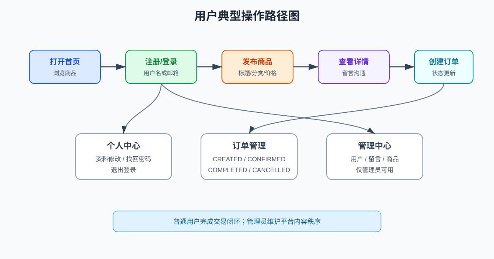
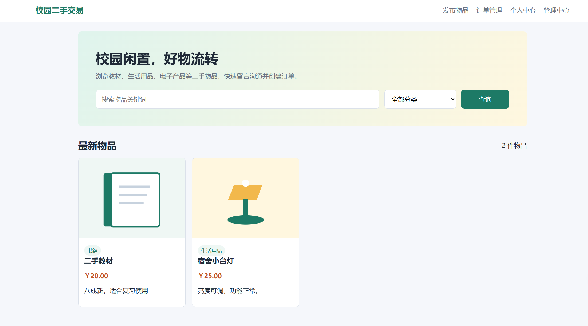
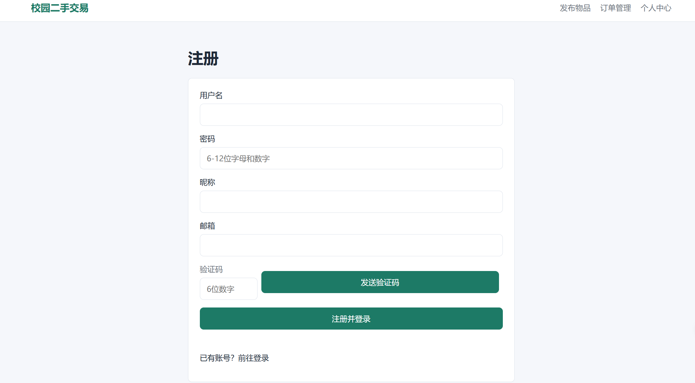
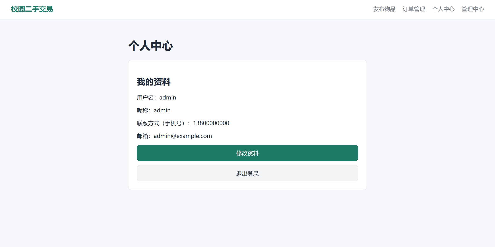
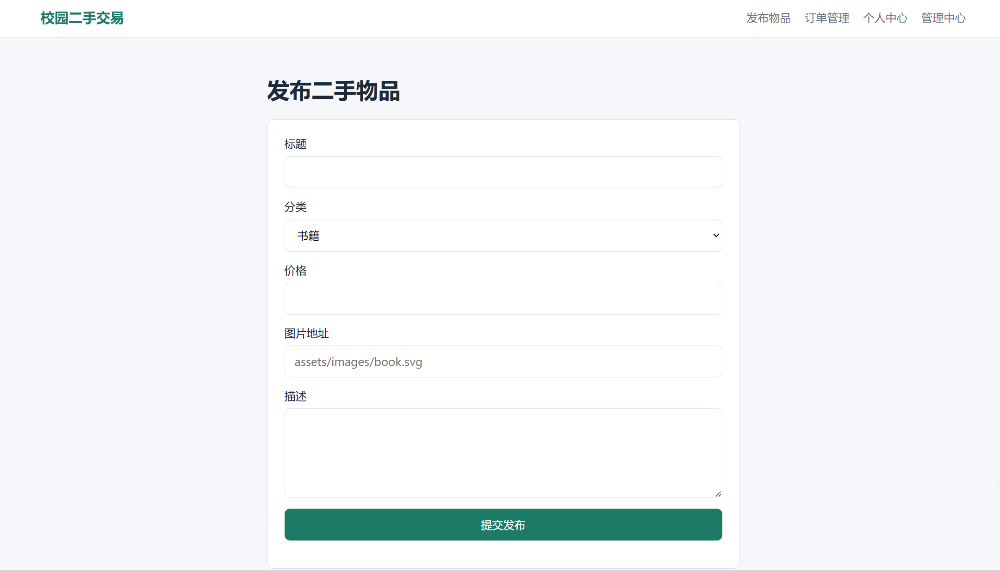
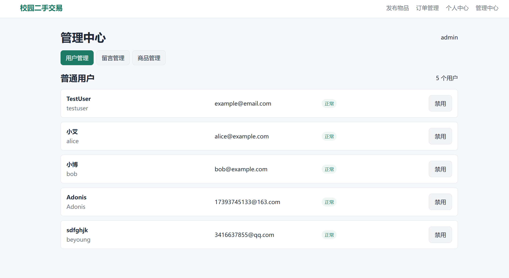

# 校园二手交易平台用户使用说明书

## 1 访客模式

### 1.1 访客访问网站

访客可直接打开：

```text
frontend/index.html
```

也可以通过静态服务器访问：

```text
http://localhost:5500/index.html
```

页面导航包括：首页、注册、发布物品、订单管理、个人中心、管理中心。



图 1 给出了普通用户从浏览商品、登录、发布、留言、创建订单到订单管理的典型操作路径，以及管理员进入管理中心的入口。

### 1.2 访客访问商品列表

打开首页后，系统自动展示当前可售商品。商品卡片包含图片、分类、标题、价格和描述。

商品列表中只展示状态为在售的商品。已售出或被管理员下架的商品不会出现在首页列表中。



图 2 给出了系统首页，用户可在该页面浏览商品列表，并通过关键词和分类筛选商品。

### 1.3 访客根据分类查看商品

在首页选择商品分类并点击搜索，系统展示该分类下状态为在售的商品。

### 1.4 访客根据关键字和类别进行搜索

1. 在关键词输入框输入商品关键字。
2. 选择商品分类，或保持全部分类。
3. 点击搜索。
4. 查看匹配结果。

### 1.5 访客查看商品详情页

点击商品卡片进入详情页。详情页展示商品图片、标题、分类、价格、描述和留言列表。

访客可以查看留言，但不能发送留言或创建订单。如果尝试执行需要登录的操作，系统会提示先登录。

### 1.6 访客注册

进入注册页：

```text
frontend/register.html
```

操作步骤：

1. 输入用户名。
2. 输入 6 到 12 位字母和数字组合的密码。
3. 输入昵称。
4. 输入邮箱。
5. 点击发送验证码。
6. 从邮箱获取验证码。
7. 输入验证码并提交注册。

用户名不能重复，验证码错误或过期会导致注册失败。



图 3 给出了注册页面，用户需要填写账号信息、邮箱和验证码后完成注册。

### 1.7 访客登录

进入个人中心：

```text
frontend/profile.html
```

选择用户名登录或邮箱登录，输入账号和密码后点击登录。

登录方式：

| 登录方式 | 输入内容 |
|---|---|
| 用户名登录 | 用户名、密码。 |
| 邮箱登录 | 邮箱、密码。 |

演示普通用户：

```text
用户名：alice
密码：abc123
```

```text
用户名：bob
密码：abc123
```



图 4 给出了个人中心页面，该页面包含登录、资料查看、资料修改和忘记密码相关操作。

## 2 用户模式

### 2.1 用户登录

登录成功后，前端会把用户基本信息保存到浏览器 `localStorage`，用于发布、留言和下单。

登录规则：

- 连续 3 次输错密码后账号锁定 10 分钟。
- 被管理员禁用的账号不能登录。
- 退出登录后需要重新登录才能进行需要身份的操作。

### 2.2 用户访问商品列表

用户登录后仍可在首页浏览所有在售商品。浏览和搜索方式与访客一致。

### 2.3 用户发布商品

进入发布页：

```text
frontend/publish.html
```

操作步骤：

1. 确认已经登录。
2. 输入商品标题。
3. 选择分类。
4. 输入价格。
5. 输入图片地址，例如 `assets/images/book.svg`。
6. 输入描述。
7. 点击发布。

本项目目前不支持从本地选择图片上传，只支持填写图片地址。

填写建议：

| 字段 | 建议 |
|---|---|
| 标题 | 使用“物品名称 + 简短特征”，例如“高等数学教材”。 |
| 分类 | 选择与物品最接近的分类。 |
| 价格 | 输入数字，不建议填写文字。 |
| 图片地址 | 可使用 `assets/images/book.svg` 等静态资源路径。 |
| 描述 | 写明新旧程度、交易方式和注意事项。 |

发布失败常见原因：

- 未登录。
- 标题、分类、价格或卖家 ID 缺失。
- 当前账号已被管理员禁用。

### 2.4 用户查看商品详情页

在首页点击商品卡片进入详情页。详情页展示商品信息、留言列表和创建订单入口。

### 2.5 用户留言

查看留言不需要登录，发送留言需要登录。

发送留言：

1. 登录账号。
2. 进入商品详情页。
3. 输入留言内容。
4. 点击发送。

修改或删除留言：

1. 找到自己发送的留言。
2. 点击编辑或删除。
3. 编辑后保存，或确认删除。

留言注意事项：

- 留言内容不能为空。
- 留言内容最长 500 字符。
- 只能修改或删除自己发送的留言。
- 管理员可删除不合规留言。

### 2.6 用户创建订单

登录后在商品详情页点击创建订单。

创建规则：

- 不能购买自己发布的商品。
- 已售出或已下架商品不能下单。
- 创建订单成功后，商品状态变为 `SOLD`，首页不再展示该商品。

创建订单失败时可按以下方向检查：

| 提示 | 处理 |
|---|---|
| 请先登录 | 进入个人中心登录后重试。 |
| 不能购买自己发布的物品 | 换用其他用户账号购买。 |
| 物品已被下单或售出 | 选择其他在售商品。 |
| 账号已被管理员禁用 | 联系管理员恢复账号。 |

### 2.7 用户管理订单

进入订单管理页：

```text
frontend/orders.html
```

页面显示当前用户作为买家或卖家的订单。可将订单状态更新为：

- 确认：`CONFIRMED`
- 完成：`COMPLETED`
- 取消：`CANCELLED`

订单状态含义：

| 状态 | 含义 |
|---|---|
| `CREATED` | 订单已创建。 |
| `CONFIRMED` | 订单已确认。 |
| `COMPLETED` | 订单已完成。 |
| `CANCELLED` | 订单已取消。 |



图 5 给出了订单管理页面，用户可查看自己作为买家或卖家的订单，并更新订单状态。

### 2.8 用户查看个人资料

进入个人中心后，登录用户可查看用户名、昵称、手机号、邮箱、角色和状态。

### 2.9 用户更改个人信息

可修改昵称、手机号和邮箱。修改邮箱时需要发送并输入新邮箱验证码。

### 2.10 用户找回密码

在个人中心点击忘记密码。

操作步骤：

1. 输入已注册邮箱。
2. 点击发送验证码。
3. 输入收到的验证码。
4. 输入新密码。
5. 提交重置。
6. 使用新密码重新登录。

新密码必须为 6 到 12 位字母和数字组合。验证码错误、过期或邮箱未注册时，系统会拒绝重置。

## 3 管理员模式

### 3.1 管理员登录

默认管理员：

```text
用户名：admin
密码：abc123
```

管理员登录后进入：

```text
frontend/admin.html
```

普通用户无管理员权限，不能执行管理操作。



图 6 给出了管理中心页面，管理员可在该页面管理普通用户、留言和商品状态。

### 3.2 管理员管理用户

管理员可查看普通用户列表，并禁用或恢复普通用户。管理员账号本身不能通过该功能修改状态。

操作说明：

1. 使用管理员账号登录。
2. 进入管理中心。
3. 在用户管理区域查看普通用户。
4. 点击禁用或恢复。
5. 确认用户状态变化。

被禁用用户不能登录、发布商品、发送留言或创建订单。

### 3.3 管理员管理留言

管理员可查看全部留言，并删除不合规留言。删除后留言不再出现在商品详情页。

删除留言后不可在页面恢复。如需保留记录，应在删除前人工记录留言内容。

### 3.4 管理员管理商品

管理员可查看全部商品，并将商品下架或恢复为在售。下架商品状态为 `REMOVED`，首页不展示。

商品管理状态：

| 操作 | 商品状态 | 页面影响 |
|---|---|---|
| 下架 | `REMOVED` | 首页不展示。 |
| 恢复 | `ON_SALE` | 首页可重新展示。 |

管理员不能通过该功能直接把商品设置为 `SOLD`。

## 4 常见提示

| 提示 | 含义 |
|---|---|
| 请先登录 | 当前操作需要登录。 |
| 验证码错误或已过期 | 验证码不正确或超过有效期。 |
| 账号已被临时锁定 | 连续输错密码达到 3 次，需要等待 10 分钟。 |
| 账号已被管理员禁用 | 管理员禁用了该账号。 |
| 物品已被下单或售出 | 商品不能重复下单。 |
| 无管理员权限 | 当前用户不是管理员。 |

## 5 典型操作流程

### 5.1 完成一次交易

1. `alice` 登录并发布商品。
2. `bob` 登录并在首页找到该商品。
3. `bob` 进入详情页发送留言。
4. `bob` 点击创建订单。
5. 系统提示订单创建成功。
6. 商品状态变为 `SOLD`，首页不再展示该商品。
7. `alice` 或 `bob` 进入订单管理页查看订单并更新状态。

### 5.2 管理员处理违规商品

1. `admin` 登录系统。
2. 进入管理中心。
3. 在商品管理区域找到目标商品。
4. 点击下架。
5. 商品状态变为 `REMOVED`。
6. 返回首页确认该商品不再展示。

### 5.3 用户修改邮箱

1. 用户登录个人中心。
2. 在资料修改区域输入新邮箱。
3. 点击发送验证码。
4. 在邮箱中获取验证码。
5. 输入验证码并保存资料。
6. 页面显示新的邮箱地址。

## 6 使用限制

- 本项目目前不支持本地图片上传，只能填写图片地址。
- 本项目目前不支持在线支付、物流和评价。
- 本项目目前使用浏览器本地登录态，换浏览器或清理缓存后需要重新登录。
- 管理员权限由后端根据 `adminId` 简化校验，适合本次课程验收和本地演示。
