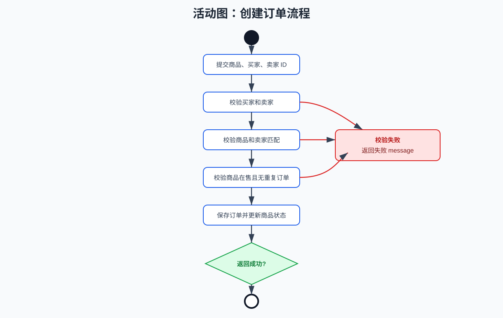
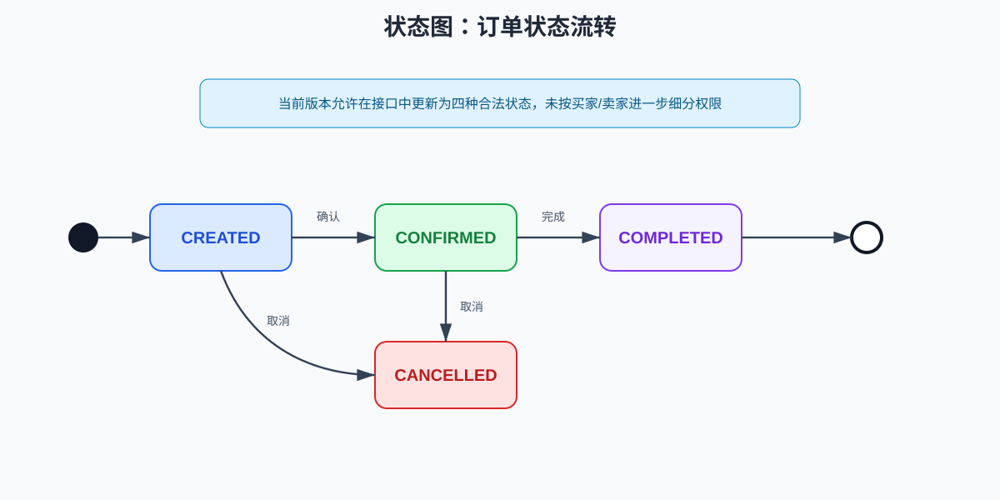
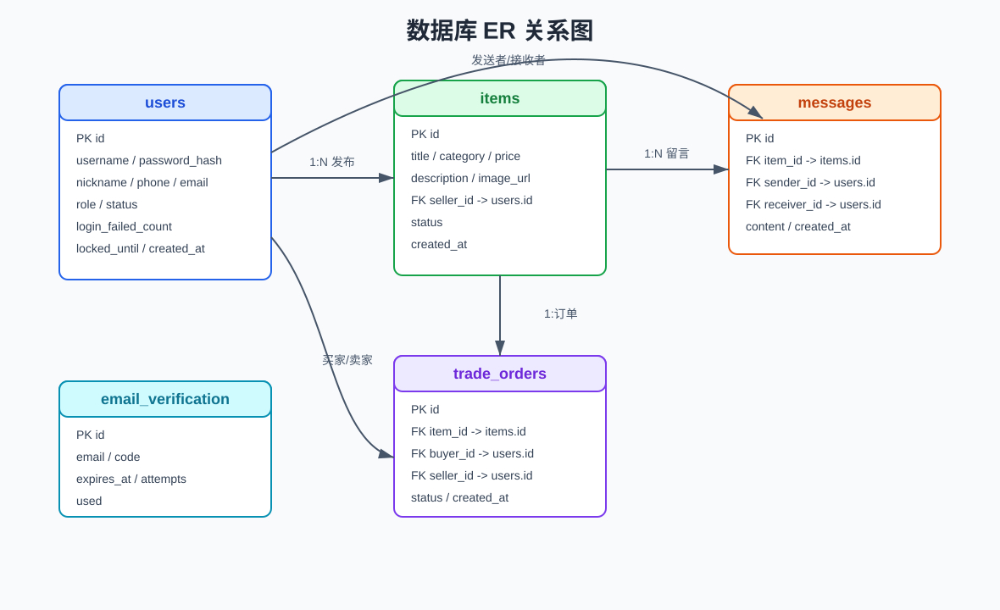
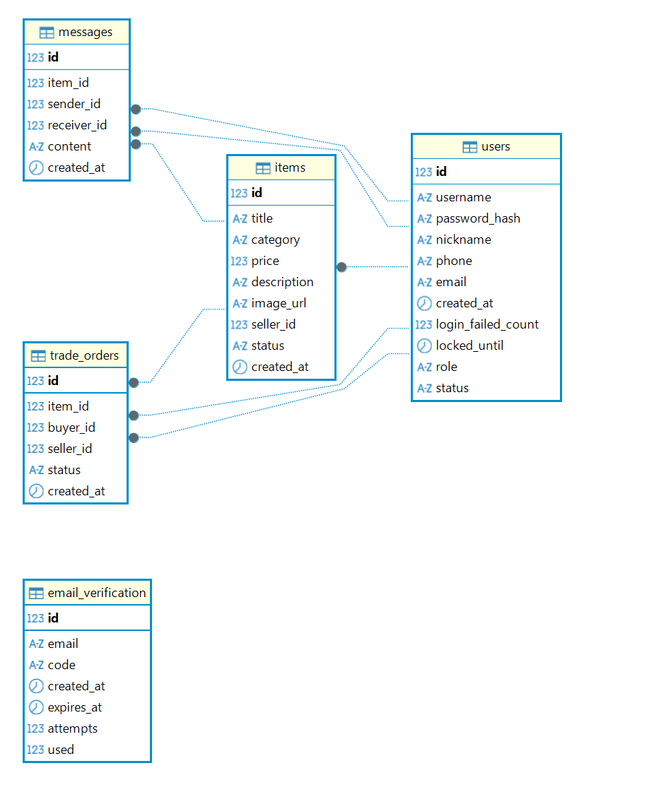

# 校园二手交易平台软件详细设计说明书

## 1 引言

### 1.1 编写目的

这份详细设计是在概要设计的基础上继续展开，重点写清类设计、接口设计、业务流程、数据库字段和前端脚本，方便后续编码、测试和维护时查对。

### 1.2 读者对象

后端开发人员、前端开发人员、测试人员、文档维护人员和课程验收人员。

### 1.3 设计依据

- 《校园二手交易平台需求规格说明书》
- 《校园二手交易平台软件概要设计说明书》
- 当前项目源码和数据库脚本

## 2 后端详细设计

后端包路径为 `com.campus.secondhand`，按业务模块分包。

### 2.1 公共模块

| 类 | 作用 |
|---|---|
| `SecondhandApplication` | Spring Boot 启动类。 |
| `ApiResponse<T>` | 统一接口响应，包含 `success`、`message`、`data`。 |
| `CorsConfig` | 跨域配置，允许前端静态页面访问后端接口。 |
| `EmailService` | 封装邮件发送能力。 |
| `GlobalExceptionHandler` | 处理参数校验等全局异常。 |

统一响应结构：

```json
{
  "success": true,
  "message": "success",
  "data": {}
}
```

公共模块设计细节：

| 类 | 关键设计 |
|---|---|
| `ApiResponse<T>` | 通过泛型承载不同接口数据，成功和失败返回结构一致。 |
| `CorsConfig` | 允许静态前端跨域访问后端接口，便于本地 HTML 或静态服务器访问。 |
| `EmailService` | 屏蔽邮件发送细节，验证码服务只依赖发送能力。 |
| `GlobalExceptionHandler` | 对参数校验异常等统一处理，减少 Controller 中重复错误处理。 |

### 2.2 用户模块

主要文件：

- `User.java`
- `UserRepository.java`
- `UserController.java`
- `EmailVerification.java`
- `EmailVerificationRepository.java`
- `VerificationService.java`

#### 2.2.1 用户实体

`User` 对应 `users` 表。

| 字段 | 说明 |
|---|---|
| `id` | 主键。 |
| `username` | 用户名，唯一。 |
| `passwordHash` | BCrypt 密码散列。 |
| `nickname` | 昵称。 |
| `phone` | 手机号。 |
| `email` | 邮箱。 |
| `role` | `USER` 或 `ADMIN`。 |
| `status` | `ACTIVE` 或 `DISABLED`。 |
| `loginFailedCount` | 连续登录失败次数。 |
| `lockedUntil` | 临时锁定截止时间。 |
| `createdAt` | 创建时间。 |

#### 2.2.2 注册流程

接口：`POST /api/users/register`

1. 校验用户名是否已存在。
2. 调用 `VerificationService.verifyCode(email, code)` 校验邮箱验证码。
3. 使用 `BCryptPasswordEncoder` 加密密码。
4. 创建用户，默认角色为 `USER`，默认状态为 `ACTIVE`。
5. 返回 `UserView`，不返回密码散列。

#### 2.2.3 登录流程

接口：`POST /api/users/login`

1. 根据 `loginType` 判断使用用户名还是邮箱登录。
2. 查询用户是否存在。
3. 若用户状态为 `DISABLED`，返回账号禁用。
4. 若 `lockedUntil` 晚于当前时间，返回临时锁定。
5. 使用 BCrypt 校验密码。
6. 密码错误时失败次数加 1；达到 3 次后设置锁定 10 分钟。
7. 密码正确时清空失败次数和锁定时间。
8. 返回 `UserView`。

#### 2.2.4 忘记密码流程

接口：

- `POST /api/users/forgot-password/send-code`
- `POST /api/users/forgot-password/reset`

1. 发送验证码前检查邮箱是否已注册。
2. 重置密码时校验邮箱、验证码和新密码格式。
3. 验证码正确后使用 BCrypt 保存新密码。

#### 2.2.5 资料修改流程

接口：`PUT /api/users/{id}`

1. 查询用户。
2. 修改昵称和手机号。
3. 若邮箱变更，则必须校验新邮箱验证码。
4. 保存并返回最新 `UserView`。

#### 2.2.6 用户模块接口明细

| 方法 | 路径 | 请求参数 | 成功返回 | 失败场景 |
|---|---|---|---|---|
| `POST` | `/users/send-verification` | `email` | 验证码已发送 | 邮件发送失败 |
| `POST` | `/users/register` | `username`、`password`、`nickname`、`email`、`code` | `UserView` | 用户名已存在、验证码错误 |
| `POST` | `/users/login` | `username` 或 `email`、`loginType`、`password` | `UserView` | 密码错误、账号禁用、账号锁定 |
| `GET` | `/users/{id}` | 路径 ID | `UserView` | 用户不存在 |
| `PUT` | `/users/{id}` | `nickname`、`phone`、`email`、`emailCode` | `UserView` | 用户不存在、验证码错误 |
| `GET` | `/users/check` | `username`、`email` | 是否存在 | 无 |
| `POST` | `/users/forgot-password/send-code` | `email` | 验证码已发送 | 邮箱未注册、发送失败 |
| `POST` | `/users/forgot-password/reset` | `email`、`code`、`newPassword` | 密码重置成功 | 验证码错误、邮箱未注册 |

#### 2.2.7 验证码设计

验证码由 `VerificationService` 负责生成、保存和校验。验证码记录包含邮箱、验证码、创建时间、过期时间、尝试次数和使用状态。注册、修改邮箱和忘记密码共享同一套验证码机制。

### 2.3 商品模块

主要文件：

- `Item.java`
- `ItemRepository.java`
- `ItemController.java`

#### 2.3.1 商品实体

`Item` 对应 `items` 表，核心字段包括 `title`、`category`、`price`、`description`、`imageUrl`、`sellerId`、`status`、`createdAt`。

| 状态 | 说明 |
|---|---|
| `ON_SALE` | 在售，可在首页展示，可创建订单。 |
| `SOLD` | 已售出，不再出现在首页列表。 |
| `REMOVED` | 管理员下架，不再出现在首页列表。 |

#### 2.3.2 商品列表

接口：`GET /api/items`

- 有 `keyword` 时，按标题包含关键字查询 `ON_SALE` 商品。
- 无关键字但有 `category` 时，按分类查询 `ON_SALE` 商品。
- 无参数时，查询全部 `ON_SALE` 商品。
- 列表按创建时间倒序返回。

#### 2.3.3 商品发布

接口：`POST /api/items`

1. 校验卖家是否存在。
2. 校验卖家是否被禁用。
3. 保存标题、分类、价格、描述、图片地址和卖家 ID。
4. 商品默认状态为 `ON_SALE`。

#### 2.3.4 商品模块接口明细

| 方法 | 路径 | 请求参数 | 说明 |
|---|---|---|---|
| `GET` | `/items` | `category`、`keyword` 可选 | 查询在售商品列表。 |
| `GET` | `/items/{id}` | 商品 ID | 查询商品详情。 |
| `POST` | `/items` | `title`、`category`、`price`、`description`、`imageUrl`、`sellerId` | 发布商品。 |

#### 2.3.5 商品状态转换

```text
发布商品 -> ON_SALE
创建订单成功 -> SOLD
管理员下架 -> REMOVED
管理员恢复 -> ON_SALE
```

`SOLD` 状态通常由订单创建触发，管理员恢复商品时只允许设置为 `ON_SALE` 或 `REMOVED`。

### 2.4 留言模块

主要文件：

- `Message.java`
- `MessageRepository.java`
- `MessageController.java`

#### 2.4.1 留言实体

`Message` 对应 `messages` 表，字段包括 `itemId`、`senderId`、`receiverId`、`content`、`createdAt`。

#### 2.4.2 查询留言

接口：`GET /api/messages/item/{itemId}`

返回按创建时间升序排列的留言列表。返回视图 `MessageView` 增加 `senderNickname`，便于前端展示。

#### 2.4.3 发送留言

接口：`POST /api/messages`

1. 校验发送者是否存在。
2. 校验发送者是否被禁用。
3. 保存商品 ID、发送者 ID、接收者 ID 和内容。

#### 2.4.4 修改与删除留言

接口：

- `PUT /api/messages/{id}`
- `DELETE /api/messages/{id}`

规则：

- 只有留言发送者本人可以修改。
- 只有留言发送者本人可以删除。
- 管理员删除任意留言由 `/api/admin/messages/{id}` 实现。

#### 2.4.5 留言模块接口明细

| 方法 | 路径 | 请求参数 | 说明 |
|---|---|---|---|
| `GET` | `/messages/item/{itemId}` | 商品 ID | 查询某商品留言，按创建时间升序。 |
| `POST` | `/messages` | `itemId`、`senderId`、`receiverId`、`content` | 发送留言。 |
| `PUT` | `/messages/{id}` | `senderId`、`content` | 修改自己的留言。 |
| `DELETE` | `/messages/{id}` | `senderId` | 删除自己的留言。 |

#### 2.4.6 留言视图设计

普通留言实体仅保存发送者 ID。接口返回时组装 `MessageView`，增加 `senderNickname` 字段，便于前端直接显示留言发送者名称。

### 2.5 订单模块

主要文件：

- `TradeOrder.java`
- `TradeOrderRepository.java`
- `TradeOrderController.java`

#### 2.5.1 订单实体

`TradeOrder` 对应 `trade_orders` 表，字段包括 `itemId`、`buyerId`、`sellerId`、`status`、`createdAt`。

| 状态 | 说明 |
|---|---|
| `CREATED` | 订单已创建。 |
| `CONFIRMED` | 订单已确认。 |
| `COMPLETED` | 订单已完成。 |
| `CANCELLED` | 订单已取消。 |

#### 2.5.2 创建订单

接口：`POST /api/orders`

1. 校验买家存在。
2. 校验卖家存在。
3. 校验买家或卖家未被禁用。
4. 校验商品存在。
5. 校验请求卖家与商品卖家一致。
6. 校验买家不能等于卖家。
7. 校验商品状态为 `ON_SALE`，且不存在该商品的非取消订单。
8. 保存订单，默认状态为 `CREATED`。
9. 将商品状态修改为 `SOLD`。



图 1 给出了创建订单的详细活动流程，包括买家卖家校验、商品校验、重复订单校验、保存订单和更新商品状态。

#### 2.5.3 查询订单

接口：`GET /api/orders?userId={id}`

查询当前用户作为买家或卖家的订单，按创建时间倒序返回。返回视图 `OrderView` 包含商品标题、价格、买家昵称和卖家昵称。

#### 2.5.4 更新订单状态

接口：`PUT /api/orders/{id}/status`

- 状态必须属于 `CREATED`、`CONFIRMED`、`COMPLETED`、`CANCELLED`。
- 状态非法时返回“订单状态不合法”。
- 本项目目前未按买家和卖家细分状态更新权限。



图 2 给出了订单从创建、确认、完成到取消的状态流转关系。

#### 2.5.5 订单模块接口明细

| 方法 | 路径 | 请求参数 | 说明 |
|---|---|---|---|
| `GET` | `/orders?userId={id}` | 当前用户 ID | 查询用户作为买家或卖家的订单。 |
| `POST` | `/orders` | `itemId`、`buyerId`、`sellerId` | 创建订单。 |
| `PUT` | `/orders/{id}/status` | `status` | 更新订单状态。 |

#### 2.5.6 订单视图设计

订单列表接口返回 `OrderView`，除订单基础字段外，还包含商品标题、商品价格、买家昵称和卖家昵称，减少前端二次查询。

### 2.6 管理员模块

主要文件：`AdminController.java`

#### 2.6.1 管理员鉴权

所有管理员接口均通过 `requireAdmin(adminId)` 校验：

1. 查询 `adminId` 对应用户。
2. 用户不存在则返回“管理员不存在”。
3. 角色不是 `ADMIN` 则返回“无管理员权限”。
4. 管理员账号被禁用则返回“管理员账号已被禁用”。

#### 2.6.2 用户管理

接口：

- `GET /api/admin/users?adminId={id}`
- `PUT /api/admin/users/{id}/status`

规则：

- 用户列表只返回普通用户。
- 可设置普通用户状态为 `ACTIVE` 或 `DISABLED`。
- 不允许修改管理员账号。

#### 2.6.3 留言管理

接口：

- `GET /api/admin/messages?adminId={id}`
- `DELETE /api/admin/messages/{id}`

管理员可查看全部留言，并删除任意留言。

#### 2.6.4 商品管理

接口：

- `GET /api/admin/items?adminId={id}`
- `PUT /api/admin/items/{id}/status`

管理员可查看全部商品，并将商品状态设置为 `ON_SALE` 或 `REMOVED`。

#### 2.6.5 管理员接口明细

| 方法 | 路径 | 请求参数 | 说明 |
|---|---|---|---|
| `GET` | `/admin/users` | `adminId` | 查询普通用户列表。 |
| `PUT` | `/admin/users/{id}/status` | `adminId`、`status` | 修改普通用户状态。 |
| `GET` | `/admin/messages` | `adminId` | 查询全部留言。 |
| `DELETE` | `/admin/messages/{id}` | `adminId` | 删除任意留言。 |
| `GET` | `/admin/items` | `adminId` | 查询全部商品。 |
| `PUT` | `/admin/items/{id}/status` | `adminId`、`status` | 下架或恢复商品。 |

## 3 前端详细设计

### 3.1 公共接口封装

`frontend/assets/js/api.js` 定义后端地址：

```javascript
const API_BASE = "http://localhost:8080/api";
```

各页面 JS 通过该地址调用后端接口，并根据统一响应结构处理成功和失败提示。

### 3.2 首页

文件：

- `frontend/index.html`
- `frontend/assets/js/main.js`

功能：

- 加载 `GET /api/items`。
- 读取关键词和分类筛选条件。
- 渲染商品卡片。
- 点击商品卡片跳转到 `detail.html?id={itemId}`。

### 3.3 注册页

文件：

- `frontend/register.html`
- `frontend/assets/js/register.js`

功能：

- 调用 `/api/users/send-verification` 发送验证码。
- 调用 `/api/users/register` 注册账号。
- 对密码、邮箱、验证码等输入进行基础校验。

### 3.4 个人中心

文件：

- `frontend/profile.html`
- `frontend/assets/js/profile.js`

功能：

- 用户名登录和邮箱登录。
- 忘记密码发送验证码与重置密码。
- 显示当前登录用户资料。
- 修改昵称、手机号和邮箱。
- 退出登录并清理 `localStorage`。

### 3.5 发布页

文件：

- `frontend/publish.html`
- `frontend/assets/js/publish.js`

功能：

- 检查是否登录。
- 提交商品标题、分类、价格、图片地址、描述和当前用户 ID。
- 发布成功后跳转首页。

### 3.6 详情页

文件：

- `frontend/detail.html`
- `frontend/assets/js/detail.js`

功能：

- 根据 URL 中的商品 ID 查询商品详情。
- 查询并展示商品留言。
- 登录用户可发送留言。
- 留言发送者可编辑或删除自己的留言。
- 登录用户可创建订单。

### 3.7 订单页

文件：

- `frontend/orders.html`
- `frontend/assets/js/orders.js`

功能：

- 检查是否登录。
- 调用 `/api/orders?userId={id}` 查询订单。
- 调用 `/api/orders/{id}/status` 更新订单状态。

### 3.8 管理中心

文件：

- `frontend/admin.html`
- `frontend/assets/js/admin.js`

功能：

- 检查当前用户是否为管理员。
- 查询普通用户并禁用或恢复账号。
- 查询全部留言并删除留言。
- 查询全部商品并下架或恢复商品。

### 3.9 前端本地状态设计

前端使用浏览器 `localStorage` 保存当前登录用户基本信息。页面加载时根据本地用户信息判断是否展示需要登录的操作。

| 状态 | 用途 |
|---|---|
| 当前用户 ID | 发布商品、发送留言、创建订单、查询订单。 |
| 当前用户角色 | 判断是否允许进入管理中心。 |
| 当前用户名或昵称 | 页面展示当前登录用户。 |

退出登录时清理本地登录态。当前实现不保存密码或密码散列。

### 3.10 前端异常处理

| 场景 | 前端处理 |
|---|---|
| 未登录访问发布或订单页 | 提示先登录。 |
| 接口返回 `success=false` | 展示后端返回的 `message`。 |
| 商品不存在 | 展示错误提示或空状态。 |
| 非管理员访问管理中心 | 提示无管理员权限。 |
| 表单必填项为空 | 阻止提交或展示失败提示。 |

## 4 数据库详细设计



图 3 给出了用户、商品、留言、订单和邮箱验证码五张核心表之间的关系。



图 4 给出了数据库表结构或管理工具中的数据库视图，可与本章列出的字段设计互相对照。

### 4.1 `users`

| 字段 | 类型 | 约束 | 说明 |
|---|---|---|---|
| `id` | BIGINT | 主键，自增 | 用户 ID。 |
| `username` | VARCHAR(50) | 非空，唯一 | 用户名。 |
| `password_hash` | VARCHAR(255) | 非空 | BCrypt 密码散列。 |
| `nickname` | VARCHAR(80) | 可空 | 昵称。 |
| `phone` | VARCHAR(30) | 可空 | 手机号。 |
| `email` | VARCHAR(100) | 可空 | 邮箱。 |
| `role` | VARCHAR(20) | 默认 `USER` | 用户角色。 |
| `status` | VARCHAR(20) | 默认 `ACTIVE` | 用户状态。 |
| `login_failed_count` | INT | 默认 0 | 登录失败次数。 |
| `locked_until` | DATETIME | 可空 | 锁定截止时间。 |
| `created_at` | DATETIME | 默认当前时间 | 创建时间。 |

### 4.2 `items`

| 字段 | 类型 | 约束 | 说明 |
|---|---|---|---|
| `id` | BIGINT | 主键，自增 | 商品 ID。 |
| `title` | VARCHAR(120) | 非空 | 标题。 |
| `category` | VARCHAR(40) | 非空 | 分类。 |
| `price` | DECIMAL(10,2) | 非空 | 价格。 |
| `description` | VARCHAR(1000) | 可空 | 描述。 |
| `image_url` | VARCHAR(255) | 可空 | 图片地址。 |
| `seller_id` | BIGINT | 外键 | 卖家 ID。 |
| `status` | VARCHAR(20) | 默认 `ON_SALE` | 商品状态。 |
| `created_at` | DATETIME | 默认当前时间 | 创建时间。 |

### 4.3 `messages`

| 字段 | 类型 | 约束 | 说明 |
|---|---|---|---|
| `id` | BIGINT | 主键，自增 | 留言 ID。 |
| `item_id` | BIGINT | 外键 | 商品 ID。 |
| `sender_id` | BIGINT | 外键 | 发送者 ID。 |
| `receiver_id` | BIGINT | 外键 | 接收者 ID。 |
| `content` | VARCHAR(500) | 非空 | 留言内容。 |
| `created_at` | DATETIME | 默认当前时间 | 创建时间。 |

### 4.4 `trade_orders`

| 字段 | 类型 | 约束 | 说明 |
|---|---|---|---|
| `id` | BIGINT | 主键，自增 | 订单 ID。 |
| `item_id` | BIGINT | 外键 | 商品 ID。 |
| `buyer_id` | BIGINT | 外键 | 买家 ID。 |
| `seller_id` | BIGINT | 外键 | 卖家 ID。 |
| `status` | VARCHAR(20) | 默认 `CREATED` | 订单状态。 |
| `created_at` | DATETIME | 默认当前时间 | 创建时间。 |

### 4.5 `email_verification`

| 字段 | 类型 | 约束 | 说明 |
|---|---|---|---|
| `id` | BIGINT | 主键，自增 | 验证码 ID。 |
| `email` | VARCHAR(255) | 非空 | 邮箱。 |
| `code` | VARCHAR(10) | 非空 | 验证码。 |
| `created_at` | DATETIME | 非空 | 创建时间。 |
| `expires_at` | DATETIME | 非空 | 过期时间。 |
| `attempts` | INT | 默认 0 | 尝试次数。 |
| `used` | BOOLEAN | 默认 FALSE | 是否已使用。 |

### 4.6 索引设计

| 表 | 索引 | 作用 |
|---|---|---|
| `items` | `idx_items_category_status` | 支持按分类和状态查询商品。 |
| `items` | `idx_items_seller` | 支持按卖家关联商品。 |
| `messages` | `idx_messages_item` | 支持按商品查询留言。 |
| `trade_orders` | `idx_orders_buyer` | 支持查询买家订单。 |
| `trade_orders` | `idx_orders_seller` | 支持查询卖家订单。 |
| `email_verification` | `idx_email` | 支持按邮箱查询验证码。 |
| `email_verification` | `idx_email_used_expires` | 支持查询未使用且未过期验证码。 |

### 4.7 外键设计

| 外键 | 关系 |
|---|---|
| `fk_items_seller` | 商品卖家关联用户。 |
| `fk_messages_item` | 留言关联商品。 |
| `fk_messages_sender` | 留言发送者关联用户。 |
| `fk_messages_receiver` | 留言接收者关联用户。 |
| `fk_orders_item` | 订单关联商品。 |
| `fk_orders_buyer` | 订单买家关联用户。 |
| `fk_orders_seller` | 订单卖家关联用户。 |

## 5 关键约束

- 后端 `server.servlet.context-path` 为 `/api`。
- JPA 配置为 `ddl-auto: validate`，不会自动建表。
- 商品列表只展示 `ON_SALE` 状态。
- 管理员恢复商品只能设置为 `ON_SALE`，不能直接设置为 `SOLD`。
- 邮箱验证码真实发送依赖 SMTP 配置。
- 本项目目前是课程项目简化权限模型，不适合作为生产环境安全方案。

## 6 错误处理设计

| 错误类型 | 示例提示 |
|---|---|
| 资源不存在 | 用户不存在、物品不存在、留言不存在、订单不存在。 |
| 权限不足 | 无管理员权限、只能修改自己的留言、只能删除自己的留言。 |
| 状态非法 | 用户状态不合法、商品状态不合法、订单状态不合法。 |
| 业务冲突 | 用户名已存在、物品已被下单或售出、不能购买自己发布的物品。 |
| 环境异常 | 发送失败、发送失败请稍后再试。 |

## 7 测试设计关联

详细设计中的主要流程由 `SecondhandApplicationTests` 覆盖。自动化测试包括注册登录、账号锁定、密码重置、商品发布搜索、留言发送查询、留言权限、管理员管理和订单状态校验。前端页面流程由《软件测试文档》的手工测试用例覆盖。
