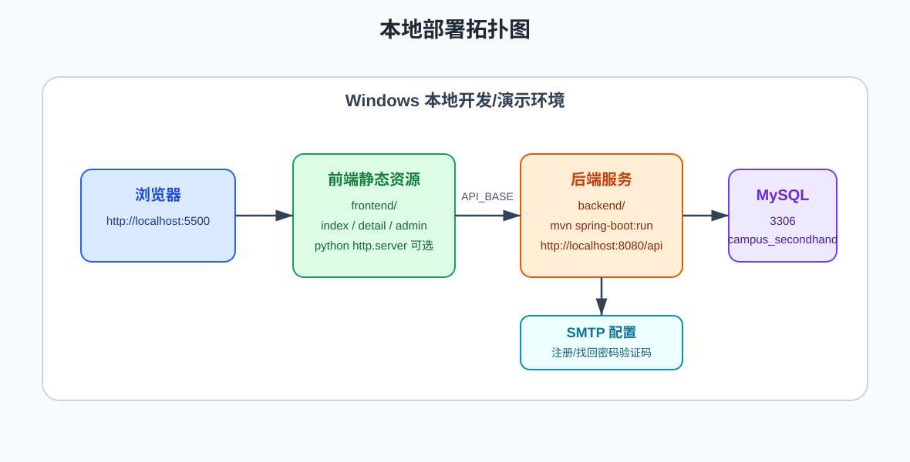

# 校园二手交易平台部署文档

## 1 前言

### 1.1 目的

这里整理了校园二手交易平台在 Windows 本地环境中的安装、配置、启动、验证和常见问题处理方法。

### 1.2 术语与缩略语

| 术语 | 说明 |
|---|---|
| 前端 | `frontend/` 下的静态页面。 |
| 后端 | `backend/` 下的 Spring Boot 服务。 |
| 数据库 | MySQL 数据库 `campus_secondhand`。 |
| SMTP | 用于发送邮箱验证码的邮件服务。 |

## 2 部署环境

### 2.1 本地硬件环境

普通 Windows 个人电脑即可运行本系统。建议至少具备 8 GB 内存，以便同时运行 MySQL、后端服务和浏览器。

### 2.2 软件环境

| 软件 | 建议版本 | 用途 |
|---|---|---|
| JDK | 24.0.2 | 运行 Spring Boot 后端。 |
| Maven | 3.8 或以上 | 构建、测试和启动后端。 |
| MySQL | 8.x | 保存业务数据。 |
| 浏览器 | Chrome、Edge、Firefox | 访问前端页面。 |
| Python | 3.x，可选 | 启动前端静态服务器。 |

检查命令：

```bash
java -version
mvn -version
mysql --version
```

### 2.3 端口规划

| 服务 | 默认端口 | 说明 |
|---|---:|---|
| MySQL | 3306 | 数据库服务端口。 |
| Spring Boot 后端 | 8080 | 后端 API 服务端口。 |
| 前端静态服务器 | 5500 | 可选，使用 Python 启动静态服务时使用。 |

如端口被占用，应先停止占用进程，或修改对应配置。后端端口可在 `application.yml` 的 `server.port` 中修改，前端 API 地址需同步修改 `frontend/assets/js/api.js`。



图 1 给出了本地部署时浏览器、前端静态资源、后端服务、MySQL 和 SMTP 配置之间的关系。

### 2.4 项目目录

项目根目录应包含：

```text
backend/
database/
doc/
frontend/
README.md
```

### 2.5 部署前检查清单

| 检查项 | 通过标准 |
|---|---|
| JDK | `java -version` 能显示 Java 24。 |
| Maven | `mvn -version` 能正常输出 Maven 版本。 |
| MySQL | MySQL 服务已启动，账号密码可登录。 |
| 项目目录 | 存在 `backend/`、`frontend/`、`database/`、`doc/`。 |
| 后端配置 | `application.yml` 中数据库连接信息正确。 |
| 前端配置 | `api.js` 中 `API_BASE` 指向后端地址。 |

## 3 数据库安装部署指南

### 3.1 初始化数据库

登录 MySQL：

```bash
mysql -u root -p
```

执行建库建表脚本：

```sql
source D:/Code/Software/bigwork/Campus_second-hand_trading_platform/database/schema.sql;
```

导入演示数据：

```sql
source D:/Code/Software/bigwork/Campus_second-hand_trading_platform/database/seed.sql;
```

检查表：

```sql
USE campus_secondhand;
SHOW TABLES;
```

应看到：

```text
users
items
messages
trade_orders
email_verification
```

演示管理员：

```text
用户名：admin
密码：abc123
```

### 3.1.1 验证演示数据

执行以下 SQL：

```sql
USE campus_secondhand;
SELECT username, role, status FROM users;
SELECT title, category, price, status FROM items;
```

预期结果：

- 用户表包含 `admin`、`alice`、`bob`。
- `admin` 的角色为 `ADMIN`。
- 商品表包含高等数学教材、宿舍小台灯、二手蓝牙耳机。
- 演示商品状态为 `ON_SALE`。

### 3.2 旧数据库处理

如果本机已有旧版本数据库，建议先备份数据，再执行：

```sql
DROP DATABASE IF EXISTS campus_secondhand;
```

然后重新执行 `schema.sql` 和 `seed.sql`。

### 3.3 数据库备份建议

如果旧库中已有测试数据，可先导出备份：

```bash
mysqldump -u root -p campus_secondhand > campus_secondhand_backup.sql
```

恢复备份示例：

```bash
mysql -u root -p campus_secondhand < campus_secondhand_backup.sql
```

课程演示环境通常可直接重建数据库；如需保留历史数据，应先备份再删除旧库。

## 4 后端安装部署指南

### 4.1 配置后端

配置文件：

```text
backend/src/main/resources/application.yml
```

数据库配置示例：

```yaml
spring:
    datasource:
        url: jdbc:mysql://localhost:3306/campus_secondhand?useUnicode=true&characterEncoding=utf8&serverTimezone=Asia/Shanghai
        username: root
        password: "你的MySQL密码"
```

服务配置：

```yaml
server:
    port: 8080
    servlet:
        context-path: /api
```

邮件配置：

```yaml
spring:
    mail:
        host: smtp.mailtrap.io
        port: 2525
        username: YOUR_MAILTRAP_USERNAME
        password: YOUR_MAILTRAP_PASSWORD
```

注册、修改邮箱和忘记密码依赖邮箱验证码。若需要真实发送邮件，必须替换为可用 SMTP 服务。

### 4.1.1 配置项说明

| 配置项 | 说明 |
|---|---|
| `spring.datasource.url` | MySQL 地址、数据库名和时区。 |
| `spring.datasource.username` | MySQL 用户名。 |
| `spring.datasource.password` | MySQL 密码。 |
| `spring.jpa.hibernate.ddl-auto` | 当前应为 `validate`，后端只校验表结构。 |
| `server.port` | 后端端口，默认 `8080`。 |
| `server.servlet.context-path` | 接口前缀，当前为 `/api`。 |
| `spring.mail.*` | 邮件验证码发送配置。 |

### 4.1.2 后端构建检查

进入后端目录后可先执行测试：

```bash
cd backend
mvn test
```

如果测试通过，说明依赖、编译和核心接口逻辑正常。

### 4.2 启动后端

进入后端目录：

```bash
cd backend
```

启动服务：

```bash
mvn spring-boot:run
```

后端地址：

```text
http://localhost:8080/api
```

健康检查：

```text
http://localhost:8080/api/actuator/health
```

返回 `UP` 表示服务正常。

### 4.3 后端接口快速验证

可在浏览器访问：

```text
http://localhost:8080/api/items
```

预期返回统一 JSON 结构，其中 `success` 为 `true`，`data` 为商品列表。

如果返回 404，应检查 `server.servlet.context-path` 是否为 `/api`；如果连接失败，应检查后端是否启动或端口是否被占用。

## 5 前端安装部署指南

### 5.1 配置前端

前端 API 地址配置文件：

```text
frontend/assets/js/api.js
```

默认配置：

```javascript
const API_BASE = "http://localhost:8080/api";
```

如果前端访问远程后端，应将 `localhost` 改为后端设备 IP。

### 5.2 本地直接访问

可直接打开：

```text
frontend/index.html
```

### 5.3 本地静态服务器访问

进入前端目录：

```bash
cd frontend
```

启动静态服务器：

```bash
python -m http.server 5500
```

访问：

```text
http://localhost:5500/index.html
```

### 5.4 前端页面检查

| 页面 | 检查内容 |
|---|---|
| `index.html` | 商品列表、搜索、分类筛选和详情跳转。 |
| `register.html` | 注册表单和发送验证码按钮。 |
| `profile.html` | 登录、忘记密码、资料展示和资料修改。 |
| `publish.html` | 发布商品表单。 |
| `detail.html` | 商品详情、留言和创建订单。 |
| `orders.html` | 用户相关订单列表和状态更新。 |
| `admin.html` | 用户、留言、商品管理。 |

## 6 部署验证

按以下顺序验证：

1. 首页能打开并显示演示商品。
2. 商品关键词搜索和分类筛选正常。
3. 管理员账号 `admin / abc123` 可登录。
4. 注册用户可发送验证码、注册并登录。
5. 登录用户可发布商品。
6. 商品详情页可发送留言。
7. 可创建订单，创建后商品从首页可售列表移除。
8. 订单管理页可查看并更新订单状态。
9. 管理中心可禁用用户、删除留言、下架商品。

### 6.1 验证记录表

| 编号 | 验证项 | 预期结果 | 结果 |
|---|---|---|---|
| V-01 | 数据库表检查 | 5 张业务表存在。 | 通过 |
| V-02 | 后端健康检查 | `/actuator/health` 返回 `UP`。 | 通过 |
| V-03 | 首页访问 | 展示演示商品。 | 通过 |
| V-04 | 管理员登录 | `admin / abc123` 可登录。 | 通过 |
| V-05 | 商品发布 | 登录用户可发布商品。 | 通过 |
| V-06 | 留言发送 | 登录用户可发送留言。 | 通过 |
| V-07 | 订单创建 | 创建订单后商品变为已售出。 | 通过 |
| V-08 | 管理操作 | 管理员可禁用用户、删除留言、下架商品。 | 通过 |

### 6.2 验证失败处理

| 失败项 | 排查方向 |
|---|---|
| 后端无法启动 | 检查 Java 版本、Maven 依赖、数据库连接和端口占用。 |
| 健康检查失败 | 查看后端控制台日志，确认应用是否完成启动。 |
| 首页无商品 | 检查 `seed.sql` 是否执行，后端 `/api/items` 是否返回数据。 |
| 注册验证码失败 | 检查 SMTP 配置是否可用。 |
| 管理接口失败 | 确认当前用户是 `ADMIN`，请求传入的 `adminId` 正确。 |

## 7 常见问题

### 7.1 数据库连接失败

检查 MySQL 是否启动、数据库是否存在、账号密码是否正确、端口是否为 3306。

### 7.2 表结构校验失败

后端配置为：

```yaml
spring:
    jpa:
        hibernate:
            ddl-auto: validate
```

因此后端不会自动创建表。请先执行 `database/schema.sql`。

### 7.3 前端请求失败

检查后端是否启动，`frontend/assets/js/api.js` 中 `API_BASE` 是否正确。

### 7.4 邮箱验证码发送失败

检查 `spring.mail` 的 SMTP 主机、端口、用户名和密码是否正确。

### 7.5 商品图片不显示

当前系统保存图片地址。请确认地址可被浏览器访问，例如：

```text
assets/images/book.svg
```

### 7.6 端口被占用

如果 `8080` 被占用，可修改 `backend/src/main/resources/application.yml`：

```yaml
server:
    port: 8081
```

同时修改 `frontend/assets/js/api.js`：

```javascript
const API_BASE = "http://localhost:8081/api";
```

### 7.7 管理员无法进入管理中心

检查当前登录用户的角色是否为 `ADMIN`。演示管理员为：

```text
用户名：admin
密码：abc123
```

如果管理员数据不存在，重新执行 `database/seed.sql`。

### 7.8 Maven 下载依赖较慢

检查网络连接或 Maven 镜像配置。依赖下载完成后再次执行：

```bash
mvn test
mvn spring-boot:run
```

## 8 回滚与卸载

### 8.1 停止服务

后端使用 `mvn spring-boot:run` 启动时，可在终端按 `Ctrl+C` 停止。前端 Python 静态服务器同样可按 `Ctrl+C` 停止。

### 8.2 清理数据库

如需清理本地数据库，可执行：

```sql
DROP DATABASE IF EXISTS campus_secondhand;
```

清理前请确认不再需要其中的测试数据，或已按 3.3 节完成备份。

### 8.3 恢复默认演示环境

恢复默认演示环境的步骤：

1. 删除旧数据库。
2. 重新执行 `schema.sql`。
3. 重新执行 `seed.sql`。
4. 启动后端。
5. 打开前端首页验证演示商品。

## 9 致谢

本项目使用 Spring Boot、Spring Data JPA、MySQL、JUnit、MockMvc 等开源技术完成课程项目开发与测试。
