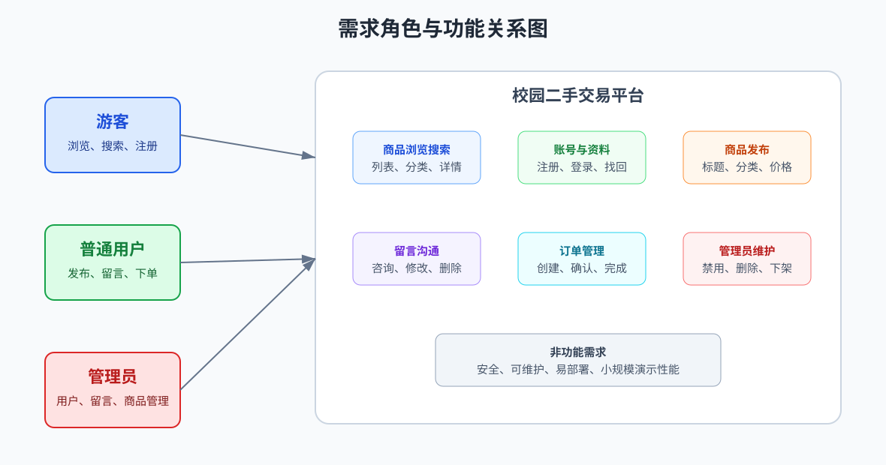
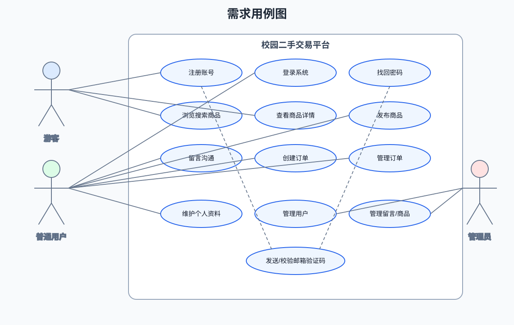
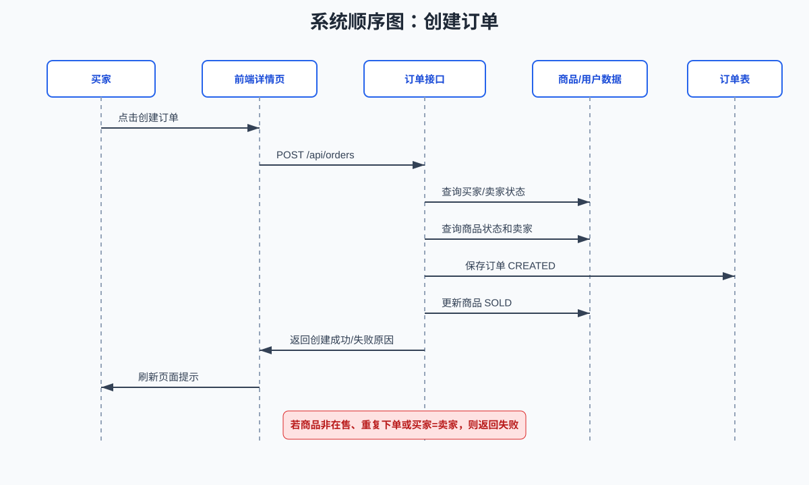
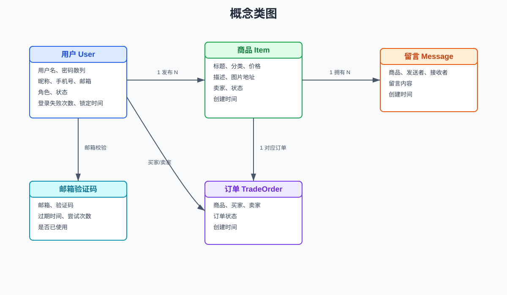

# 校园二手交易平台需求规格说明书

## 1 引言

### 1.1 目的

本说明书整理了校园二手交易平台的软件需求，把系统目标、功能范围、用户角色、接口、非功能需求和实现边界集中说明清楚，后面的设计、编码、测试和验收都按这里对齐。

### 1.2 范围

软件名称：校园二手交易平台。

软件描述：系统面向校园学生，提供二手物品发布、浏览搜索、留言沟通、订单创建、订单管理、个人资料维护和管理员管理能力。项目采用静态前端、Spring Boot REST API 和 MySQL 数据库组成的简易前后端分离架构。

应用场景：课程项目演示、小规模校园二手交易信息流转、学生闲置物品交换管理。

### 1.3 术语与缩略语

| 术语 | 说明 |
|---|---|
| 游客 | 未登录用户，可浏览商品、搜索商品、查看详情和留言。 |
| 注册用户 | 已注册并登录的普通用户，可发布商品、留言、下单和维护个人资料。 |
| 买家 | 对商品创建订单的用户。 |
| 卖家 | 发布商品并处理订单的用户。 |
| 管理员 | 具有用户、留言、商品管理权限的特殊账号。 |
| API | 后端提供给前端调用的 HTTP JSON 接口。 |
| BCrypt | 用于保存密码散列的加密算法。 |

### 1.4 文档概述

后文先写产品整体情况，再展开功能需求、接口、性能、约束、系统属性和数据库要求。

## 2 产品整体描述

### 2.1 产品描述

校园二手交易平台由前端页面、后端服务和数据库三部分组成。前端负责页面展示、表单交互和接口调用；后端负责业务校验、数据持久化、统一响应、邮箱验证码和管理员权限校验；数据库保存用户、商品、留言、订单和验证码数据。

### 2.2 产品功能

本项目已经实现的功能主要有：

- 用户注册、用户名登录、邮箱登录、退出登录。
- 邮箱验证码发送、注册校验、忘记密码重置、修改邮箱校验。
- 登录失败次数记录和临时锁定。
- 商品浏览、关键词搜索、分类筛选、详情查看。
- 登录用户发布商品。
- 商品详情页留言、修改自己的留言、删除自己的留言。
- 创建订单、查看相关订单、更新订单状态。
- 管理员禁用或恢复普通用户、删除留言、下架或恢复商品。

### 2.3 用户特征

| 用户类型 | 使用特点 |
|---|---|
| 游客 | 主要浏览商品和查看详情，不具备写入操作权限。 |
| 普通用户 | 需要完成注册登录，关注商品发布、留言、下单和订单状态。 |
| 管理员 | 关注平台秩序维护，负责用户状态、留言内容和商品状态管理。 |

### 2.4 约束

- 前端为静态 HTML、CSS、JavaScript，无构建步骤。
- 后端使用 Java 24、Spring Boot 3.5.14、Spring Data JPA。
- 数据库使用 MySQL 8.x，后端配置 `ddl-auto: validate`，不会自动建表。
- 登录态由前端 `localStorage` 保存用户基本信息，未实现正式 Token 或 Session 鉴权。
- 商品图片字段为图片地址 `imageUrl`，不支持本地文件上传。
- 管理接口通过请求参数 `adminId` 校验管理员角色，满足本次课程项目的演示需要。

### 2.5 假设和依赖

- 浏览器可访问后端 `http://localhost:8080/api`。
- 数据库已执行 `database/schema.sql` 和 `database/seed.sql`。
- 邮箱验证码功能依赖 `application.yml` 中可用的 SMTP 配置。
- 演示数据中存在管理员账号 `admin`，密码为 `abc123`。

### 2.6 需求分配

| 模块 | 需求归属 |
|---|---|
| 前端页面 | 商品展示、表单输入、提示信息、页面跳转和本地登录态维护。 |
| 后端接口 | 业务规则、数据校验、权限校验、密码散列、邮箱验证码和统一响应。 |
| 数据库 | 用户、商品、留言、订单、验证码持久化和关系约束。 |

### 2.7 运行环境要求

| 类别 | 最低要求 | 推荐要求 |
|---|---|---|
| 操作系统 | Windows 10 | Windows 10/11 |
| JDK | Java 24 | Java 24.0.2 |
| 构建工具 | Maven 3.8 | Maven 3.9 或以上 |
| 数据库 | MySQL 8.x | MySQL 8.x，UTF-8/utf8mb4 字符集 |
| 浏览器 | Chrome、Edge、Firefox 任一现代版本 | Chrome 或 Edge 最新稳定版 |
| 前端静态服务 | 可直接打开 HTML | Python 3.x `http.server` |

### 2.8 用户角色与权限矩阵

| 功能 | 游客 | 普通用户 | 管理员 |
|---|---:|---:|---:|
| 浏览商品列表 | 是 | 是 | 是 |
| 搜索和分类筛选 | 是 | 是 | 是 |
| 查看商品详情 | 是 | 是 | 是 |
| 查看留言 | 是 | 是 | 是 |
| 注册账号 | 是 | 否 | 否 |
| 登录系统 | 是 | 是 | 是 |
| 发布商品 | 否 | 是 | 是 |
| 发送留言 | 否 | 是 | 是 |
| 修改自己的留言 | 否 | 是 | 是 |
| 创建订单 | 否 | 是 | 是 |
| 查看自己的订单 | 否 | 是 | 是 |
| 管理用户 | 否 | 否 | 是 |
| 删除任意留言 | 否 | 否 | 是 |
| 下架或恢复商品 | 否 | 否 | 是 |



图 1 给出了游客、普通用户和管理员三类角色与系统主要功能之间的关系。

## 3 需求说明

### 3.1 功能需求

#### 3.1.1 用户需求

游客需要快速浏览校园二手商品，按关键词或分类查找目标物品，并查看商品详情和留言。

普通用户需要注册登录、发布闲置物品、在商品详情页沟通、创建订单、管理订单状态，并维护个人资料。

管理员需要维护平台秩序，包括禁用违规用户、删除不合规留言、下架不合规商品。

#### 3.1.2 用例描述

| 用例编号 | 用例名称 | 参与者 | 前置条件 | 基本流程 | 后置结果 |
|---|---|---|---|---|---|
| UC-01 | 注册账号 | 游客 | 邮箱可接收验证码 | 输入资料、发送验证码、提交注册 | 创建普通用户账号 |
| UC-02 | 登录系统 | 注册用户 | 账号存在且未禁用 | 输入用户名或邮箱与密码 | 前端保存用户信息 |
| UC-03 | 重置密码 | 注册用户 | 邮箱已注册 | 发送验证码、提交新密码 | 新密码生效 |
| UC-04 | 浏览搜索商品 | 游客、注册用户 | 系统有可售商品 | 打开首页、输入关键词或分类 | 返回匹配商品列表 |
| UC-05 | 发布商品 | 注册用户 | 已登录且账号正常 | 填写标题、分类、价格、图片地址和描述 | 商品状态为 `ON_SALE` |
| UC-06 | 留言沟通 | 注册用户 | 已登录且商品存在 | 在详情页提交留言 | 留言保存并展示 |
| UC-07 | 创建订单 | 注册用户 | 商品在售且不是本人发布 | 点击创建订单 | 订单创建，商品变为 `SOLD` |
| UC-08 | 管理平台内容 | 管理员 | 管理员已登录 | 操作用户、留言或商品状态 | 管理操作生效 |



图 2 给出了游客、普通用户、管理员与系统主要用例之间的关系，其中邮箱验证码作为注册和找回密码等用例的公共支撑能力。

#### 3.1.2.1 用例优先级

| 优先级 | 用例 | 说明 |
|---|---|---|
| 高 | 注册、登录、浏览商品、发布商品、留言、创建订单 | 构成校园二手交易平台的核心闭环，必须优先保证可用。 |
| 中 | 忘记密码、资料修改、订单状态更新、管理员管理 | 支撑账号安全、交易跟踪和平台维护。 |
| 低 | 图片地址展示、演示数据、健康检查 | 提升演示完整性和部署可验证性。 |

#### 3.1.2.2 主要业务流程

普通用户交易流程：

1. 游客打开首页浏览商品。
2. 游客注册账号并登录。
3. 用户发布闲置商品，商品状态为 `ON_SALE`。
4. 其他用户在详情页留言咨询。
5. 买家创建订单。
6. 系统创建订单并将商品状态改为 `SOLD`。
7. 买卖双方在订单页查看并更新订单状态。

管理员维护流程：

1. 管理员登录系统。
2. 管理员进入管理中心。
3. 管理员查看普通用户、留言和商品列表。
4. 管理员对违规用户执行禁用，对违规留言执行删除，对违规商品执行下架。
5. 后端校验管理员身份并保存管理结果。



图 3 给出了创建订单场景中的系统级交互顺序，包括前端详情页、订单接口、商品/用户数据和订单表之间的消息传递。

#### 3.1.2.3 概念类图

需求分析阶段识别出的核心概念包括用户、商品、留言、订单和邮箱验证码。用户可发布商品、发送留言、作为买家或卖家参与订单；商品可拥有多条留言，并在订单创建后发生状态变化。



图 4 给出了需求层面的概念类及其关系，用于指导后续概要设计、详细设计和数据库设计。

#### 3.1.3 用户注册

- 用户名不能为空且唯一。
- 密码必须为 6 到 12 位字母和数字组合。
- 注册需要邮箱验证码。
- 密码使用 BCrypt 散列保存。
- 注册成功后返回用户基本资料，不返回密码散列。

输入项与校验规则：

| 字段 | 是否必填 | 校验规则 | 异常提示 |
|---|---|---|---|
| `username` | 是 | 非空且唯一 | 用户名已存在 |
| `password` | 是 | 6 到 12 位字母和数字组合 | 密码需为6-12位字母和数字组合 |
| `nickname` | 否 | 可为空 | 无 |
| `email` | 是 | 非空，需能接收验证码 | 发送失败或验证码错误 |
| `code` | 是 | 与邮箱验证码匹配且未过期 | 验证码错误或已过期 |

#### 3.1.4 用户登录

- 支持用户名和邮箱两种登录方式。
- 被禁用账号不能登录。
- 密码错误时记录失败次数。
- 连续 3 次登录失败后账号锁定 10 分钟。
- 登录成功后清空失败次数和锁定时间。

登录异常规则：

| 场景 | 系统处理 |
|---|---|
| 用户名或邮箱为空 | 返回“请输入用户名”或“请输入邮箱”。 |
| 用户不存在 | 返回账号或密码错误，不暴露账号是否存在。 |
| 密码错误 | 记录失败次数并提示剩余尝试次数。 |
| 错误达到 3 次 | 设置 `locked_until`，锁定 10 分钟。 |
| 账号被禁用 | 拒绝登录并提示账号已被管理员禁用。 |
| 锁定期内登录 | 拒绝登录并提示稍后再试。 |

#### 3.1.5 忘记密码与资料维护

- 用户可以通过已注册邮箱发送验证码并重置密码。
- 用户可查看用户名、昵称、手机号、邮箱、角色和状态。
- 用户名只读。
- 昵称和手机号可直接修改。
- 修改邮箱必须校验新邮箱验证码。

资料维护规则：

| 操作 | 规则 |
|---|---|
| 查看资料 | 根据用户 ID 查询，用户不存在时返回失败。 |
| 修改昵称 | 允许为空或新昵称，保存后返回最新资料。 |
| 修改手机号 | 允许为空或新手机号，保存后返回最新资料。 |
| 修改邮箱 | 新邮箱与旧邮箱不一致时必须提交新邮箱验证码。 |
| 重置密码 | 邮箱必须已注册，验证码必须正确，新密码需符合密码规则。 |

#### 3.1.6 商品功能

- 首页只展示状态为 `ON_SALE` 的商品。
- 商品信息包含标题、分类、价格、描述、图片地址、卖家和状态。
- 支持按标题关键词搜索。
- 支持按分类筛选。
- 登录用户可发布商品，被禁用用户不能发布。

商品字段要求：

| 字段 | 是否必填 | 说明 |
|---|---|---|
| `title` | 是 | 商品标题，建议简洁描述物品名称。 |
| `category` | 是 | 商品分类，如书籍、生活用品、电子产品。 |
| `price` | 是 | 商品价格，数据库保存为两位小数。 |
| `description` | 否 | 商品描述，最长 1000 字符。 |
| `imageUrl` | 否 | 图片地址或静态资源路径。 |
| `sellerId` | 是 | 发布者用户 ID。 |

搜索规则：

- 当 `keyword` 不为空时，优先按标题模糊搜索。
- 当 `keyword` 为空且 `category` 不为空时，按分类筛选。
- 当两个参数均为空时，返回全部 `ON_SALE` 商品。

#### 3.1.7 留言功能

- 游客和登录用户均可查看留言。
- 登录用户可发送留言。
- 被禁用用户不能发送留言。
- 留言发送者可修改或删除自己的留言。
- 管理员可删除任意留言。
- 留言内容最长 500 字符。

留言权限规则：

| 操作 | 权限 |
|---|---|
| 查看商品留言 | 游客、普通用户、管理员均可查看。 |
| 发送留言 | 登录用户可发送，被禁用用户不可发送。 |
| 修改留言 | 仅留言发送者本人可修改。 |
| 删除自己的留言 | 仅留言发送者本人可删除。 |
| 删除任意留言 | 仅管理员可以通过管理接口删除。 |

#### 3.1.8 订单功能

- 登录用户可对他人发布且状态为 `ON_SALE` 的商品创建订单。
- 买家不能购买自己发布的商品。
- 商品已售出、已下架或存在非取消订单时不能重复下单。
- 订单创建成功后状态为 `CREATED`，商品状态更新为 `SOLD`。
- 用户可查看自己作为买家或卖家的订单。
- 支持订单状态更新为 `CREATED`、`CONFIRMED`、`COMPLETED`、`CANCELLED`。

订单状态说明：

| 状态 | 含义 | 典型触发 |
|---|---|---|
| `CREATED` | 订单已创建 | 买家在商品详情页点击创建订单。 |
| `CONFIRMED` | 交易已确认 | 买卖双方确认交易意向。 |
| `COMPLETED` | 交易已完成 | 双方完成线下交付。 |
| `CANCELLED` | 交易已取消 | 买卖任一方取消交易。 |

下单拦截规则：

- 买家不存在或卖家不存在时拒绝创建订单。
- 买家或卖家被禁用时拒绝创建订单。
- 商品不存在时拒绝创建订单。
- 请求中的卖家 ID 与商品卖家不一致时拒绝创建订单。
- 买家与卖家相同时拒绝创建订单。
- 商品状态不是 `ON_SALE` 时拒绝创建订单。
- 商品已存在非取消订单时拒绝重复下单。

#### 3.1.9 管理员功能

- 管理员可查看普通用户列表。
- 管理员可将普通用户状态修改为 `ACTIVE` 或 `DISABLED`。
- 管理员不能修改管理员账号状态。
- 管理员可查看全部留言并删除留言。
- 管理员可查看全部商品。
- 管理员可将商品状态修改为 `ON_SALE` 或 `REMOVED`。

管理员接口必须校验 `adminId`。若管理员不存在、角色不是 `ADMIN` 或管理员账号被禁用，则拒绝执行管理操作。

#### 3.1.10 功能验收标准

| 功能 | 验收标准 |
|---|---|
| 注册登录 | 可使用邮箱验证码注册，用户名和邮箱登录均可用，错误密码触发锁定。 |
| 商品浏览 | 首页展示演示商品，搜索和分类筛选结果正确。 |
| 商品发布 | 登录用户可发布商品，发布后首页可见。 |
| 留言沟通 | 登录用户可留言，留言者可编辑和删除自己的留言。 |
| 订单管理 | 买家可创建订单，商品状态联动为 `SOLD`，重复下单被拒绝。 |
| 管理功能 | 管理员可禁用用户、删除留言、下架商品。 |
| 数据库 | 脚本可创建 5 张业务表并导入演示数据。 |

### 3.2 对外接口需求

#### 3.2.1 用户界面

| 页面 | 功能 |
|---|---|
| `index.html` | 商品列表、搜索、分类筛选。 |
| `register.html` | 注册和发送邮箱验证码。 |
| `profile.html` | 登录、忘记密码、资料查看、资料修改、退出登录。 |
| `publish.html` | 发布商品。 |
| `detail.html` | 商品详情、留言、创建订单。 |
| `orders.html` | 用户相关订单列表和状态更新。 |
| `admin.html` | 管理普通用户、留言和商品。 |

#### 3.2.2 软件接口

接口统一挂载在 `/api` 下，统一返回：

```json
{
  "success": true,
  "message": "success",
  "data": {}
}
```

| 模块 | 主要接口 |
|---|---|
| 用户 | `/api/users/send-verification`、`/api/users/register`、`/api/users/login`、`/api/users/forgot-password/send-code`、`/api/users/forgot-password/reset`、`/api/users/{id}`、`/api/users/check` |
| 商品 | `/api/items`、`/api/items/{id}` |
| 留言 | `/api/messages/item/{itemId}`、`/api/messages`、`/api/messages/{id}` |
| 订单 | `/api/orders`、`/api/orders/{id}/status` |
| 管理员 | `/api/admin/users`、`/api/admin/users/{id}/status`、`/api/admin/messages`、`/api/admin/messages/{id}`、`/api/admin/items`、`/api/admin/items/{id}/status` |

#### 3.2.3 硬件接口

系统无专用硬件接口，普通个人电脑即可运行后端、数据库和浏览器。

#### 3.2.4 通讯接口

前端通过 HTTP 调用后端 JSON 接口。开发环境默认地址为 `http://localhost:8080/api`。

### 3.3 性能需求

- 支持课程演示环境下 10 到 20 人小规模访问。
- 常规接口响应应满足页面交互需要。
- 首页商品列表按创建时间倒序展示。
- 数据库对商品分类、商品状态、卖家、留言商品 ID、订单买家和订单卖家建立索引。

性能指标：

| 指标 | 要求 |
|---|---|
| 演示并发 | 支持 10 到 20 人课程演示访问。 |
| 商品列表响应 | 小规模数据下应在用户可感知的正常页面交互时间内返回。 |
| 搜索响应 | 关键词和分类筛选应能即时刷新页面结果。 |
| 数据规模 | 适用于课程项目和小规模校园场景，不作为大规模生产流量。 |

### 3.4 设计约束

- 必须使用 `database/schema.sql` 初始化数据库。
- 后端不应向前端返回密码散列。
- 前端不得保存密码或密码散列。
- 管理员权限必须在后端校验。
- 文档不得承诺当前代码未实现的支付、物流、评价、文件上传、实时聊天等功能。

### 3.5 软件系统属性

#### 3.5.1 可靠性

系统通过数据库外键约束维护用户、商品、留言和订单之间的基本关系。后端对关键业务流程进行存在性、状态和权限校验。

#### 3.5.2 可用性

页面导航包含首页、注册、发布物品、订单管理、个人中心和管理中心。表单提交失败时应显示后端返回的错误原因。

#### 3.5.3 安全性

密码使用 BCrypt 散列保存。注册、修改邮箱和忘记密码依赖验证码。登录失败 3 次后临时锁定账号。被禁用用户不能登录、发布商品、发送留言或创建订单。

#### 3.5.4 可维护性

后端按用户、商品、留言、订单、管理员和公共组件分包。前端按页面拆分 HTML 和 JavaScript。数据库脚本集中存放于 `database/`，项目文档集中存放于 `doc/`。

#### 3.5.5 可移植性

系统依赖 Java、Maven、MySQL 和现代浏览器，可在 Windows 环境本地部署。前端为静态文件，可直接打开或通过静态服务器访问。

#### 3.5.6 可测试性

后端提供 MockMvc 自动化测试，测试配置使用 H2 内存数据库，不依赖本地 MySQL。部署测试可以通过健康检查接口、首页访问、演示账号登录和主要业务流程完成。

#### 3.5.7 数据一致性

订单创建成功后必须同步更新商品状态为 `SOLD`。商品、留言和订单通过外键关联用户与商品，避免产生孤立数据。验证码使用后应标记为已使用，过期验证码不可继续用于注册或重置密码。

### 3.6 其他需求

#### 3.6.1 逻辑数据库要求

| 表名 | 用途 |
|---|---|
| `users` | 保存用户账号、密码散列、资料、角色、状态、登录失败次数和锁定时间。 |
| `items` | 保存商品标题、分类、价格、描述、图片地址、卖家和状态。 |
| `messages` | 保存商品留言、发送方、接收方和内容。 |
| `trade_orders` | 保存订单商品、买家、卖家、状态和创建时间。 |
| `email_verification` | 保存邮箱验证码、过期时间、尝试次数和使用状态。 |

#### 3.6.2 实现边界

- 商品图片使用 URL 或静态资源路径。
- 留言按商品维度展示，没有独立私信会话。
- 前端登录态使用 `localStorage`。
- 管理员权限根据 `adminId` 简化校验。
- 邮件验证码依赖 SMTP 配置。
