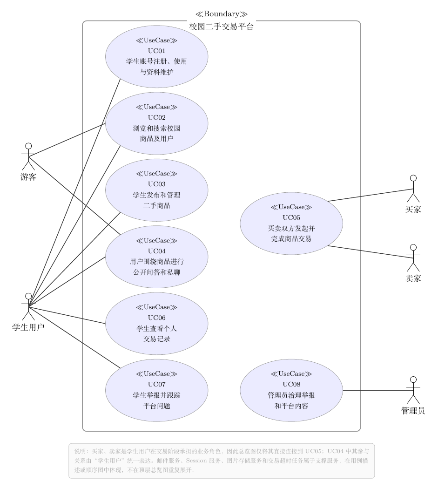
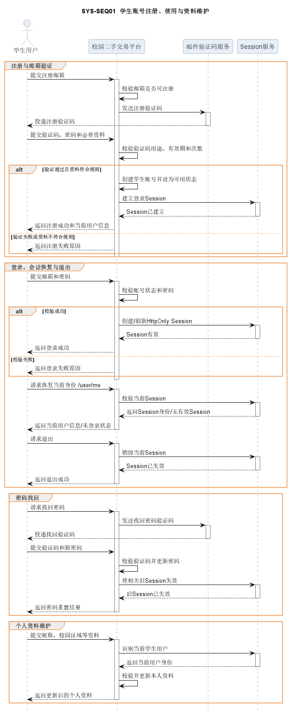
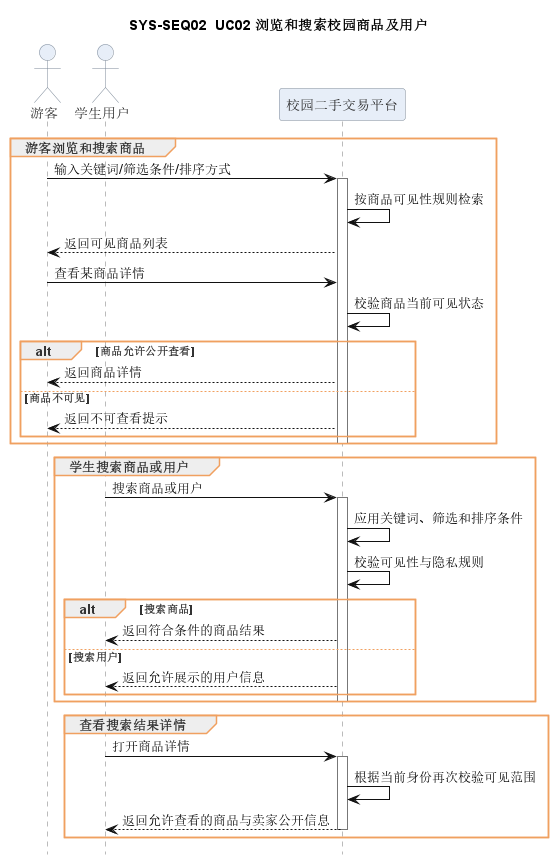
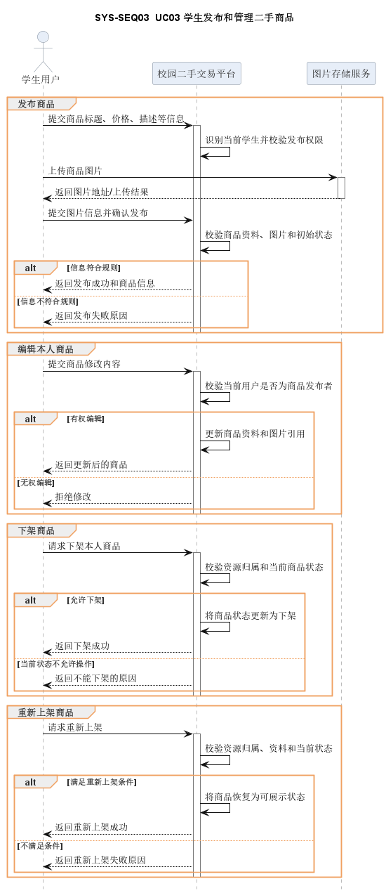
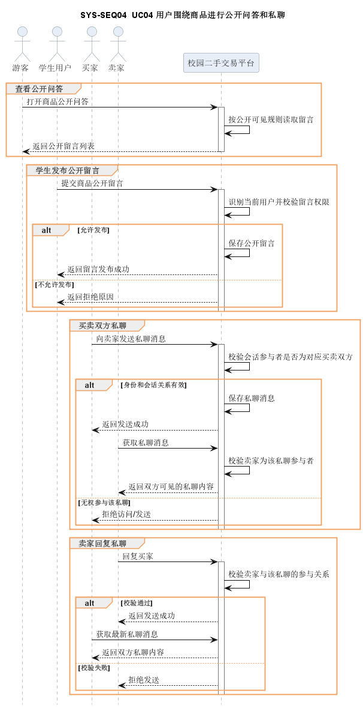
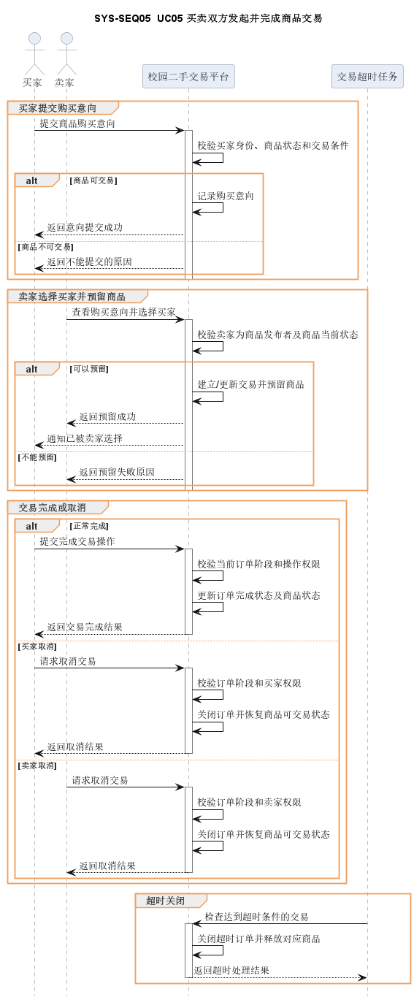
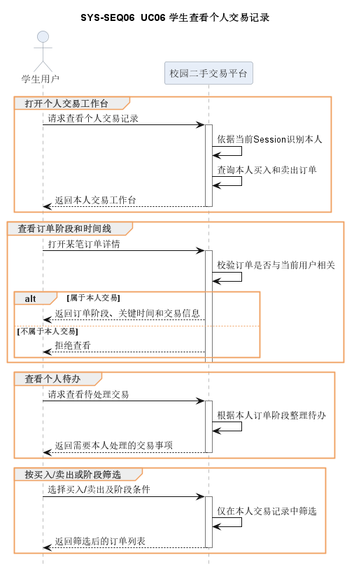
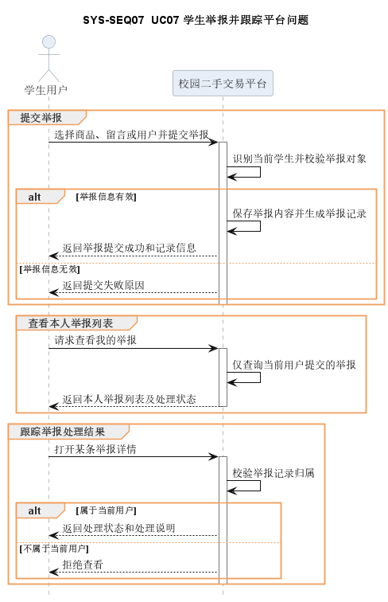
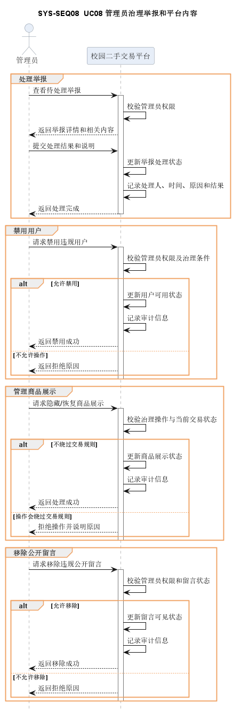

# 校园二手交易平台软件需求规格说明书

## 1. 项目概述

校园二手交易平台面向校园学生，提供二手物品发布、浏览、搜索、留言沟通、下单、订单管理、个人资料维护和管理员管理功能。系统采用静态前端 + Spring Boot REST API + MySQL 的简易前后端分离架构，适用于课程项目演示和小规模校园场景。

## 2. 用户角色

| 角色     | 说明                                                       |
| -------- | ---------------------------------------------------------- |
| 游客     | 未登录用户，可浏览商品、搜索商品、查看商品详情和留言。     |
| 注册用户 | 已登录用户，可发布商品、发送留言、创建订单、维护个人资料。 |
| 买家     | 对商品创建订单的注册用户。                                 |
| 卖家     | 发布商品并处理相关订单的注册用户。                         |
| 管理员   | 管理普通用户、留言和商品状态的特殊用户。                   |

## 3. 功能需求

### 3.1 用户注册

- 用户可填写用户名、密码、昵称、邮箱和邮箱验证码进行注册。
- 用户名不能为空且唯一。
- 邮箱不能为空，注册前需要发送并校验邮箱验证码。
- 密码必须为 6 到 12 位字母和数字组合。
- 密码使用 BCrypt 散列保存，不保存明文。
- 注册成功后返回用户基本资料，不返回密码散列。

### 3.2 用户登录

- 支持邮箱 + 密码登录。
- 被禁用账号不能登录。
- 密码错误时记录失败次数。
- 同一账号连续 3 次登录失败后锁定 10 分钟。
- 锁定期间拒绝登录。
- 登录成功后清空失败次数和锁定时间。
- 登录成功后由服务端 Session 保存身份，浏览器只持有 HttpOnly Cookie。

### 3.3 忘记密码

- 用户可输入已注册邮箱发送验证码。
- 邮箱不存在时返回提示。
- 用户提交邮箱、验证码和新密码后可重置密码。
- 新密码仍需满足 6 到 12 位字母和数字组合。
- 重置成功后新密码使用 BCrypt 散列保存。

### 3.4 个人资料管理

- 登录用户可查看自己的用户名、昵称、手机号、邮箱、角色和状态。
- 用户名只读。
- 昵称和手机号可直接修改。
- 修改邮箱时必须校验新邮箱验证码。

### 3.5 商品浏览与搜索

- 首页展示状态为 `ON_SALE` 的商品。
- 商品信息包含标题、分类、价格、描述、图片地址、卖家和状态。
- 支持按关键词搜索商品标题。
- 支持按分类筛选商品。
- 点击商品进入详情页。

### 3.6 商品发布

- 登录用户可发布商品。
- 被禁用用户不能发布商品。
- 发布字段包括标题、分类、价格、描述、图片地址和卖家 ID。
- 标题、分类、价格、卖家 ID 为必填。
- 当前版本图片字段为图片地址 `imageUrl`，不支持本地文件上传。

### 3.7 商品详情

- 用户可查看商品图片、状态、价格、描述、交易标签、校园区域和安全的卖家公开摘要。
- 卖家摘要只包含昵称、校园区域、信用、活跃时间和在售数量，不得返回邮箱、手机号。
- 用户可查看公开问答、同卖家其他在售商品和校园当面交易提醒；私聊与公开问答必须视觉分区。
- 游客点击私聊或购买意向时先在当前页面确认登录；已有有效意向的买家只显示交易进度，卖家本人只显示商品管理。
- 桌面、平板和移动端应提供适配布局，移动端主要交易操作固定在底部且不得遮挡内容。

### 3.8 留言沟通

- 游客和登录用户均可查看留言。
- 登录用户可发送留言。
- 被禁用用户不能发送留言。
- 留言发送者可修改自己的留言。
- 留言发送者可删除自己的留言。
- 管理员可删除任意留言。
- 留言内容最长 500 字符。

### 3.8.1 买卖双方私聊

- 学生可从在售商品详情发起与卖家的私聊，同一商品、买家和卖家复用同一会话。
- 私聊正文仅买卖双方可见；管理员不能查看学生私聊内容，发送者身份只取当前登录 Session。
- 会话列表显示最新消息与未读数，历史消息按游标分页；用户可标记已读、屏蔽或解除屏蔽对方。
- 任一方屏蔽后双方不能继续发送，但仍可查看历史并举报对方；私聊和公开商品留言互不混用。
- 首期只支持最多 2000 字符的文本消息，页面每 8 秒轮询；图片消息、结构化议价与 WebSocket/SSE 后续实现。

### 3.9 订单管理

- 登录用户可对他人发布且状态为 `ON_SALE` 的商品创建订单。
- 买家不能购买自己发布的商品。
- 创建购买意向时从 Session 推导买家，从商品推导卖家，不接收客户端身份字段。
- 同一买家不能对同一商品重复提交有效意向，不同买家可以同时表达意向。
- 意向创建成功后状态为 `PURCHASE_REQUESTED`，商品保持 `ON_SALE`。
- 卖家接受一条意向后订单进入 `WAITING_HANDOVER`、商品进入 `RESERVED`，其余待回应意向进入 `DECLINED`。
- 用户可查看自己作为买家或卖家的订单。
- 支持按参与方执行 `ACCEPT`、`DECLINE`、`COMPLETE`、`CANCEL`，不能直接提交目标状态。
- 非法订单状态应被拒绝。

### 3.10 管理员管理

- 管理员可查看普通用户列表。
- 管理员可将普通用户状态修改为 `ACTIVE` 或 `DISABLED`。
- 管理员不能修改管理员账号状态。
- 管理员可查看全部留言并删除留言。
- 管理员可查看全部商品。
- 管理员可将商品状态修改为 `ON_SALE` 或 `REMOVED`。
- 管理接口只使用管理员 Session，并在每个请求中复核数据库角色和状态。

### 3.11 数据初始化

- `database/schema.sql` 创建数据库和表。
- `database/seed.sql` 写入演示管理员、普通用户和商品。
- 演示管理员账号为 `admin`，密码为 `abc123`。

## 4. 非功能需求

### 4.1 运行环境

- JDK 25 LTS。
- Maven 3.8 或以上。
- MySQL 8.x。
- Chrome、Edge 或 Firefox 等现代浏览器。
- Python 3.x 可选，用于启动前端静态服务器。

### 4.2 性能需求

- 支持课程演示环境下 10 到 20 人小规模访问。
- 常规接口响应应满足页面交互需要。
- 首页商品列表按创建时间倒序展示，数据库对商品分类、状态和卖家字段建立索引。

### 4.3 安全需求

- 密码必须使用 BCrypt 散列保存。
- 注册、修改邮箱、忘记密码需使用邮箱验证码。
- 登录失败达到 3 次后临时锁定账号。
- 管理接口需校验管理员角色。
- 前端不得保存密码或密码散列。

### 4.4 可维护性需求

- 后端按用户、商品、留言、订单、管理员、公共组件分包。
- 前端按页面拆分 HTML 和 JavaScript 文件。
- 数据库结构由 `backend/src/main/resources/db/migration/` 中的 Flyway 迁移维护，`database/schema.sql` 仅用于创建空数据库。
- 项目文档集中存放在 `doc/`。

### 4.5 易用性需求

- 页面导航清晰，普通用户可在首页、发布、订单、个人中心之间切换。
- 表单提交失败时应显示原因。
- 管理员功能集中在管理中心页面。

## 5. 数据需求

| 表名                 | 用途                                                         |
| -------------------- | ------------------------------------------------------------ |
| `users`              | 保存用户账号、密码散列、资料、角色、状态、登录失败次数和锁定时间。 |
| `items`              | 保存商品标题、价格、描述、图片地址、卖家、校园区域、标签和状态。 |
| `messages`           | 保存商品留言、发送方、接收方和内容。                         |
| `trade_orders`       | 保存订单快照、买卖双方、预留期限、状态和创建时间。           |
| `email_verification` | 保存验证码 HMAC 摘要、用途、过期时间、尝试次数和使用状态。   |

## 6. 接口需求概览

| 模块   | 主要接口                                                     |
| ------ | ------------------------------------------------------------ |
| 用户   | `/api/auth/csrf`、`/api/auth/register`、`/api/auth/login`、`/api/auth/logout`、`/api/auth/password/reset`、`/api/users/me` |
| 商品   | `/api/items`、`/api/items/{id}`                              |
| 留言   | `/api/messages/item/{itemId}`、`/api/messages`、`/api/messages/{id}` |
| 订单   | `/api/orders`、`/api/orders/{id}/actions`                    |
| 管理员 | `/api/admin/users`、`/api/admin/users/{id}/status`、`/api/admin/messages`、`/api/admin/messages/{id}`、`/api/admin/items`、`/api/admin/items/{id}/status` |

## 7. 实现边界

- 商品图片使用 URL 或静态资源路径。

- 公开留言按商品维度展示；买卖双方私聊由独立会话和消息模块提供。

- Web 登录态使用服务端 Session 和 CSRF 防护，不把凭据保存到 localStorage。

- 管理员接口只认当前 Session，并实时检查账号角色和状态。

- 邮件验证码依赖 `application.yml` 中的 SMTP 配置。

  

  .png)

# 业务场景（用例）清单

## 用例总览

以下按平台核心业务目标归并相关操作。登录、权限、CSRF 和资源归属校验属于所有场景的共同约束，不单独列为业务用例。

| 编号 | 业务场景（用例） | 主要参与者 | 可验收结果 |
| --- | --- | --- | --- |
| UC01 | 学生账号注册、使用与资料维护 | 学生用户、邮件服务、Session 服务 | 学生可完成注册验证、登录退出、密码找回、资料维护；服务端始终依据当前 Session 识别本人 |
| UC02 | 浏览和搜索校园商品及用户 | 游客、学生用户 | 可搜索商品或用户、筛选排序并查看商品详情；结果符合可见性和隐私规则 |
| UC03 | 学生发布和管理二手商品 | 学生用户、图片存储服务 | 商品可发布、编辑、下架和重新上架，图片、状态和操作权限均符合规则 |
| UC04 | 用户围绕商品进行公开问答和私聊 | 游客、学生用户、买家、卖家 | 公开留言和私聊均可按各自权限使用，私聊消息仅买卖双方可见 |
| UC05 | 买卖双方发起并完成商品交易 | 买家、卖家、交易超时任务 | 买家提交意向，卖家选择并预留，双方可完成、取消或因超时关闭订单，商品状态正确变化 |
| UC06 | 学生查看个人交易记录 | 学生用户 | 交易工作台仅展示本人买入/卖出订单、阶段、时间线和待办 |
| UC07 | 学生举报并跟踪平台问题 | 学生用户 | 可举报商品、留言或用户，并查看本人举报的处理状态和说明 |
| UC08 | 管理员治理举报和平台内容 | 管理员 | 可处理举报、禁用用户、管理商品展示和移除留言，结果可审计且不绕过交易规则 |

------

## UC01 学生账号注册、使用与资料维护

- **需求编号**：REQ01～REQ04
- **参与者**：学生用户、邮件验证码服务、Session 服务
- **触发条件**：学生希望创建平台账号，或已注册学生需要登录、退出、恢复会话、找回密码、修改个人资料。
- **前置条件**：注册时学生拥有可接收验证码且尚未注册的邮箱；登录时账号已注册且状态可用；找回密码时邮箱已注册；资料维护时已登录。
- **主成功流程**：
  1. 学生提交注册邮箱，系统生成注册用途验证码并由邮件验证码服务发送。
  2. 学生提交验证码、密码和必要资料，系统校验验证码用途、有效期和次数，创建 `ACTIVE` 学生账号并建立登录状态。
  3. 已注册学生提交邮箱和密码登录，系统验证后创建 HttpOnly Session。
  4. 学生访问页面时，系统通过 `/users/me` 恢复当前身份；退出时销毁当前会话。
  5. 学生忘记密码时申请重置验证码，提交有效验证码和新密码，系统更新密码并撤销旧认证状态。
  6. 学生读取本人资料并提交昵称、校园区域等合法修改，系统保存并返回更新后的公开资料。
- **备选/异常流程**：邮箱已存在；验证码错误、过期、用途不匹配、重复使用或频率超限；密码不符合规则或登录密码错误；账号被禁用；认证版本或旧会话失效；未登录修改资料；字段非法；尝试修改账号安全字段或他人资料。
- **可验证结果**：学生能够完成注册、登录、退出、会话恢复、密码找回和本人资料维护；新密码生效后旧密码失效；退出、禁用或认证失效后旧 Session 不能继续代表用户；个人中心和搜索中的公开信息正确更新，邮箱等隐私字段不外泄。
- **追溯关系**：`REQ01～REQ04 / UC01 / SYS-SEQ01 / COMP-ACCOUNT01、COMP-SESSION01、COMP-ACCOUNT02、COMP-PROFILE01 / OBJ-ACCOUNT01、OBJ-SESSION01、OBJ-PASSWORD01、OBJ-USER01 / UNIT-TC01～UNIT-TC04 / INT-TC01～INT-TC04 / E2E-TC01～E2E-TC04`
- 

## UC02 浏览和搜索校园商品及用户

- **需求编号**：REQ05、REQ08
- **参与者**：游客、学生用户
- **触发条件**：用户输入搜索关键词、筛选条件或访问某个商品详情。
- **前置条件**：搜索无登录要求；“离我最近”排序需要登录用户校园区域；查看详情时商品必须存在，可见性取决于商品审核状态、交易状态和卖家状态。
- **主成功流程**：
  1. 用户输入一个或多个搜索关键词并选择商品或用户范围。
  2. 系统按最多 8 个关键词取交集，并应用价格、区域、标签和排序条件。
  3. 系统分页返回符合可见性规则的商品或用户结果。
  4. 用户打开商品详情，系统根据当前身份和商品状态返回商品资料、卖家安全摘要、购买意向、可执行动作、同卖家在售商品和公开问答。
- **备选/异常流程**：关键词为空或超过上限；无匹配结果；游客使用需要登录的区域排序；商品不存在；游客访问不可见商品；卖家本人查看被下架商品；买家已有有效意向。
- **可验证结果**：搜索结果符合关键词、筛选和排序条件；商品结果仅包含在售、可见且卖家有效的记录；用户结果及商品详情不暴露邮箱、手机号等隐私字段；不同身份能够看到正确的商品详情和可执行动作。
- **追溯关系**：`REQ05、REQ08 / UC02 / SYS-SEQ02 / COMP-SEARCH01、COMP-DETAIL01 / OBJ-SEARCH01、OBJ-ITEM03 / UNIT-TC05、UNIT-TC08 / INT-TC05、INT-TC08 / E2E-TC05、E2E-TC08`
- 

## UC03 学生发布和管理二手商品

- **需求编号**：REQ06～REQ07
- **参与者**：学生用户、图片存储服务
- **触发条件**：学生提交商品发布表单，或卖家进入“我的发布”编辑商品、下架商品或重新上架。
- **前置条件**：已登录；发布时图片属于本人上传且通过验证；编辑和状态操作时当前用户为商品发布者。
- **主成功流程**：
  1. 学生上传并标准化商品图片。
  2. 学生填写标题、描述、价格、区域和标签，系统校验后创建商品并置为 `ON_SALE + VISIBLE`。
  3. 卖家进入“我的发布”查看本人商品并修改允许字段。
  4. 卖家可按规则执行下架操作，使商品停止公开展示。
  5. 满足重新上架条件时，卖家可将本人商品重新置为可展示、可交易状态。
- **备选/异常流程**：图片格式、大小、像素、配额或内容校验失败；字段非法；CSRF 缺失；非发布者操作；商品已预留或售出；商品被管理员移除；并发状态冲突。
- **可验证结果**：商品成功发布后可在公开搜索和详情中展示；图片不含 EXIF 且路径不可被任意伪造；只有发布者能够编辑和执行卖家状态操作；管理员移除不能被卖家绕过；下架、重新上架不错误改变交易状态。
- **追溯关系**：`REQ06～REQ07 / UC03 / SYS-SEQ03 / COMP-ITEM-PUBLISH01、COMP-INVENTORY01 / OBJ-ITEM01、OBJ-ITEM02 / UNIT-TC06～UNIT-TC07 / INT-TC06～INT-TC07 / E2E-TC06～E2E-TC07`
- 

## UC04 用户围绕商品进行公开问答和私聊

- **需求编号**：REQ09～REQ10
- **参与者**：游客、学生用户、买家、卖家
- **触发条件**：用户在商品详情查看、发布或维护公开留言，或买卖双方从商品详情/订单工作台发起私聊。
- **前置条件**：公开问答要求商品对当前用户可见；发布、修改或删除公开留言时用户已登录且操作本人留言；私聊发起者必须是合法买家或卖家，商品详情中新建会话时商品需处于在售且可见状态。
- **主成功流程**：
  1. 游客或学生用户查看商品公开留言。
  2. 已登录学生发布问题或回复，并可修改、删除本人留言。
  3. 买家或卖家从商品详情或订单工作台创建或复用唯一私聊会话。
  4. 买卖双方分页查看历史消息、发送消息并标记已读。
  5. 系统维护正确的未读数，并确保私聊内容仅会话双方可见。
- **备选/异常流程**：未登录发布公开留言；越权修改他人留言；商品已不可见；留言被治理移除；陌生用户访问私聊；屏蔽状态下发送消息；商品已下架或售出后尝试新建会话；消息频率超限。
- **可验证结果**：公开留言对所有有权查看商品的访客可见且维护权限正确；私聊正文不会出现在公开问答中；私聊消息仅买卖双方可见；未读数正确；屏蔽后不能继续发送但历史消息仍可读取。
- **追溯关系**：`REQ09～REQ10 / UC04 / SYS-SEQ04 / COMP-MESSAGE01、COMP-CHAT01 / OBJ-MESSAGE01、OBJ-CHAT01 / UNIT-TC09～UNIT-TC10 / INT-TC09～INT-TC10 / E2E-TC09～E2E-TC10`
- 

## UC05 买卖双方发起并完成商品交易

- **需求编号**：REQ11～REQ13
- **参与者**：买家、卖家、交易超时任务
- **触发条件**：买家在商品详情点击“我想要”；卖家在交易工作台处理购买意向；双方进行当面交接，或订单达到取消/超时条件。
- **前置条件**：买家已登录，商品为 `ON_SALE + VISIBLE` 且买家不是卖家本人；卖家处理意向时已登录且为商品发布者；完成、取消或超时处理时订单处于允许的交易阶段。
- **主成功流程**：
  1. 系统从当前 Session 推导买家身份，创建 `PURCHASE_REQUESTED` 购买意向，商品保持在售。
  2. 卖家查看待处理购买意向并接受其中一条。
  3. 系统将商品变为 `RESERVED`，订单进入 `WAITING_HANDOVER`，并关闭其他待回应意向。
  4. 买卖双方线下交接后，买家确认收到商品。
  5. 系统将订单更新为 `COMPLETED`，商品更新为 `SOLD`。
- **备选/异常流程**：重复有效意向；商品状态已变化；卖家本人下单；未登录或 CSRF 失败；卖家拒绝意向；意向已过期；商品被并发请求预留；非卖家越权操作；买家或卖家取消；预留超时；非法参与者操作；重复完成。
- **可验证结果**：购买意向创建时不产生独占预留；同一商品最多只有一个有效预留；交易完成后商品不可重新上架；取消或超时后订单关闭且商品恢复在售；所有交易状态变化均经过统一交易规则处理。
- **追溯关系**：`REQ11～REQ13 / UC05 / SYS-SEQ05 / COMP-TRADING01、COMP-TRADING02、COMP-TRADING03 / OBJ-ORDER01、OBJ-ORDER02、OBJ-ORDER03 / UNIT-TC11～UNIT-TC13 / INT-TC11～INT-TC13 / E2E-TC11～E2E-TC13`
- 

## UC06 学生查看个人交易记录

- **需求编号**：REQ14
- **参与者**：学生用户
- **触发条件**：学生进入订单/交易工作台。
- **前置条件**：已登录。
- **主成功流程**：
  1. 学生进入交易工作台。
  2. 选择“我买到的/我卖出的”和交易阶段。
  3. 系统仅查询当前用户参与的订单。
  4. 系统返回统计、商品分组、对方公开资料、订单阶段、时间线、剩余时间和当前允许动作。
  5. 学生根据待办继续处理本人交易。
- **备选/异常流程**：无订单；阶段筛选无结果；访问他人订单；订单状态在读取期间发生变化。
- **可验证结果**：交易工作台仅展示本人买入/卖出的订单、阶段、时间线和待办；不返回他人订单，也不包含对方邮箱、手机号等账号隐私。
- **追溯关系**：`REQ14 / UC06 / SYS-SEQ06 / COMP-TRADEDESK01 / OBJ-ORDER04 / UNIT-TC14 / INT-TC14 / E2E-TC14`
- 

## UC07 学生举报并跟踪平台问题

- **需求编号**：REQ15
- **参与者**：学生用户
- **触发条件**：学生举报商品、公开留言或其他学生用户，或查看本人举报处理进度。
- **前置条件**：已登录；举报对象属于允许类型；不能举报自己或重复举报。
- **主成功流程**：
  1. 学生选择商品、留言或用户并填写举报理由。
  2. 系统保存举报对象快照并创建 `OPEN` 举报记录。
  3. 举报进入管理员处理队列。
  4. 学生进入“我的举报”查看本人举报的处理进度。
  5. 举报处理完成后，学生查看最终状态和处理说明。
- **备选/异常流程**：重复举报；超过 24 小时 20 条限制；举报对象不存在；举报自己；未登录；尝试查看他人举报。
- **可验证结果**：合法举报能够进入管理员处理队列；学生只能查看自己提交的举报，并能够获得对应处理状态和说明。
- **追溯关系**：`REQ15 / UC07 / SYS-SEQ07 / COMP-GOVERNANCE01 / OBJ-REPORT01 / UNIT-TC15 / INT-TC15 / E2E-TC15`
- 

## UC08 管理员治理举报和平台内容

- **需求编号**：REQ16～REQ17
- **参与者**：管理员
- **触发条件**：管理员处理举报队列中的 `OPEN` 记录，或进入管理中心管理用户、商品和公开留言。
- **前置条件**：管理员 Session 有效且具备 ADMIN 权限。
- **主成功流程**：
  1. 管理员查看举报队列并核查举报对象快照。
  2. 管理员选择举报成立或驳回并填写处理说明。
  3. 举报成立时，系统根据对象类型执行匹配的商品下架、留言移除或用户禁用措施，并追加审计记录。
  4. 管理员可在管理中心查看用户、商品和公开留言。
  5. 管理员按规则禁用用户、管理商品审核/展示状态、移除公开留言。
  6. 系统记录必要的治理状态和审计信息，同时遵守交易状态机。
- **备选/异常流程**：驳回举报；举报已被其他管理员处理；治理措施与对象类型不匹配；普通学生越权调用；资源不存在；交易状态与审核状态冲突；并发更新。
- **可验证结果**：举报状态仅能从 `OPEN` 进入 `RESOLVED` 或 `DISMISSED`，同一举报只能最终处理一次；管理员治理操作正确生效并留下审计记录；普通用户不能越权执行管理操作；管理员对商品的治理不绕过交易状态机。
- **追溯关系**：`REQ16～REQ17 / UC08 / SYS-SEQ08 / COMP-GOVERNANCE02、COMP-ADMIN01 / OBJ-REPORT02、OBJ-ADMIN01 / UNIT-TC16～UNIT-TC17 / INT-TC16～INT-TC17 / E2E-TC16～E2E-TC17`
- 

## 共同安全约束

登录、权限、CSRF 和资源归属校验适用于 UC01～UC08，不单独作为业务用例。

- **来源需求编号**：REQ18
- **适用参与者**：学生用户、管理员、Session/CSRF 服务
- **约束条件**：客户端提交任一写操作或受保护读取时，请求需携带有效 Session；写请求需携带有效 CSRF。
- **处理规则**：服务端从当前 Session 获取操作者，校验角色和资源归属后再执行对应领域服务，客户端不能自行决定操作者身份。
- **异常情况**：未登录、CSRF 缺失、伪造用户 ID、越权访问、会话失效、管理员权限撤销。
- **可验证结果**：非法请求被拒绝，合法请求成功；任何业务场景都不能通过客户端参数绕过身份、权限或资源归属校验。
- **追溯关系**：`REQ18 / COMP-SECURITY01 / OBJ-SECURITY01 / UNIT-TC18 / INT-TC18 / E2E-TC18`
