# 校园二手交易平台软件需求说明书

## 1. 文档目的

本文定义校园二手交易平台当前验收范围、业务规则、非功能要求和接口边界。需求基线为 `REQ01`～`REQ18`，与《业务场景（用例）清单》和《需求追溯矩阵》一致。

## 2. 产品范围与角色

平台面向校园内二手物品发布、沟通和当面交易，当前只有三类使用者：

| 角色 | 权限边界 |
| --- | --- |
| 游客 | 浏览、搜索公开商品和用户，查看公开商品详情与问答。 |
| 学生用户 | 注册登录、维护资料、发布商品、公开问答、私聊、提交购买意向、处理本人交易和举报。 |
| 管理员 | 管理用户、商品和公开留言，处理举报并保留审计记录。 |

学生用户在具体交易中临时成为买家或卖家，不存在永久“买家账号”或“卖家账号”。当前交易只支持校内当面交接，不包含在线支付、物流和评价。

### 2.1 需求模型

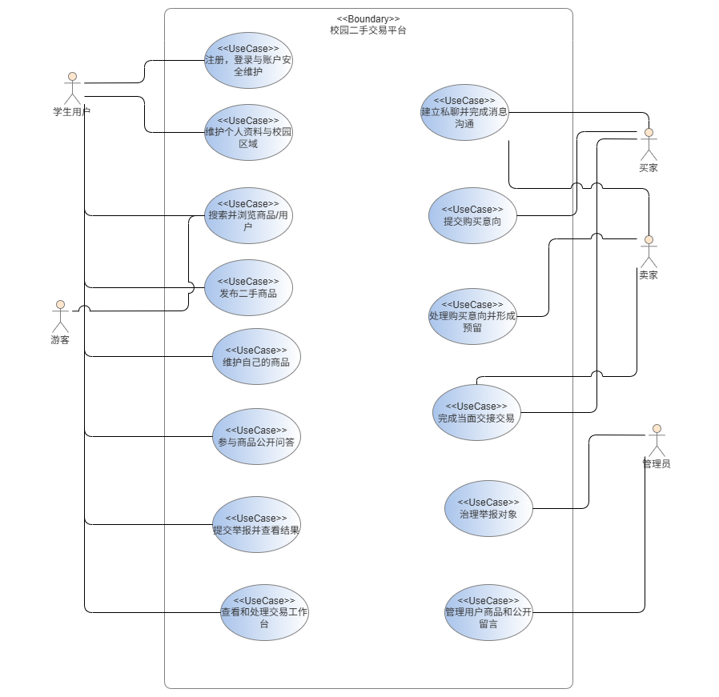

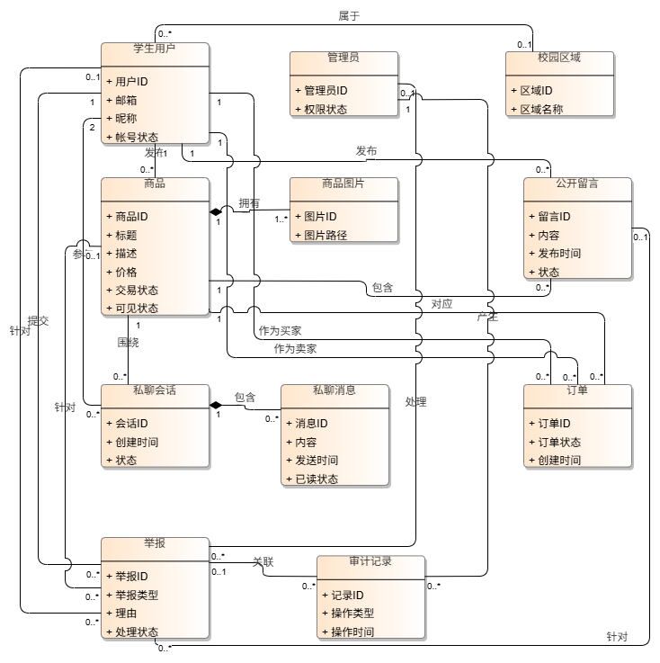

## 3. 功能需求

### REQ01 邮箱验证注册

- 学生使用未注册邮箱申请注册验证码。
- 验证码必须校验用途、有效期、尝试次数、发送频率和单次消费。
- 用户名和邮箱必须唯一；密码为 6～12 位且同时包含字母和数字。
- 注册成功创建 `ACTIVE` 学生账号并建立服务端 Session。

### REQ02 会话登录与退出

- 用户使用邮箱和密码登录；禁用或临时锁定账号不得登录。
- Web 身份只由 HttpOnly Cookie 中的服务端 Session 表示。
- 页面通过 `/users/me` 恢复当前身份；退出、封禁或认证版本变化后旧会话失效。
- 前端会话读取必须防止迟到响应覆盖新登录状态。

### REQ03 密码重置

- 已注册邮箱可以申请密码重置验证码。
- 注册验证码和重置验证码用途隔离，不能混用或重复使用。
- 重置成功后旧密码失效，并撤销已有认证状态。

### REQ04 个人资料

- 学生可读取和修改本人昵称、手机号、校园区域等允许字段。
- 用户搜索和商品详情只返回安全公开资料，不暴露邮箱、手机号等账号隐私。
- 任何用户不得修改他人的资料或通过请求体指定身份。

### REQ05 校园搜索

- 游客和学生可搜索商品或用户；一次最多接受 8 个空格或逗号分隔的关键词，关键词之间取交集。
- 商品搜索匹配标题、描述和商品标签，并支持价格、校园区域、标签、卖家和排序条件。
- 商品结果只包含 `ON_SALE + VISIBLE` 且卖家为 `ACTIVE` 的记录。
- 用户结果仅包含公开昵称、用户名、校园区域、信用分和活跃时间。
- “离我最近”当前仅表示与登录用户校园区域相同优先，不使用精确定位。

### REQ06 商品发布与图片

- 登录学生可以发布标题、描述、价格、校园区域、最多 4 个标签和一张受控图片。
- 图片只接受 JPG/PNG，输入和输出不超过 5MB，限制像素与边长，并重新编码清除元数据。
- 图片使用随机文件名并校验归属；商品不能引用其他用户或任意外部图片地址。
- 发布成功的商品状态为 `ON_SALE + VISIBLE`。

### REQ07 卖家商品管理

- 卖家可查看全部本人商品，修改允许字段，执行卖家下架和重新上架。
- 只有发布者能够修改商品；`RESERVED` 或 `SOLD` 商品不得编辑。
- 管理员移除与卖家下架相互独立，卖家不得绕过管理员移除。

### REQ08 商品详情

- 商品详情一次返回商品、安全卖家摘要、当前用户有效购买意向、允许动作、同卖家其他在售商品和公开问答。
- 游客、普通买家、已有意向的买家和卖家本人获得不同的允许动作。
- 不可见商品不得通过详情或留言接口向无权限访问者泄漏。

### REQ09 公开问答

- 商品公开问答对所有有权查看商品的访问者可见。
- 登录学生可发布留言，只能修改或删除自己的留言。
- 公开问答与私聊严格分离，私聊正文不得出现在公开接口中。

### REQ10 商品私聊

- 同一商品、买家和卖家最多形成一个私聊会话，对外使用随机 UUID。
- 会话和消息仅买卖双方可见，管理员没有读取私聊正文的特殊权限。
- 消息按单调 sequence 分页，双方分别维护已读游标并计算未读数。
- 任一方屏蔽后双方不能发送新消息，但可以查看历史并解除自己的屏蔽。
- 商品详情仅能为 `ON_SALE + VISIBLE` 商品新建会话；交易参与者仍可从订单打开已有或对应会话。

### REQ11 购买意向

- 买家可对他人 `ON_SALE + VISIBLE` 商品提交一条有效购买意向。
- 购买意向为非独占请求，创建后商品继续在售，其他买家仍可提交意向。
- 买家身份必须从 Session 推导，禁止购买自己的商品或重复提交有效意向。

### REQ12 卖家选择与预留

- 卖家可以接受或拒绝本人商品的购买意向。
- 接受一条意向后，订单进入 `WAITING_HANDOVER`，商品进入 `RESERVED`，其他待回应意向关闭。
- 同一商品最多形成一个有效预留；并发状态修改必须串行并统一经过 `TradingService`。

### REQ13 当面交接与交易终态

- 当面交接后由买家确认完成，订单进入 `COMPLETED`，商品进入 `SOLD`。
- 买家或卖家可以在规则允许时取消；预留也可超时。
- 取消或超时关闭订单并释放预留，商品恢复在售；完成后的商品不能重新上架。

### REQ14 交易工作台

- 学生可按“我买到的 / 我卖出的”和交易阶段浏览本人订单。
- 工作台显示阶段统计、卖家按商品分组的意向、交易时间线、剩余时间、关闭原因和允许动作。
- 只返回当前学生参与的订单，不泄露对方账号隐私。

### REQ15 学生举报

- 学生可以举报商品、公开留言或其他学生用户，并查看自己的处理结果。
- 禁止举报自己、重复举报或 24 小时内提交超过 20 条举报。
- 举报保存对象快照并进入 `OPEN` 状态；普通学生只能查看自己的举报。

### REQ16 举报治理

- 管理员可将 `OPEN` 举报处理为 `RESOLVED` 或 `DISMISSED`。
- 举报成立时，治理措施必须与对象类型匹配：下架商品、移除留言或禁用用户。
- 驳回不得改变举报对象；每次最终处理追加真实管理员、说明、措施和时间的审计记录。
- 同一举报只能最终处理一次。

### REQ17 管理员管理

- 管理员可查看并管理用户、商品和公开留言。
- 管理员可以禁用或恢复学生账号、调整商品审核状态、移除公开留言。
- 管理操作不得绕过商品交易状态机；普通学生不能调用管理员接口。

### REQ18 统一安全边界

- 所有受保护操作先校验有效 Session；所有 Web 写请求必须校验 CSRF。
- 服务端通过 `CurrentActorService` 获取操作者，再校验角色、账号状态和资源归属。
- 请求体中的 `userId`、`buyerId`、`sellerId`、`senderId` 或 `adminId` 不得决定身份。
- CORS 只允许配置的精确来源；错误响应不得泄漏凭据、验证码或内部异常细节。

## 3.1 系统顺序图

以下顺序图分别对应 `REQ01`～`REQ18`，用于说明参与者、Web 边界和后端服务之间的需求级交互。图中字段和流程以本说明书正文及《业务场景（用例）清单》为准。

### REQ01 / UC01

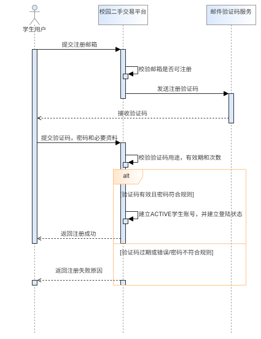

### REQ02 / UC02

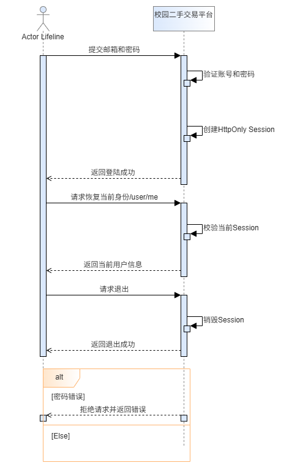

### REQ03 / UC03

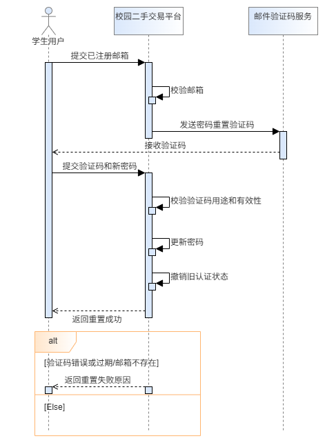

### REQ04 / UC04

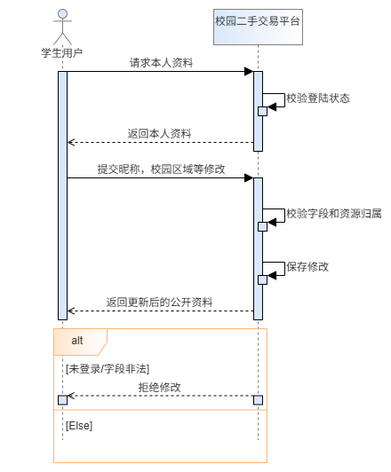

### REQ05 / UC05

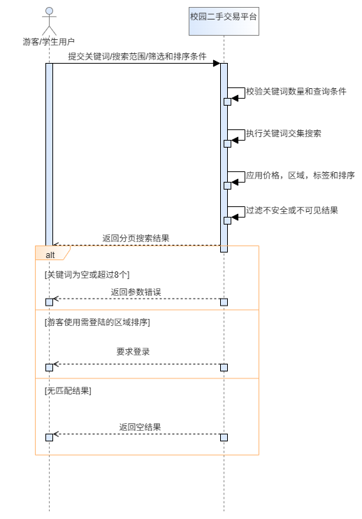

### REQ06 / UC06

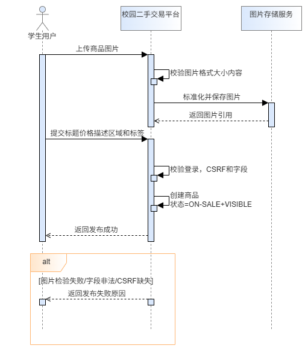

### REQ07 / UC07

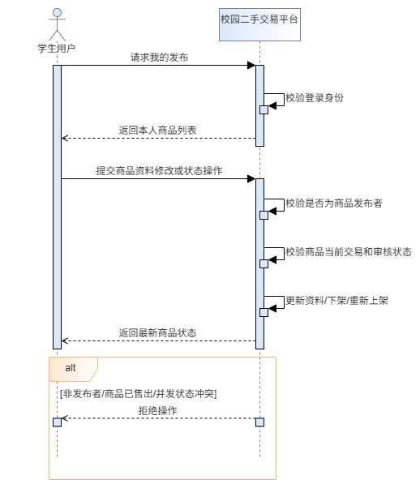

### REQ08 / UC08

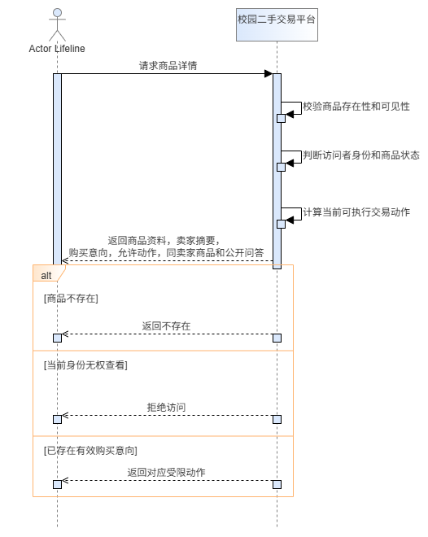

### REQ09 / UC09

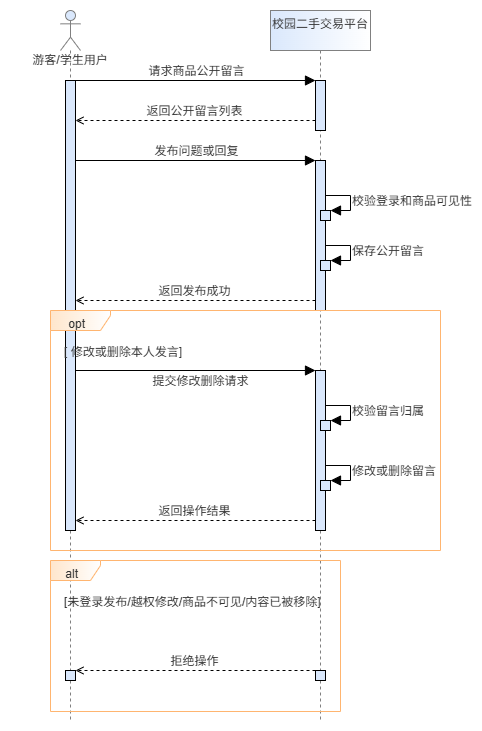

### REQ10 / UC10

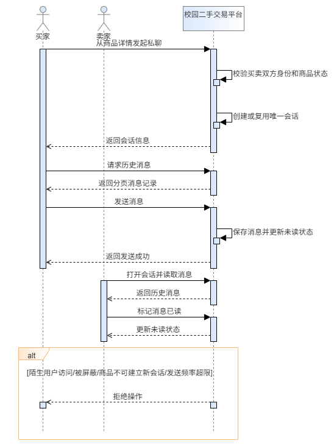

### REQ11 / UC11

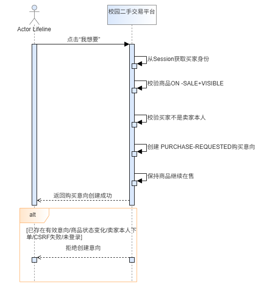

### REQ12 / UC12

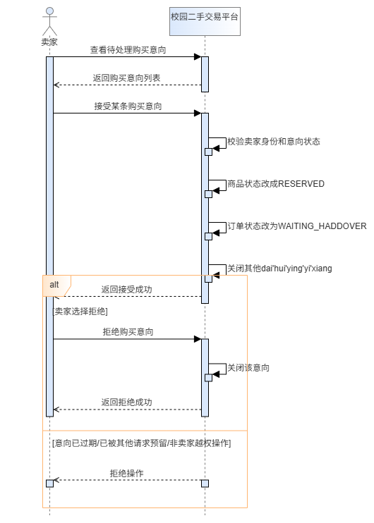

### REQ13 / UC13

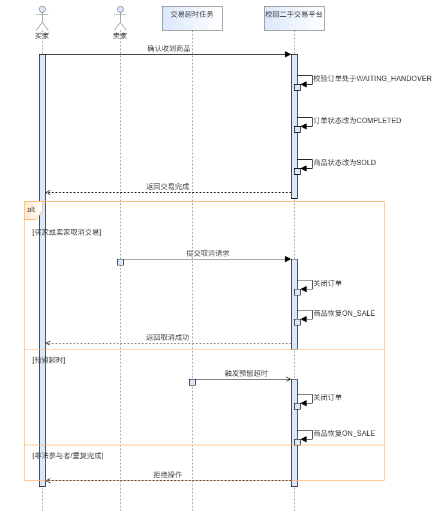

### REQ14 / UC14

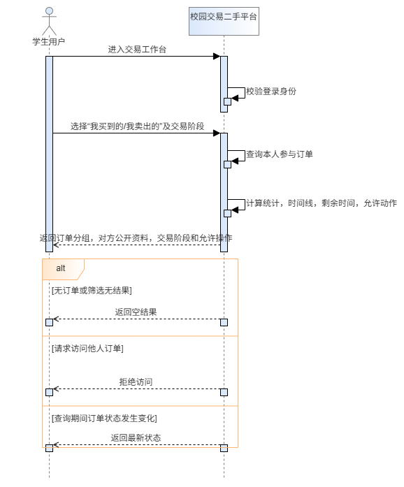

### REQ15 / UC15

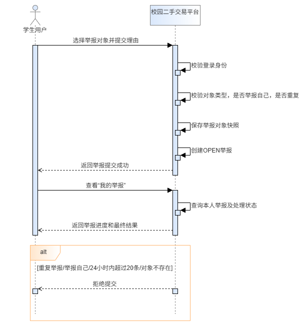

### REQ16 / UC16

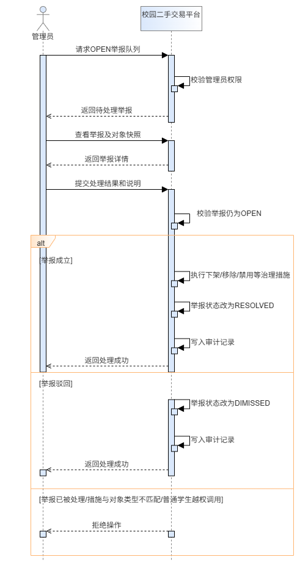

### REQ17 / UC17

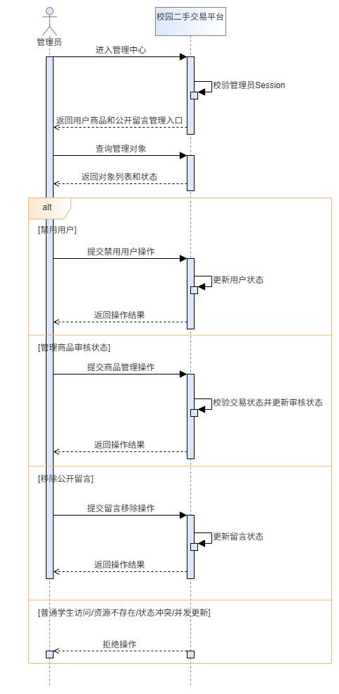

### REQ18 / UC18

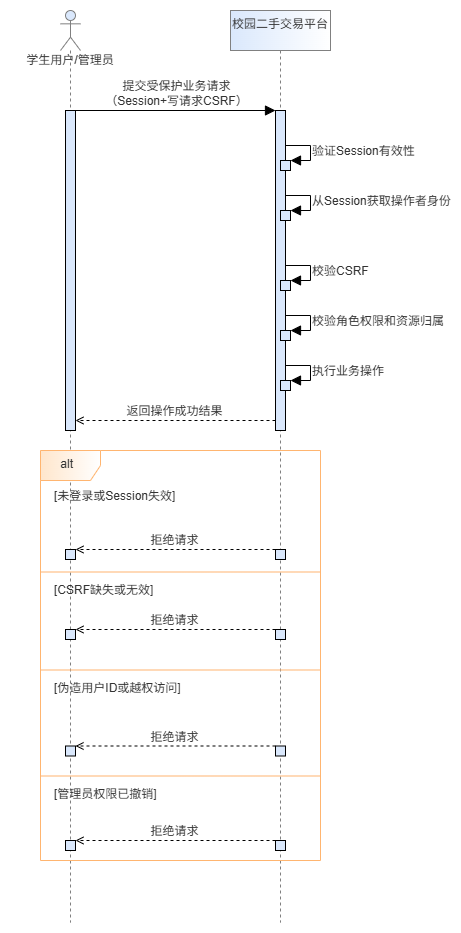

## 4. 核心状态规则

| 对象 | 状态与约束 |
| --- | --- |
| 商品交易状态 | `ON_SALE`、`RESERVED`、`SOLD`、`WITHDRAWN`。 |
| 商品审核状态 | `VISIBLE`、`REMOVED`，与交易状态独立。 |
| 订单 | `PURCHASE_REQUESTED` → `WAITING_HANDOVER` → `COMPLETED`；也可进入 `DECLINED`、`CANCELLED`、`EXPIRED`。 |
| 举报 | `OPEN` → `RESOLVED` 或 `DISMISSED`。 |
| 私聊 | 会话参与者固定；消息 sequence 只增，已读游标只前进。 |

订单保存形成意向时的商品标题、价格和双方昵称快照，不因后续资料修改而变化。

## 5. 外部接口范围

所有业务接口以 `/api` 为前缀：

| 模块 | 主要路径 |
| --- | --- |
| 认证与资料 | `/auth/**`、`/users/me` |
| 商品与图片 | `/items/**`、`/media/product-images/**` |
| 搜索 | `/search` |
| 公开问答 | `/messages/**` |
| 私聊 | `/chat/**` |
| 交易 | `/orders`、`/orders/desk`、`/orders/{id}/actions` |
| 举报 | `/reports/**` |
| 管理 | `/admin/users/**`、`/admin/items/**`、`/admin/messages/**`、`/admin/reports/**` |

字段、方法、示例请求和 Session/CSRF 使用方式以 `doc/postman_collection.json` 为准。

## 6. 数据与部署要求

- MySQL 8.4 保存业务数据，Spring Session JDBC 保存共享 Web 会话。
- `database/schema.sql` 只创建空数据库；所有表结构由 Flyway 迁移建立。
- Hibernate 使用 `validate` 校验映射，不得使用自动建表代替迁移。
- 商品图片由文件系统 adapter 保存；Docker 使用独立持久卷。多实例部署前需替换为对象存储 adapter。
- 演示数据只允许向全新本地业务库导入，生产环境不得执行 `database/seed.sql`。

## 7. 非功能需求

### 安全性

- 密码使用 BCrypt，验证码使用带 pepper 的摘要存储。
- Cookie、CSRF、CORS、登录限流、验证码限流和资源归属检查必须共同生效。
- 不记录或提交真实密码、SMTP 密钥、验证码 pepper 和验证码明文。

### 可用性与兼容性

- 支持当前 Chrome 和 Edge。
- 桌面端与 390px 移动端不得出现整体横向溢出。
- 加载、空数据、成功、失败、无权限和网络中断均应提供可见反馈。

### 可维护性

- 交易状态修改统一经过 `TradingService`，身份统一经过 `CurrentActorService`。
- 前端写请求统一经过 `frontend/assets/js/api.js` 的 `request()`。
- interface 变化时同步更新项目上下文、Postman 契约、测试和需求追溯矩阵。

## 8. 验收与追溯

当前验收范围为 UC01～UC18。每项需求必须在《需求追溯矩阵》中关联业务用例、系统/组件/对象模型、实现模块以及单元、集成或端到端测试证据。详细主流程和反向场景见《业务场景（用例）清单》。
