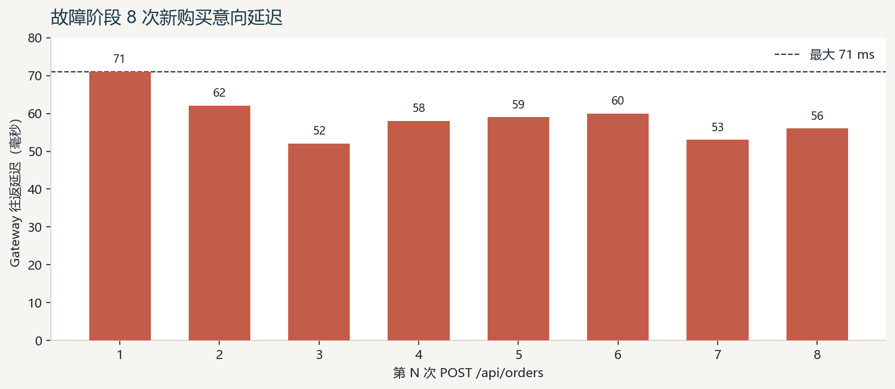
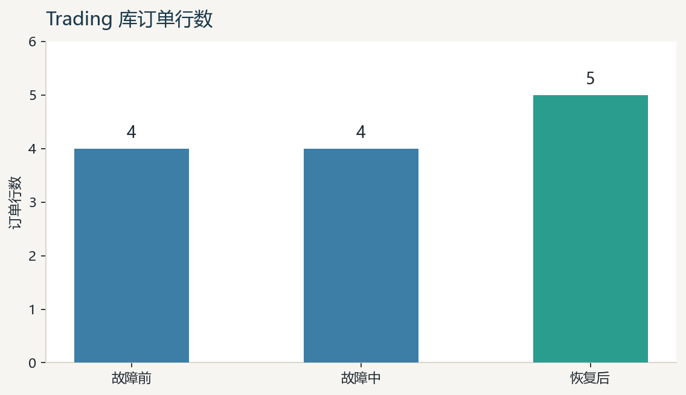
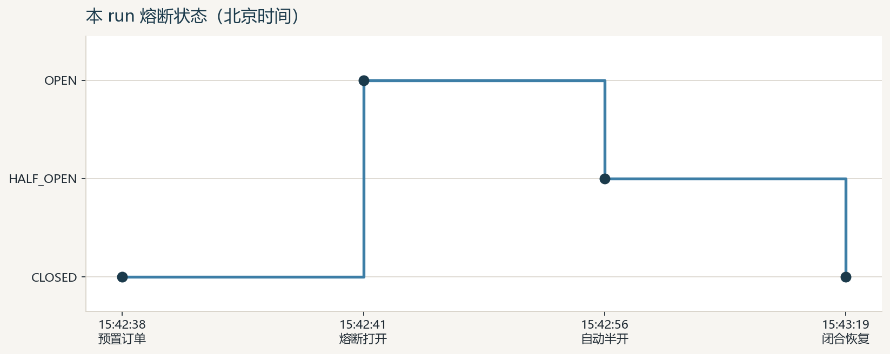

# Trading → Marketplace 依赖故障隔离实验报告

> 由 Canvas 导出。图表 PNG 与本文件在同一目录；用支持本地图片的 Markdown 预览即可看到柱状图和时间线。

**判定 PASS** · runId `fault-20260902T074227Z-22133ba3` · 北京时间 2026-09-02 15:42:27–15:43:21

Marketplace 停止后，Trading 稳定返回 503，不写订单、不拖垮其他服务；恢复后熔断自行闭合，无需重启 Trading。

| 指标 | 值 |
| --- | --- |
| 公共入口 | PASS |
| 故障请求 | 8 / 8 返回 503 |
| 最大延迟 | 71 ms |
| Trading Pod | 未重启 |

## 故障阶段延迟

横轴为第 N 次 `POST /api/orders`，纵轴为 Gateway 往返延迟（毫秒）。8 次全部 HTTP 503 / `PRODUCT_SERVICE_UNAVAILABLE` / `Retry-After: 1`。

数据：71, 62, 52, 58, 59, 60, 53, 56 ms

## 订单数隔离

横轴为实验阶段，纵轴为 Trading 库订单行数。故障中保持 4，恢复后为 5。

## 熔断状态

本 run 北京时间轨迹。不要用 `circuit-transitions.txt` 的两轮叠字。

- 15:42:41 CLOSED → OPEN（failureRate=80.0）
- 15:42:56 OPEN → HALF_OPEN（约 15s）
- 15:43:19 HALF_OPEN → CLOSED（新订单 id=5）

## 完整可视化文件

- [HTML（浏览器打开，可打印成 PDF）](fault-isolation-experiment-report.html)
- [PDF 幻灯片](fault-isolation-experiment-report.pdf)
